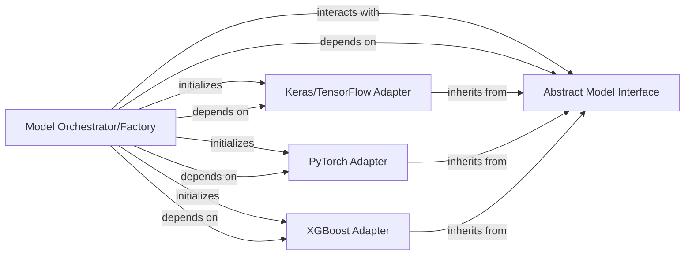

## Details

The Model Abstraction Layer in `dice_ml` provides a unified interface for interacting with various machine learning models, promoting model agnosticism within the explanation engine. At its core, the `Model Orchestrator/Factory` (`dice_ml.model.Model`) acts as the central entry point, dynamically instantiating the appropriate model adapter based on the underlying model's framework. All specific model implementations adhere to the `Abstract Model Interface` (`dice_ml.model_interfaces.base_model.BaseModel`), ensuring a consistent contract for prediction and output shape determination. Concrete adapters, such as `Keras/TensorFlow Adapter` (`dice_ml.model_interfaces.keras_tensorflow_model.KerasTensorFlowModel`), `PyTorch Adapter` (`dice_ml.model_interfaces.pytorch_model.PyTorchModel`), and `XGBoost Adapter` (`dice_ml.model_interfaces.xgboost_model.XGBoostModel`), encapsulate framework-specific logic, translating diverse model APIs into the standardized interface. This design, leveraging Factory and Adapter patterns, simplifies the integration of new model types and streamlines the interaction between the explanation engine and various ML frameworks.

### Model Orchestrator/Factory
Serves as the primary entry point for the Model Abstraction Layer. Its main responsibility is to determine and instantiate the correct model interface (adapter) based on the type of the underlying machine learning model (e.g., Keras/TensorFlow, PyTorch, XGBoost). This component embodies the Factory and Facade patterns, simplifying client interaction with the diverse model types.

**Related Classes/Methods**:

- <a href="https://github.com/interpretml/DiCE/blob/main/dice_ml/model.py" target="_blank" rel="noopener noreferrer">`dice_ml.model.Model`</a>

### Abstract Model Interface
Defines the abstract interface and common methods (`get_output`, `get_num_output_nodes`, `get_num_output_nodes2`) that all specific machine learning model implementations must adhere to. This ensures model agnosticism by providing a standardized contract for prediction and output shape determination, crucial for the explanation engine. This component is central to the Adapter pattern.

**Related Classes/Methods**:

- <a href="https://github.com/interpretml/DiCE/blob/main/dice_ml/model_interfaces/base_model.py#L14-L70" target="_blank" rel="noopener noreferrer">`dice_ml.model_interfaces.base_model.BaseModel`:14-70</a>

### Keras/TensorFlow Adapter
Provides the concrete implementation for interacting with Keras/TensorFlow models, encapsulating framework-specific prediction calls and output node determination. It adapts the Keras/TensorFlow API to the Abstract Model Interface.

**Related Classes/Methods**:

- <a href="https://github.com/interpretml/DiCE/blob/main/dice_ml/model_interfaces/keras_tensorflow_model.py#L9-L48" target="_blank" rel="noopener noreferrer">`dice_ml.model_interfaces.keras_tensorflow_model.KerasTensorFlowModel`:9-48</a>

### PyTorch Adapter
Provides the concrete implementation for interacting with PyTorch models, abstracting PyTorch-specific operations for prediction and output node determination. It adapts the PyTorch API to the Abstract Model Interface.

**Related Classes/Methods**:

- <a href="https://github.com/interpretml/DiCE/blob/main/dice_ml/model_interfaces/pytorch_model.py#L10-L57" target="_blank" rel="noopener noreferrer">`dice_ml.model_interfaces.pytorch_model.PyTorchModel`:10-57</a>

### XGBoost Adapter
Provides the concrete implementation for interacting with XGBoost models, handling the loading and prediction logic specific to XGBoost. It adapts the XGBoost API to the Abstract Model Interface.

**Related Classes/Methods**:

- <a href="https://github.com/interpretml/DiCE/blob/main/dice_ml/model_interfaces/xgboost_model.py#L7-L32" target="_blank" rel="noopener noreferrer">`dice_ml.model_interfaces.xgboost_model.XGBoostModel`:7-32</a>

### [FAQ](https://github.com/CodeBoarding/GeneratedOnBoardings/tree/main?tab=readme-ov-file#faq)