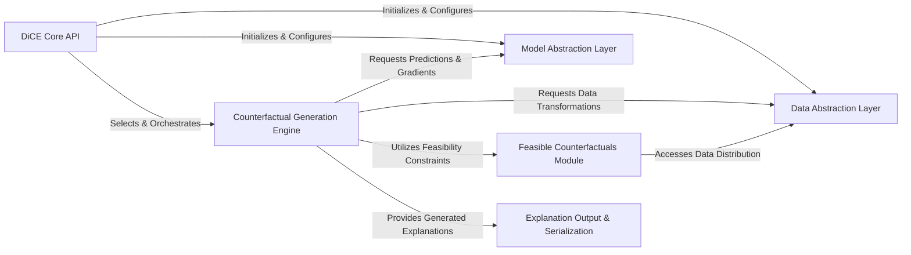

## Details

The DiCE project implements a highly modular and extensible architecture designed for generating diverse counterfactual explanations. The process begins with the DiCE Core API, which serves as the central orchestrator, initializing and coordinating the Data Abstraction Layer for all data handling and the Model Abstraction Layer for seamless, model-agnostic interaction with various machine learning models. The core of the explanation process is encapsulated within the Counterfactual Generation Engine, which employs different algorithmic strategies. This engine dynamically interacts with both the Model Abstraction Layer to obtain necessary predictions and gradients, and the Data Abstraction Layer for data transformations. For specific requirements like generating realistic counterfactuals, the Feasible Counterfactuals Module provides specialized support. Finally, the generated explanations are structured and prepared for consumption by the Explanation Output & Serialization component, completing the explanation pipeline. This clear separation of concerns facilitates easy extension and maintenance, making DiCE adaptable to new data types, models, and explanation algorithms.

### DiCE Core API [[Expand]](./DiCE_Core_API.md)
The primary entry point for users, orchestrating the overall counterfactual explanation generation process. It initializes and coordinates interactions between the Data Abstraction Layer, Model Abstraction Layer, and the chosen Explanation Strategy.

**Related Classes/Methods**:

- <a href="https://github.com/interpretml/DiCE/blob/main/dice_ml/dice.py#L12-L40" target="_blank" rel="noopener noreferrer">`dice`:12-40</a>

### Data Abstraction Layer [[Expand]](./Data_Abstraction_Layer.md)
Manages all aspects of data handling, including loading, validation, preprocessing (e.g., one-hot encoding, normalization), and transformation. It provides a unified interface, abstracting away complexities of different data types and formats.

**Related Classes/Methods**:

- <a href="https://github.com/interpretml/DiCE/blob/main/dice_ml/data.py#L12-L25" target="_blank" rel="noopener noreferrer">`data`:12-25</a>
- <a href="https://github.com/interpretml/DiCE/blob/main/dice_ml/data_interfaces/" target="_blank" rel="noopener noreferrer">`data_interfaces`</a>

### Model Abstraction Layer [[Expand]](./Model_Abstraction_Layer.md)
Provides a standardized, unified interface for interacting with various machine learning models (e.g., Keras/TensorFlow, PyTorch, XGBoost). It abstracts framework-specific prediction calls and gradient computations, enabling model agnosticism.

**Related Classes/Methods**:

- <a href="https://github.com/interpretml/DiCE/blob/main/dice_ml/model.py" target="_blank" rel="noopener noreferrer">`model`</a>
- <a href="https://github.com/interpretml/DiCE/blob/main/dice_ml/model_interfaces/" target="_blank" rel="noopener noreferrer">`model_interfaces`</a>

### Counterfactual Generation Engine [[Expand]](./Counterfactual_Generation_Engine.md)
Implements the core logic for generating diverse counterfactual explanations. This component encompasses various algorithmic strategies (e.g., KD-tree, Genetic, Gradient-based) that extend a base explainer interface.

**Related Classes/Methods**:

- <a href="https://github.com/interpretml/DiCE/blob/main/dice_ml/explainer_interfaces/explainer_base.py" target="_blank" rel="noopener noreferrer">`explainer_base`</a>
- <a href="https://github.com/interpretml/DiCE/blob/main/dice_ml/explainer_interfaces/dice_KD.py" target="_blank" rel="noopener noreferrer">`dice_KD`</a>
- <a href="https://github.com/interpretml/DiCE/blob/main/dice_ml/explainer_interfaces/dice_genetic.py" target="_blank" rel="noopener noreferrer">`dice_genetic`</a>
- <a href="https://github.com/interpretml/DiCE/blob/main/dice_ml/explainer_interfaces/dice_random.py" target="_blank" rel="noopener noreferrer">`dice_random`</a>
- <a href="https://github.com/interpretml/DiCE/blob/main/dice_ml/explainer_interfaces/dice_pytorch.py" target="_blank" rel="noopener noreferrer">`dice_pytorch`</a>
- <a href="https://github.com/interpretml/DiCE/blob/main/dice_ml/explainer_interfaces/dice_tensorflow1.py" target="_blank" rel="noopener noreferrer">`dice_tensorflow1`</a>
- <a href="https://github.com/interpretml/DiCE/blob/main/dice_ml/explainer_interfaces/dice_tensorflow2.py" target="_blank" rel="noopener noreferrer">`dice_tensorflow2`</a>
- <a href="https://github.com/interpretml/DiCE/blob/main/dice_ml/explainer_interfaces/dice_xgboost.py" target="_blank" rel="noopener noreferrer">`dice_xgboost`</a>

### Feasible Counterfactuals Module [[Expand]](./Feasible_Counterfactuals_Module.md)
A specialized module focused on generating feasible counterfactuals, often leveraging Variational Autoencoders (VAEs) to ensure generated explanations adhere to data distribution constraints. It provides specific methods or models for this purpose, used by certain generation strategies.

**Related Classes/Methods**:

- <a href="https://github.com/interpretml/DiCE/blob/main/dice_ml/explainer_interfaces/feasible_base_vae.py" target="_blank" rel="noopener noreferrer">`feasible_base_vae`</a>
- <a href="https://github.com/interpretml/DiCE/blob/main/dice_ml/explainer_interfaces/feasible_model_approx.py" target="_blank" rel="noopener noreferrer">`feasible_model_approx`</a>
- <a href="https://github.com/interpretml/DiCE/blob/main/dice_ml/utils/sample_architecture/vae_model.py" target="_blank" rel="noopener noreferrer">`vae_model`</a>

### Explanation Output & Serialization [[Expand]](./Explanation_Output_Serialization.md)
Responsible for structuring, serializing, and managing the generated counterfactual explanations. It prepares the explanations for display, storage, or further analysis, often adhering to defined schemas.

**Related Classes/Methods**:

- <a href="https://github.com/interpretml/DiCE/blob/main/dice_ml/counterfactual_explanations.py" target="_blank" rel="noopener noreferrer">`counterfactual_explanations`</a>
- <a href="https://github.com/interpretml/DiCE/blob/main/dice_ml/diverse_counterfactuals.py" target="_blank" rel="noopener noreferrer">`diverse_counterfactuals`</a>

### [FAQ](https://github.com/CodeBoarding/GeneratedOnBoardings/tree/main?tab=readme-ov-file#faq)