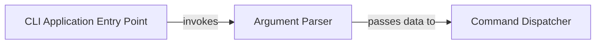

## Details

Abstract Components Overview

### CLI Application Entry Point
This component represents the main entry point of the command-line application. It is responsible for initializing the CLI environment, orchestrating the overall flow of execution, and initiating the argument parsing process.

**Related Classes/Methods**:

- <a href="https://github.com/BravestCheetah/DirLink/blob/main/src/dirlink/cli.py#L7-L46" target="_blank" rel="noopener noreferrer">`cli.main` (7:46)</a>

### Argument Parser
This component is dedicated to parsing and validating command-line arguments and options provided by the user. It ensures that the input conforms to the expected syntax and structure, translating raw command-line strings into structured data that can be understood by the application's logic.

**Related Classes/Methods**:

- <a href="https://github.com/BravestCheetah/DirLink/blob/main/src/dirlink/cli.py#L1-L1" target="_blank" rel="noopener noreferrer">`cli.argument_parsers` (1:1)</a>

### Command Dispatcher
The Command Dispatcher is responsible for interpreting the parsed command and routing it to the appropriate business logic component for execution. It acts as a bridge between the user interface layer and the core application logic, ensuring that commands are handled by the correct internal services.

**Related Classes/Methods**:

- <a href="https://github.com/BravestCheetah/DirLink/blob/main/src/dirlink/cli.py#L1-L1" target="_blank" rel="noopener noreferrer">`cli.command_dispatchers` (1:1)</a>
- <a href="https://github.com/BravestCheetah/DirLink/blob/main/src/dirlink/cli.py#L1-L1" target="_blank" rel="noopener noreferrer">`dirlink.cli.handle_command` (1:1)</a>

### [FAQ](https://github.com/CodeBoarding/GeneratedOnBoardings/tree/main?tab=readme-ov-file#faq)