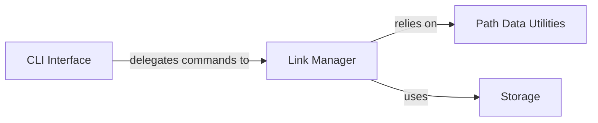

## Details

The `Link Management` subsystem is central to the `dirlink` application, embodying the core business logic for handling directory links. It adheres to a layered architecture, ensuring clear separation of concerns and promoting maintainability.

### CLI Interface [[Expand]](./CLI_Interface.md)
This component serves as the application's entry point, handling user interaction via the command line. It is responsible for parsing user commands and arguments, validating basic input, and then delegating the execution of specific link operations to the `Link Manager`. It acts as the presentation layer for the `dirlink` utility.

**Related Classes/Methods**:

- `dirlink/cli.py`

### Link Manager
The core business logic component for the `Link Management` subsystem. It encapsulates all operations related to directory links, including creating, deleting, listing, and updating links. It orchestrates the workflow by applying business rules and coordinating interactions between the `CLI Interface`, `Path Data Utilities`, and `Storage` components.

**Related Classes/Methods**:

- `dirlink/link_manager.py`

### Path Data Utilities
This utility component provides low-level functions for interacting with the file system. Its responsibilities include resolving paths, validating path existence, and performing file system operations directly related to managing directory links (e.g., creating symbolic links, checking file types). It abstracts away the complexities of file system interactions from the `Link Manager`.

**Related Classes/Methods**:

- <a href="https://github.com/BravestCheetah/DirLink/blob/main/src/dirlink/path_data.py" target="_blank" rel="noopener noreferrer">`dirlink/path_data.py`</a>

### Storage
This component is responsible for the persistence and retrieval of link metadata. It abstracts the underlying storage mechanism, ensuring that the `Link Manager` does not need to know the specifics of how data is stored (e.g., in a file, database). It handles reading from and writing to the persistent store, maintaining data integrity.

**Related Classes/Methods**:

- `dirlink/storage.py`

### [FAQ](https://github.com/CodeBoarding/GeneratedOnBoardings/tree/main?tab=readme-ov-file#faq)