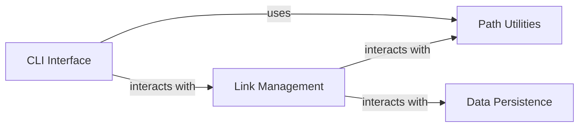

## Details

The DirLink application is designed with a clear layered architecture, facilitating a robust and maintainable command-line utility. The `CLI Interface` acts as the primary entry point, responsible for parsing user commands and arguments. It then delegates the core operations to the `Link Management` component, which encapsulates all business logic related to creating, deleting, and listing directory links. Both the `CLI Interface` and `Link Management` components leverage the `Path Utilities` for consistent and reliable handling of file and directory paths, including validation and normalization. Finally, the `Link Management` component interacts with the `Data Persistence` layer to store and retrieve the metadata associated with the managed links, ensuring the application's state is preserved.

### CLI Interface [[Expand]](./CLI_Interface.md)
Serves as the primary user interaction point. It handles command-line argument parsing, validates user input, and dispatches commands to the appropriate business logic.

**Related Classes/Methods**:

- <a href="https://github.com/BravestCheetah/DirLink/blob/main/src/dirlink/cli.py#L7-L46" target="_blank" rel="noopener noreferrer">`cli.main` (7:46)</a>
- <a href="https://github.com/BravestCheetah/DirLink/blob/main/src/dirlink/cli.py#L1-L1" target="_blank" rel="noopener noreferrer">`cli.argument_parsers` (1:1)</a>
- <a href="https://github.com/BravestCheetah/DirLink/blob/main/src/dirlink/cli.py#L1-L1" target="_blank" rel="noopener noreferrer">`cli.command_dispatchers` (1:1)</a>

### Link Management [[Expand]](./Link_Management.md)
Encapsulates the core business rules and operations for managing directory links. This includes creating, deleting, listing, and validating link operations, coordinating between path utilities and data persistence.

**Related Classes/Methods**:

- <a href="https://github.com/BravestCheetah/DirLink/blob/main/src/dirlink/link_manager.py#L1-L1" target="_blank" rel="noopener noreferrer">`link_manager.create_link` (1:1)</a>
- <a href="https://github.com/BravestCheetah/DirLink/blob/main/src/dirlink/link_manager.py#L1-L1" target="_blank" rel="noopener noreferrer">`link_manager.delete_link` (1:1)</a>
- <a href="https://github.com/BravestCheetah/DirLink/blob/main/src/dirlink/link_manager.py#L1-L1" target="_blank" rel="noopener noreferrer">`link_manager.list_links` (1:1)</a>

### Path Utilities
Provides a set of reusable, OS-agnostic functions for handling file and directory paths. This includes operations like path validation, normalization, and resolution, ensuring consistency and robustness across the application.

**Related Classes/Methods**:

- <a href="https://github.com/BravestCheetah/DirLink/blob/main/src/dirlink/path_data.py#L1-L1" target="_blank" rel="noopener noreferrer">`path_data.is_valid_path` (1:1)</a>
- <a href="https://github.com/BravestCheetah/DirLink/blob/main/src/dirlink/path_data.py#L1-L1" target="_blank" rel="noopener noreferrer">`path_data.normalize_path` (1:1)</a>
- <a href="https://github.com/BravestCheetah/DirLink/blob/main/src/dirlink/path_data.py#L1-L1" target="_blank" rel="noopener noreferrer">`path_data.resolve_absolute_path` (1:1)</a>

### Data Persistence
Manages the storage and retrieval of DirLink's operational data, specifically the metadata related to created links (e.g., source-to-target directory mappings). It abstracts the underlying storage mechanism.

**Related Classes/Methods**:

- `storage.save_link_metadata` (1:1)
- `storage.load_link_metadata` (1:1)
- `storage.delete_link_metadata` (1:1)

### [FAQ](https://github.com/CodeBoarding/GeneratedOnBoardings/tree/main?tab=readme-ov-file#faq)