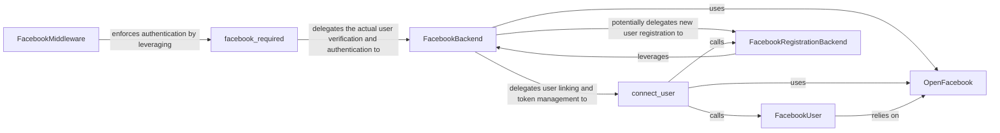

## Details

The `django-facebook` subsystem is built around a clear separation of concerns, with Django's authentication system at its core. The `FacebookMiddleware` and `facebook_required` decorator act as the entry points for Facebook authentication, ensuring that only authenticated users can access protected views. The `FacebookBackend` then takes over, validating Facebook credentials and either authenticating existing users or initiating the registration process through `FacebookRegistrationBackend`. The `connect_user` function serves as a central orchestrator for linking Facebook profiles with Django users, managing access tokens, and updating user information. All interactions with the Facebook Graph API are abstracted through the `OpenFacebook` component, which handles the low-level details of API requests and responses. Finally, the `FacebookUser` model stores and manages Facebook-specific user data, including the crucial access tokens, which are extended using the `OpenFacebook` component to maintain persistent sessions. This architecture ensures a modular, maintainable, and scalable approach to integrating Facebook authentication into Django applications.

### FacebookBackend
This component acts as a custom Django authentication backend. Its primary responsibility is to verify Facebook credentials (e.g., access tokens) and either retrieve an existing Django user or provision a new one based on the provided Facebook data. It integrates directly with Django's authentication system.

**Related Classes/Methods**:

- <a href="https://github.com/tschellenbach/Django-facebook/blob/master/django_facebook/connect.py#L40-L115" target="_blank" rel="noopener noreferrer">`django_facebook.connect.connect_user`:40-115</a>
- <a href="https://github.com/tschellenbach/Django-facebook/blob/master/django_facebook/registration_backends.py#L80-L117" target="_blank" rel="noopener noreferrer">`django_facebook.registration_backends.FacebookRegistrationBackend`:80-117</a>
- <a href="https://github.com/tschellenbach/Django-facebook/blob/master/open_facebook/api.py#L644-L957" target="_blank" rel="noopener noreferrer">`open_facebook.api.OpenFacebook`:644-957</a>

### FacebookMiddleware
This middleware intercepts incoming HTTP requests to ensure that a valid Facebook session is active for the user. It acts as a gatekeeper, redirecting unauthenticated users to the Facebook OAuth flow when necessary to initiate the authentication process.

**Related Classes/Methods**:

- <a href="https://github.com/tschellenbach/Django-facebook/blob/master/django_facebook/decorators.py" target="_blank" rel="noopener noreferrer">`django_facebook.decorators.facebook_required`</a>

### connect_user
A crucial utility function that orchestrates the linking of a Django user with their Facebook profile. It handles updating user information from Facebook, managing (acquiring, extending, and storing) Facebook access tokens, and coordinating the registration process for new users.

**Related Classes/Methods**:

- <a href="https://github.com/tschellenbach/Django-facebook/blob/master/django_facebook/models.py#L315-L335" target="_blank" rel="noopener noreferrer">`django_facebook.models.FacebookUser`:315-335</a>
- <a href="https://github.com/tschellenbach/Django-facebook/blob/master/django_facebook/registration_backends.py#L80-L117" target="_blank" rel="noopener noreferrer">`django_facebook.registration_backends.FacebookRegistrationBackend`:80-117</a>
- <a href="https://github.com/tschellenbach/Django-facebook/blob/master/open_facebook/api.py#L644-L957" target="_blank" rel="noopener noreferrer">`open_facebook.api.OpenFacebook`:644-957</a>

### FacebookUser
This Django model represents a user's Facebook profile data, including their Facebook User ID and access token. Its `extend_access_token` method is specifically responsible for refreshing short-lived Facebook access tokens into long-lived ones, which is vital for maintaining persistent user sessions.

**Related Classes/Methods**:

- <a href="https://github.com/tschellenbach/Django-facebook/blob/master/open_facebook/api.py#L644-L957" target="_blank" rel="noopener noreferrer">`open_facebook.api.OpenFacebook`:644-957</a>

### facebook_required
A Django decorator designed to enforce Facebook authentication on specific views. When applied, it handles the redirection to Facebook for the OAuth process and processes the callback after successful authentication, ensuring that only authenticated users can access the decorated view.

**Related Classes/Methods**:

- <a href="https://github.com/tschellenbach/Django-facebook/blob/master/django_facebook/auth_backends.py#L15-L136" target="_blank" rel="noopener noreferrer">`django_facebook.auth_backends.FacebookBackend`:15-136</a>

### FacebookRegistrationBackend
This component manages the specific logic for registering new users who sign up through Facebook. It integrates with Django's built-in user management system to create new user accounts based on data received from Facebook.

**Related Classes/Methods**:

- <a href="https://github.com/tschellenbach/Django-facebook/blob/master/django_facebook/auth_backends.py#L15-L136" target="_blank" rel="noopener noreferrer">`django_facebook.auth_backends.FacebookBackend`:15-136</a>

### OpenFacebook
This component provides a high-level abstraction for interacting with the Facebook Graph API. It handles constructing requests, making HTTP calls, and parsing responses. It is a critical dependency for token validation, user data retrieval, and token extension within this subsystem.

**Related Classes/Methods**:

- <a href="https://github.com/tschellenbach/Django-facebook/blob/master/open_facebook/api.py#L644-L957" target="_blank" rel="noopener noreferrer">`open_facebook.api.OpenFacebook`:644-957</a>

### [FAQ](https://github.com/CodeBoarding/GeneratedOnBoardings/tree/main?tab=readme-ov-file#faq)