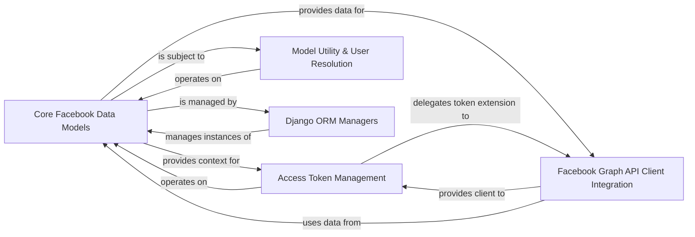

## Details

The `Django ORM & Data Models` subsystem is the persistence layer for `django-facebook`, leveraging Django's ORM to define the database schema for storing user-related Facebook data, access tokens, and configuration. Its boundaries are primarily defined by the `django_facebook.models` module, located in `/mnt/e/StartUp/Django-facebook/django_facebook/models.py`.

### Core Facebook Data Models
This component defines the fundamental database schemas for storing Facebook user profiles, their likes, and their friends. It serves as the central data repository for all Facebook-related information within the application.

**Related Classes/Methods**:

- <a href="https://github.com/tschellenbach/Django-facebook/blob/master/django_facebook/models.py#L115-L281" target="_blank" rel="noopener noreferrer">`django_facebook.models.BaseFacebookModel`:115-281</a>
- <a href="https://github.com/tschellenbach/Django-facebook/blob/master/django_facebook/models.py#L286-L308" target="_blank" rel="noopener noreferrer">`django_facebook.models.FacebookModel`:286-308</a>
- <a href="https://github.com/tschellenbach/Django-facebook/blob/master/django_facebook/models.py#L338-L352" target="_blank" rel="noopener noreferrer">`django_facebook.models.FacebookLike`:338-352</a>
- <a href="https://github.com/tschellenbach/Django-facebook/blob/master/django_facebook/models.py#L315-L335" target="_blank" rel="noopener noreferrer">`django_facebook.models.FacebookUser`:315-335</a>

### Access Token Management
Responsible for the lifecycle management of Facebook access tokens, including updating, extending, and clearing them. This component ensures secure and valid communication with the Facebook Graph API.

**Related Classes/Methods**:

- <a href="https://github.com/tschellenbach/Django-facebook/blob/master/django_facebook/models.py" target="_blank" rel="noopener noreferrer">`django_facebook.models.FacebookProfileModel:update_access_token`</a>
- <a href="https://github.com/tschellenbach/Django-facebook/blob/master/django_facebook/models.py" target="_blank" rel="noopener noreferrer">`django_facebook.models.FacebookProfileModel:extend_access_token`</a>
- <a href="https://github.com/tschellenbach/Django-facebook/blob/master/django_facebook/models.py" target="_blank" rel="noopener noreferrer">`django_facebook.models.FacebookProfileModel:_extend_access_token`</a>
- <a href="https://github.com/tschellenbach/Django-facebook/blob/master/django_facebook/models.py" target="_blank" rel="noopener noreferrer">`django_facebook.models.FacebookProfileModel:clear_access_token`</a>

### Model Utility & User Resolution
Provides a collection of general-purpose utility methods for the data models, including refreshing model instances, calculating derived states (like Facebook Open Graph state), disconnecting Facebook accounts, and resolving associated Django User objects or their IDs.

**Related Classes/Methods**:

- <a href="https://github.com/tschellenbach/Django-facebook/blob/master/django_facebook/models.py" target="_blank" rel="noopener noreferrer">`django_facebook.models.BaseFacebookModel:get_user`</a>
- <a href="https://github.com/tschellenbach/Django-facebook/blob/master/django_facebook/models.py" target="_blank" rel="noopener noreferrer">`django_facebook.models.BaseFacebookModel:get_user_id`</a>
- <a href="https://github.com/tschellenbach/Django-facebook/blob/master/django_facebook/models.py" target="_blank" rel="noopener noreferrer">`django_facebook.models.BaseFacebookModel:refresh`</a>
- <a href="https://github.com/tschellenbach/Django-facebook/blob/master/django_facebook/models.py" target="_blank" rel="noopener noreferrer">`django_facebook.models.BaseFacebookModel:facebook_og_state`</a>
- <a href="https://github.com/tschellenbach/Django-facebook/blob/master/django_facebook/models.py" target="_blank" rel="noopener noreferrer">`django_facebook.models.BaseFacebookModel:disconnect_facebook`</a>

### Facebook Graph API Client Integration
Facilitates the creation and retrieval of `OpenFacebook` client instances, enabling interaction with the Facebook Graph API using the stored access tokens. It acts as the bridge between the ORM models and the external Facebook API.

**Related Classes/Methods**:

- <a href="https://github.com/tschellenbach/Django-facebook/blob/master/django_facebook/models.py" target="_blank" rel="noopener noreferrer">`django_facebook.models.FacebookProfileModel:get_offline_graph`</a>
- <a href="https://github.com/tschellenbach/Django-facebook/blob/master/open_facebook/api.py#L388-L641" target="_blank" rel="noopener noreferrer">`open_facebook.api.FacebookAuthorization`:388-641</a>

### Django ORM Managers
Represents the standard Django model managers (`objects`) for the `django-facebook` models. This component provides the primary interface for database queries, object creation, and instance retrieval, adhering to Django's ORM patterns.

**Related Classes/Methods**:

- <a href="https://github.com/tschellenbach/Django-facebook/blob/master/django_facebook/models.py" target="_blank" rel="noopener noreferrer">`django_facebook.models.BaseFacebookModel:objects`</a>
- <a href="https://github.com/tschellenbach/Django-facebook/blob/master/django_facebook/models.py" target="_blank" rel="noopener noreferrer">`django_facebook.models.FacebookModel:objects`</a>
- <a href="https://github.com/tschellenbach/Django-facebook/blob/master/django_facebook/models.py" target="_blank" rel="noopener noreferrer">`django_facebook.models.FacebookLike:objects`</a>
- <a href="https://github.com/tschellenbach/Django-facebook/blob/master/django_facebook/models.py" target="_blank" rel="noopener noreferrer">`django_facebook.models.FacebookUser:objects`</a>

### [FAQ](https://github.com/CodeBoarding/GeneratedOnBoardings/tree/main?tab=readme-ov-file#faq)