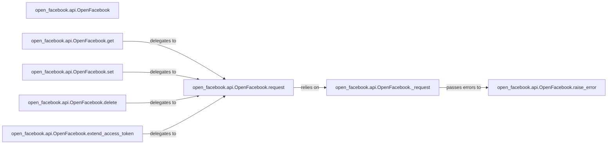

## Details

The `Facebook Graph API Client` subsystem is primarily encapsulated within the `open_facebook.api` module, with `open_facebook.api.OpenFacebook` serving as its central component. This subsystem provides a robust, abstracted interface for interacting with the Facebook Graph API, handling authentication, request construction, low-level HTTP communication, and error management.

### open_facebook.api.OpenFacebook
The primary client class and the main interface for developers to interact with the Facebook Graph API. It manages the authentication state (e.g., access tokens, expiration) and provides structured access to various API functionalities. It also handles serialization for persistence.

**Related Classes/Methods**:

- <a href="https://github.com/tschellenbach/Django-facebook/blob/master/open_facebook/api.py#L644-L957" target="_blank" rel="noopener noreferrer">`open_facebook.api.OpenFacebook`:644-957</a>

### open_facebook.api.OpenFacebook.request
The central orchestrator for all API calls. It constructs request URLs and parameters, delegates low-level HTTP communication, and manages initial response processing. This method acts as a facade for specific HTTP verbs.

**Related Classes/Methods**:

- <a href="https://github.com/tschellenbach/Django-facebook/blob/master/open_facebook/api.py" target="_blank" rel="noopener noreferrer">`open_facebook.api.OpenFacebook.request`</a>

### open_facebook.api.OpenFacebook._request
A low-level helper responsible for direct HTTP communication with the Facebook Graph API. It sends requests, receives raw responses, and performs initial server error checks before passing control to higher-level error handling.

**Related Classes/Methods**:

- <a href="https://github.com/tschellenbach/Django-facebook/blob/master/open_facebook/api.py" target="_blank" rel="noopener noreferrer">`open_facebook.api.OpenFacebook._request`</a>

### open_facebook.api.OpenFacebook.raise_error
Handles API error responses by interpreting error codes and messages from Facebook's API, mapping them to specific exceptions for robust error management and clearer debugging.

**Related Classes/Methods**:

- <a href="https://github.com/tschellenbach/Django-facebook/blob/master/open_facebook/api.py" target="_blank" rel="noopener noreferrer">`open_facebook.api.OpenFacebook.raise_error`</a>

### open_facebook.api.OpenFacebook.get
Provides a high-level, user-friendly interface for performing GET requests to retrieve data from the Facebook Graph API, abstracting the underlying `request` mechanism.

**Related Classes/Methods**:

- <a href="https://github.com/tschellenbach/Django-facebook/blob/master/open_facebook/api.py" target="_blank" rel="noopener noreferrer">`open_facebook.api.OpenFacebook.get`</a>

### open_facebook.api.OpenFacebook.set
Provides a high-level interface for performing POST or PUT requests to create or update data on the Facebook Graph API, simplifying data manipulation operations.

**Related Classes/Methods**:

- <a href="https://github.com/tschellenbach/Django-facebook/blob/master/open_facebook/api.py" target="_blank" rel="noopener noreferrer">`open_facebook.api.OpenFacebook.set`</a>

### open_facebook.api.OpenFacebook.delete
Provides a high-level interface for performing DELETE requests to remove data from the Facebook Graph API, offering a clear method for resource deletion.

**Related Classes/Methods**:

- <a href="https://github.com/tschellenbach/Django-facebook/blob/master/open_facebook/api.py" target="_blank" rel="noopener noreferrer">`open_facebook.api.OpenFacebook.delete`</a>

### open_facebook.api.OpenFacebook.extend_access_token
Manages the lifecycle of user access tokens by extending their expiration to ensure continued validity, crucial for maintaining user sessions without re-authentication.

**Related Classes/Methods**:

- <a href="https://github.com/tschellenbach/Django-facebook/blob/master/open_facebook/api.py" target="_blank" rel="noopener noreferrer">`open_facebook.api.OpenFacebook.extend_access_token`</a>

### [FAQ](https://github.com/CodeBoarding/GeneratedOnBoardings/tree/main?tab=readme-ov-file#faq)