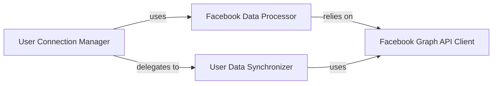

## Details

The User Profile & Data Synchronization subsystem is central to integrating Facebook user data within the Django application. It encompasses the entire lifecycle of user profile management, from initial connection and registration to ongoing data synchronization.

### User Connection Manager
Orchestrates the core user connection lifecycle, including initial registration, login, and ongoing synchronization of user data. It acts as the primary interface for managing user-Facebook relationships within the Django application. This component is crucial for managing the state and flow of user authentication and profile updates.

**Related Classes/Methods**:

- <a href="https://github.com/tschellenbach/Django-facebook/blob/master/django_facebook/connect.py#L40-L115" target="_blank" rel="noopener noreferrer">`connect_user`:40-115</a>
- <a href="https://github.com/tschellenbach/Django-facebook/blob/master/django_facebook/connect.py#L407-L418" target="_blank" rel="noopener noreferrer">`update_connection`:407-418</a>
- <a href="https://github.com/tschellenbach/Django-facebook/blob/master/django_facebook/connect.py#L196-L271" target="_blank" rel="noopener noreferrer">`_register_user`:196-271</a>
- <a href="https://github.com/tschellenbach/Django-facebook/blob/master/django_facebook/connect.py#L118-L124" target="_blank" rel="noopener noreferrer">`_login_user`:118-124</a>
- <a href="https://github.com/tschellenbach/Django-facebook/blob/master/django_facebook/connect.py#L127-L149" target="_blank" rel="noopener noreferrer">`_connect_user`:127-149</a>
- <a href="https://github.com/tschellenbach/Django-facebook/blob/master/django_facebook/connect.py#L305-L375" target="_blank" rel="noopener noreferrer">`_update_user`:305-375</a>
- <a href="https://github.com/tschellenbach/Django-facebook/blob/master/django_facebook/connect.py#L152-L170" target="_blank" rel="noopener noreferrer">`_update_likes_and_friends`:152-170</a>
- <a href="https://github.com/tschellenbach/Django-facebook/blob/master/django_facebook/connect.py#L173-L193" target="_blank" rel="noopener noreferrer">`_update_access_token`:173-193</a>
- <a href="https://github.com/tschellenbach/Django-facebook/blob/master/django_facebook/connect.py#L295-L302" target="_blank" rel="noopener noreferrer">`_remove_old_connections`:295-302</a>
- <a href="https://github.com/tschellenbach/Django-facebook/blob/master/django_facebook/connect.py#L274-L292" target="_blank" rel="noopener noreferrer">`_get_old_connections`:274-292</a>
- <a href="https://github.com/tschellenbach/Django-facebook/blob/master/django_facebook/connect.py#L378-L404" target="_blank" rel="noopener noreferrer">`_update_image`:378-404</a>

### Facebook Graph API Client [[Expand]](./Facebook_Graph_API_Client.md)
Provides an abstraction layer for authenticated access to the Facebook Graph API. It manages the retrieval of Graph API client instances, ensuring persistent connections and user context for subsequent data operations. This component is foundational as it encapsulates all external communication with Facebook, adhering to the API Client/Wrapper pattern.

**Related Classes/Methods**:

- <a href="https://github.com/tschellenbach/Django-facebook/blob/master/django_facebook/api.py#L48-L94" target="_blank" rel="noopener noreferrer">`get_persistent_graph`:48-94</a>
- <a href="https://github.com/tschellenbach/Django-facebook/blob/master/django_facebook/api.py#L97-L242" target="_blank" rel="noopener noreferrer">`get_facebook_graph`:97-242</a>
- <a href="https://github.com/tschellenbach/Django-facebook/blob/master/django_facebook/api.py#L24-L33" target="_blank" rel="noopener noreferrer">`require_persistent_graph`:24-33</a>
- <a href="https://github.com/tschellenbach/Django-facebook/blob/master/django_facebook/api.py#L36-L45" target="_blank" rel="noopener noreferrer">`require_facebook_graph`:36-45</a>
- <a href="https://github.com/tschellenbach/Django-facebook/blob/master/django_facebook/api.py#L245-L257" target="_blank" rel="noopener noreferrer">`_add_current_user_id`:245-257</a>

### Facebook Data Processor
Responsible for processing raw data received from the Facebook Graph API. It converts and maps Facebook-specific data into a structured format suitable for Django user models, handling tasks like generating usernames and passwords, and parsing profile information. This component ensures data integrity and compatibility with Django's ORM, aligning with data transformation responsibilities.

**Related Classes/Methods**:

- <a href="https://github.com/tschellenbach/Django-facebook/blob/master/django_facebook/api.py#L280-L295" target="_blank" rel="noopener noreferrer">`facebook_registration_data`:280-295</a>
- <a href="https://github.com/tschellenbach/Django-facebook/blob/master/django_facebook/api.py#L308-L360" target="_blank" rel="noopener noreferrer">`_convert_facebook_data`:308-360</a>
- <a href="https://github.com/tschellenbach/Django-facebook/blob/master/django_facebook/api.py" target="_blank" rel="noopener noreferrer">`facebook_profile_data`</a>
- <a href="https://github.com/tschellenbach/Django-facebook/blob/master/django_facebook/api.py#L428-L449" target="_blank" rel="noopener noreferrer">`_report_broken_facebook_data`:428-449</a>
- <a href="https://github.com/tschellenbach/Django-facebook/blob/master/django_facebook/api.py#L451-L466" target="_blank" rel="noopener noreferrer">`_create_unique_username`:451-466</a>
- <a href="https://github.com/tschellenbach/Django-facebook/blob/master/django_facebook/api.py#L398-L412" target="_blank" rel="noopener noreferrer">`_generate_fake_password`:398-412</a>
- <a href="https://github.com/tschellenbach/Django-facebook/blob/master/django_facebook/api.py#L414-L426" target="_blank" rel="noopener noreferrer">`_parse_data_of_birth`:414-426</a>
- <a href="https://github.com/tschellenbach/Django-facebook/blob/master/django_facebook/api.py#L468-L498" target="_blank" rel="noopener noreferrer">`_retrieve_facebook_username`:468-498</a>
- <a href="https://github.com/tschellenbach/Django-facebook/blob/master/django_facebook/api.py#L362-L396" target="_blank" rel="noopener noreferrer">`_extract_url`:362-396</a>
- <a href="https://github.com/tschellenbach/Django-facebook/blob/master/django_facebook/api.py#L500-L514" target="_blank" rel="noopener noreferrer">`_make_username`:500-514</a>

### User Data Synchronizer
Manages the specific retrieval and storage of detailed user-related data (e.g., likes, friends) from the Facebook Graph API into the Django application's database. It focuses on the persistent storage aspect of synchronized data, ensuring that rich user information is maintained locally. This component embodies the data persistence and synchronization logic.

**Related Classes/Methods**:

- <a href="https://github.com/tschellenbach/Django-facebook/blob/master/django_facebook/api.py#L516-L526" target="_blank" rel="noopener noreferrer">`get_and_store_likes`:516-526</a>
- <a href="https://github.com/tschellenbach/Django-facebook/blob/master/django_facebook/api.py#L528-L531" target="_blank" rel="noopener noreferrer">`_get_and_store_likes`:528-531</a>
- <a href="https://github.com/tschellenbach/Django-facebook/blob/master/django_facebook/api.py#L533-L540" target="_blank" rel="noopener noreferrer">`get_likes`:533-540</a>
- <a href="https://github.com/tschellenbach/Django-facebook/blob/master/django_facebook/api.py#L516-L526" target="_blank" rel="noopener noreferrer">`_store_likes`:516-526</a>
- <a href="https://github.com/tschellenbach/Django-facebook/blob/master/django_facebook/api.py#L516-L526" target="_blank" rel="noopener noreferrer">`store_likes`:516-526</a>
- <a href="https://github.com/tschellenbach/Django-facebook/blob/master/django_facebook/api.py#L590-L600" target="_blank" rel="noopener noreferrer">`get_and_store_friends`:590-600</a>
- <a href="https://github.com/tschellenbach/Django-facebook/blob/master/django_facebook/api.py#L602-L608" target="_blank" rel="noopener noreferrer">`_get_and_store_friends`:602-608</a>
- <a href="https://github.com/tschellenbach/Django-facebook/blob/master/django_facebook/api.py#L610-L625" target="_blank" rel="noopener noreferrer">`get_friends`:610-625</a>
- <a href="https://github.com/tschellenbach/Django-facebook/blob/master/django_facebook/api.py#L590-L600" target="_blank" rel="noopener noreferrer">`_store_friends`:590-600</a>
- <a href="https://github.com/tschellenbach/Django-facebook/blob/master/django_facebook/api.py#L590-L600" target="_blank" rel="noopener noreferrer">`store_friends`:590-600</a>
- <a href="https://github.com/tschellenbach/Django-facebook/blob/master/django_facebook/api.py#L681-L699" target="_blank" rel="noopener noreferrer">`registered_friends`:681-699</a>

### [FAQ](https://github.com/CodeBoarding/GeneratedOnBoardings/tree/main?tab=readme-ov-file#faq)