```mermaid
graph LR
    Authentication_Session_Management["Authentication & Session Management"]
    User_Profile_Data_Synchronization["User Profile & Data Synchronization"]
    Facebook_Graph_API_Client["Facebook Graph API Client"]
    Django_ORM_Data_Models["Django ORM & Data Models"]
    Asynchronous_Task_Processor["Asynchronous Task Processor"]
    Authentication_Session_Management -- "requests access tokens and basic user data" --> Facebook_Graph_API_Client
    Facebook_Graph_API_Client -- "returns access tokens and basic user data" --> Authentication_Session_Management
    Authentication_Session_Management -- "passes authenticated user context and initial Facebook profile data" --> User_Profile_Data_Synchronization
    User_Profile_Data_Synchronization -- "makes subsequent API calls to fetch detailed user data" --> Facebook_Graph_API_Client
    Facebook_Graph_API_Client -- "returns raw Facebook data" --> User_Profile_Data_Synchronization
    User_Profile_Data_Synchronization -- "persists and updates user profile data" --> Django_ORM_Data_Models
    Django_ORM_Data_Models -- "retrieves existing user profile data" --> User_Profile_Data_Synchronization
    User_Profile_Data_Synchronization -- "schedules background tasks (e.g., Open Graph shares)" --> Asynchronous_Task_Processor
    Asynchronous_Task_Processor -- "executes API calls in the background" --> Facebook_Graph_API_Client
    click Authentication_Session_Management href "https://github.com/CodeBoarding/GeneratedOnBoardings/blob/main/Django-facebook/Authentication_Session_Management.md" "Details"
    click User_Profile_Data_Synchronization href "https://github.com/CodeBoarding/GeneratedOnBoardings/blob/main/Django-facebook/User_Profile_Data_Synchronization.md" "Details"
    click Facebook_Graph_API_Client href "https://github.com/CodeBoarding/GeneratedOnBoardings/blob/main/Django-facebook/Facebook_Graph_API_Client.md" "Details"
    click Django_ORM_Data_Models href "https://github.com/CodeBoarding/GeneratedOnBoardings/blob/main/Django-facebook/Django_ORM_Data_Models.md" "Details"
```

## Details

The `Django-facebook` architecture is designed as a modular Django extension, facilitating seamless integration with Facebook functionalities. It centers around five key components: **Authentication & Session Management** handles user login and token acquisition; **User Profile & Data Synchronization** manages the mapping and persistence of Facebook user data; the **Facebook Graph API Client** provides the core interface for all Facebook API interactions; **Django ORM & Data Models** serves as the robust persistence layer; and the **Asynchronous Task Processor** offloads long-running operations. This design ensures a clear separation of concerns, enabling efficient data flow from Facebook, through processing and synchronization, to persistent storage within the Django application, with background tasks enhancing responsiveness.

### Authentication & Session Management [[Expand]](./Authentication_Session_Management.md)
Manages the entire user authentication lifecycle with Facebook, including OAuth flows, token acquisition, validation, and persistent session management within Django.

**Related Classes/Methods**:

- <a href="https://github.com/tschellenbach/Django-facebook/blob/master/django_facebook/auth_backends.py" target="_blank" rel="noopener noreferrer">`django_facebook.auth_backends`</a>
- <a href="https://github.com/tschellenbach/Django-facebook/blob/master/django_facebook/middleware.py" target="_blank" rel="noopener noreferrer">`django_facebook.middleware`</a>
- <a href="https://github.com/tschellenbach/Django-facebook/blob/master/django_facebook/registration_backends.py" target="_blank" rel="noopener noreferrer">`django_facebook.registration_backends`</a>

### User Profile & Data Synchronization [[Expand]](./User_Profile_Data_Synchronization.md)
Responsible for creating, updating, and synchronizing Django user profiles with rich data obtained from the Facebook Graph API, mapping Facebook-specific data to local Django models.

**Related Classes/Methods**:

- <a href="https://github.com/tschellenbach/Django-facebook/blob/master/django_facebook/connect.py" target="_blank" rel="noopener noreferrer">`django_facebook.connect`</a>
- <a href="https://github.com/tschellenbach/Django-facebook/blob/master/django_facebook/api.py" target="_blank" rel="noopener noreferrer">`django_facebook.api`</a>

### Facebook Graph API Client [[Expand]](./Facebook_Graph_API_Client.md)
Provides a robust, abstracted interface for making requests to the Facebook Graph API, handling low-level HTTP communication, request signing, and basic error handling.

**Related Classes/Methods**:

- <a href="https://github.com/tschellenbach/Django-facebook/blob/master/open_facebook/api.py" target="_blank" rel="noopener noreferrer">`open_facebook.api`</a>

### Django ORM & Data Models [[Expand]](./Django_ORM_Data_Models.md)
Represents the persistence layer for `django-facebook`, defining the database schema for storing user-related Facebook data, access tokens, and other configuration, leveraging Django's ORM.

**Related Classes/Methods**:

- <a href="https://github.com/tschellenbach/Django-facebook/blob/master/django_facebook/models.py" target="_blank" rel="noopener noreferrer">`django_facebook.models`</a>

### Asynchronous Task Processor
Manages background tasks, primarily using Celery, for operations that are time-consuming, require retries, or should not block the main request-response cycle.

**Related Classes/Methods**:

- <a href="https://github.com/tschellenbach/Django-facebook/blob/master/django_facebook/tasks.py" target="_blank" rel="noopener noreferrer">`django_facebook.tasks`</a>

### [FAQ](https://github.com/CodeBoarding/GeneratedOnBoardings/tree/main?tab=readme-ov-file#faq)