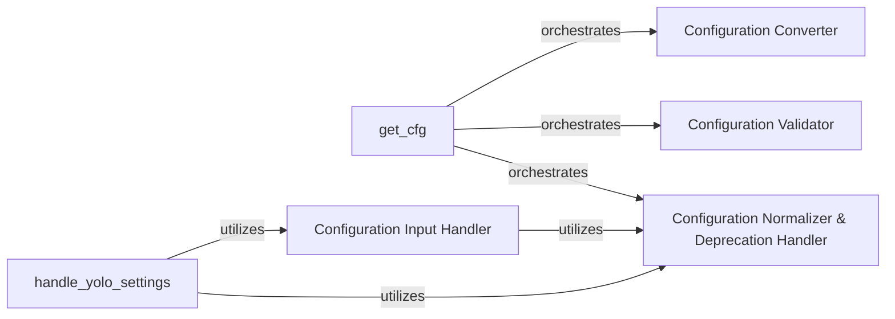

## Details

Analysis of the Configuration Management subsystem, encapsulated within the `doclayout_yolo/cfg/` directory. This subsystem is responsible for loading, processing, validating, and managing all project-wide configuration settings for the ML Toolkit/Deep Learning Model, with a focus on YOLO-specific configurations.

### get_cfg
The primary entry point and orchestrator for the entire configuration process. It is responsible for loading, processing, and validating all project-wide configuration settings, ensuring a complete and validated configuration object is available to the rest of the system.

**Related Classes/Methods**:

- <a href="https://github.com/opendatalab/DocLayout-YOLO/blob/main/doclayout_yolo/cfg/__init__.py#L196-L229" target="_blank" rel="noopener noreferrer">`get_cfg`:196-229</a>

### Configuration Input Handler
Manages the initial parsing of external configuration inputs, such as command-line arguments or other dynamic inputs. It breaks down raw inputs into structured key-value pairs and intelligently converts values to appropriate Python data types.

**Related Classes/Methods**:

- <a href="https://github.com/opendatalab/DocLayout-YOLO/blob/main/doclayout_yolo/cfg/__init__.py#L443-L593" target="_blank" rel="noopener noreferrer">`entrypoint`:443-593</a>
- <a href="https://github.com/opendatalab/DocLayout-YOLO/blob/main/doclayout_yolo/cfg/__init__.py#L420-L425" target="_blank" rel="noopener noreferrer">`parse_key_value_pair`:420-425</a>
- <a href="https://github.com/opendatalab/DocLayout-YOLO/blob/main/doclayout_yolo/cfg/__init__.py#L328-L351" target="_blank" rel="noopener noreferrer">`merge_equals_args`:328-351</a>
- <a href="https://github.com/opendatalab/DocLayout-YOLO/blob/main/doclayout_yolo/cfg/__init__.py#L428-L440" target="_blank" rel="noopener noreferrer">`smart_value`:428-440</a>

### handle_yolo_settings
Specializes in parsing and managing configuration parameters that are unique to YOLO models. It ensures that YOLO-specific settings, such as model hyperparameters or dataset paths, are correctly interpreted and applied within the broader configuration.

**Related Classes/Methods**:

- <a href="https://github.com/opendatalab/DocLayout-YOLO/blob/main/doclayout_yolo/cfg/__init__.py#L380-L410" target="_blank" rel="noopener noreferrer">`handle_yolo_settings`:380-410</a>

### Configuration Validator
Performs high-level structural validation of the entire configuration. It ensures that essential parameters are present, correctly formatted, and adhere to the overall configuration schema, preventing runtime errors due to malformed settings.

**Related Classes/Methods**:

- <a href="https://github.com/opendatalab/DocLayout-YOLO/blob/main/doclayout_yolo/cfg/__init__.py#L232-L265" target="_blank" rel="noopener noreferrer">`check_cfg`:232-265</a>

### Configuration Normalizer & Deprecation Handler
Ensures internal consistency and proper alignment within configuration dictionaries. This includes handling potential deprecations by issuing warnings or mapping old settings to new ones, thereby maintaining backward compatibility and data integrity across different configuration versions.

**Related Classes/Methods**:

- <a href="https://github.com/opendatalab/DocLayout-YOLO/blob/main/doclayout_yolo/cfg/__init__.py#L303-L325" target="_blank" rel="noopener noreferrer">`check_dict_alignment`:303-325</a>
- <a href="https://github.com/opendatalab/DocLayout-YOLO/blob/main/doclayout_yolo/cfg/__init__.py#L283-L300" target="_blank" rel="noopener noreferrer">`_handle_deprecation`:283-300</a>

### Configuration Converter
Converts raw configuration data (potentially from various sources or formats) into a standardized Python dictionary format. This standardization simplifies subsequent manipulation, validation, and access by other components within the system.

**Related Classes/Methods**:

- <a href="https://github.com/opendatalab/DocLayout-YOLO/blob/main/doclayout_yolo/cfg/__init__.py#L179-L193" target="_blank" rel="noopener noreferrer">`cfg2dict`:179-193</a>

### [FAQ](https://github.com/CodeBoarding/GeneratedOnBoardings/tree/main?tab=readme-ov-file#faq)