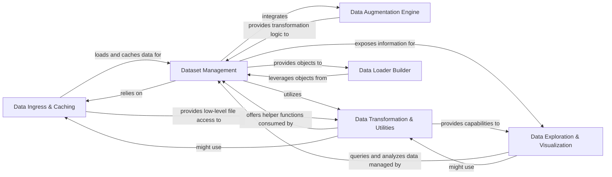

## Details

The `Dataset Management & Preprocessing` subsystem is crucial for preparing data for the DocLayout-YOLO model. It encompasses functionalities from raw data loading to advanced augmentation and format conversion, ensuring data is in an optimal state for model consumption.

### Data Ingress & Caching
Manages the low-level loading of images and data from various sources (including specialized inputs like video streams) and handles efficient caching to RAM or disk. It acts as the foundational layer for data access.

**Related Classes/Methods**:

- <a href="https://github.com/opendatalab/DocLayout-YOLO/blob/main/doclayout_yolo/data/base.py" target="_blank" rel="noopener noreferrer">`doclayout_yolo.data.base`</a>
- <a href="https://github.com/opendatalab/DocLayout-YOLO/blob/main/doclayout_yolo/data/loaders.py" target="_blank" rel="noopener noreferrer">`doclayout_yolo.data.loaders`</a>

### Dataset Management
Provides the primary abstraction for datasets, overseeing operations like image integrity verification, caching and loading dataset labels, and managing initial data transformations. It represents the core dataset object.

**Related Classes/Methods**:

- <a href="https://github.com/opendatalab/DocLayout-YOLO/blob/main/doclayout_yolo/data/dataset.py" target="_blank" rel="noopener noreferrer">`doclayout_yolo.data.dataset`</a>

### Data Augmentation Engine
Implements a suite of data augmentation techniques (e.g., mosaic, affine transformations, random flips, HSV adjustments) to enrich the dataset, prevent overfitting, and improve model generalization during training.

**Related Classes/Methods**:

- <a href="https://github.com/opendatalab/DocLayout-YOLO/blob/main/doclayout_yolo/data/augment.py" target="_blank" rel="noopener noreferrer">`doclayout_yolo.data.augment`</a>

### Data Transformation & Utilities
Offers general utility functions for data verification (images, labels), handles various annotation format conversions (e.g., COCO to YOLO, DOTA to YOLO OBB, polygons to masks), and provides specialized dataset splitting functionalities (e.g., DOTA dataset windowing).

**Related Classes/Methods**:

- <a href="https://github.com/opendatalab/DocLayout-YOLO/blob/main/doclayout_yolo/data/utils.py" target="_blank" rel="noopener noreferrer">`doclayout_yolo.data.utils`</a>
- <a href="https://github.com/opendatalab/DocLayout-YOLO/blob/main/doclayout_yolo/data/converter.py" target="_blank" rel="noopener noreferrer">`doclayout_yolo.data.converter`</a>
- <a href="https://github.com/opendatalab/DocLayout-YOLO/blob/main/doclayout_yolo/data/split_dota.py" target="_blank" rel="noopener noreferrer">`doclayout_yolo.data.split_dota`</a>

### Data Loader Builder
Responsible for constructing efficient data loaders (e.g., PyTorch DataLoaders) that feed preprocessed and augmented data to the model during training and inference, optimizing batching and parallel processing.

**Related Classes/Methods**:

- <a href="https://github.com/opendatalab/DocLayout-YOLO/blob/main/doclayout_yolo/data/build.py" target="_blank" rel="noopener noreferrer">`doclayout_yolo.data.build`</a>

### Data Exploration & Visualization
Facilitates interactive data exploration through functionalities like embedding creation, similarity searches, and SQL queries on the dataset, complemented by a graphical user interface for visualization and user interaction.

**Related Classes/Methods**:

- <a href="https://github.com/opendatalab/DocLayout-YOLO/blob/main/doclayout_yolo/data/explorer" target="_blank" rel="noopener noreferrer">`doclayout_yolo.data.explorer`</a>
- <a href="https://github.com/opendatalab/DocLayout-YOLO/blob/main/doclayout_yolo/data/explorer/gui" target="_blank" rel="noopener noreferrer">`doclayout_yolo.data.explorer.gui`</a>

### [FAQ](https://github.com/CodeBoarding/GeneratedOnBoardings/tree/main?tab=readme-ov-file#faq)