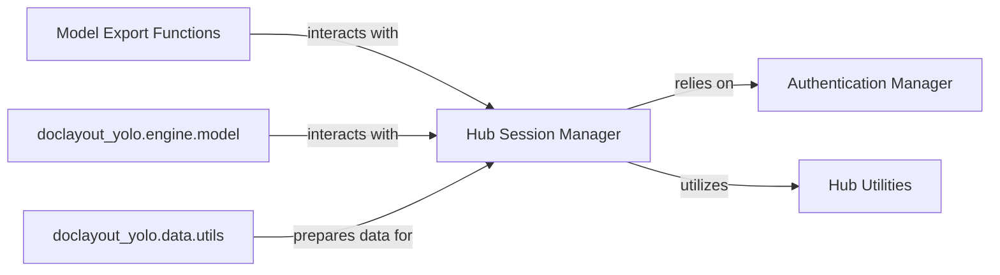

## Details

The doclayout_yolo project's hub interaction subsystem is designed around a central Hub Session Manager that orchestrates all communications with external model hubs. This manager relies on the Authentication Manager for secure access and leverages Hub Utilities for efficient and reliable data transfer, especially for large files. Models prepared by Model Export Functions and potentially data processed by doclayout_yolo.data.utils are then handled by the Hub Session Manager for upload. The doclayout_yolo.engine.model component interacts with the Hub Session Manager to facilitate model training and inference operations involving the hub. This architecture ensures a clear separation of concerns, with data preparation and model handling distinct from the actual network session management.

### Authentication Manager
Manages secure authentication with external model hubs, handling API keys, user credentials, and token management to ensure authorized access for all hub operations.

**Related Classes/Methods**:

- <a href="https://github.com/opendatalab/DocLayout-YOLO/blob/main/doclayout_yolo/hub/auth.py" target="_blank" rel="noopener noreferrer">`doclayout_yolo.hub.auth`</a>

### Hub Session Manager
Orchestrates the primary interactions with the external hub, including loading pre-trained models, uploading trained models, and sending training metrics. It incorporates robust request handling (e.g., queuing, retries) for reliable communication.

**Related Classes/Methods**:

- <a href="https://github.com/opendatalab/DocLayout-YOLO/blob/main/doclayout_yolo/hub/session.py" target="_blank" rel="noopener noreferrer">`doclayout_yolo.hub.session`</a>

### Hub Utilities
Provides general utility functions to support efficient and reliable communication with the hub, including smart request handling with progress tracking, crucial for large file transfers (models, datasets).

**Related Classes/Methods**:

- <a href="https://github.com/opendatalab/DocLayout-YOLO/blob/main/doclayout_yolo/hub/utils.py" target="_blank" rel="noopener noreferrer">`doclayout_yolo.hub.utils`</a>

### Model Export Functions
Manages the preparation and export of models into various formats suitable for upload to the hub, including serialization and format conversion.

**Related Classes/Methods**:

- <a href="https://github.com/opendatalab/DocLayout-YOLO/blob/main/doclayout_yolo/hub" target="_blank" rel="noopener noreferrer">`doclayout_yolo.hub`</a>

### doclayout_yolo.engine.model
Represents the model training/inference engine.

**Related Classes/Methods**:

- <a href="https://github.com/opendatalab/DocLayout-YOLO/blob/main/doclayout_yolo/engine/model.py" target="_blank" rel="noopener noreferrer">`doclayout_yolo.engine.model`</a>

### doclayout_yolo.data.utils
Provides data utility functions, likely for data preparation and formatting.

**Related Classes/Methods**:

- <a href="https://github.com/opendatalab/DocLayout-YOLO/blob/main/doclayout_yolo/data/utils.py" target="_blank" rel="noopener noreferrer">`doclayout_yolo.data.utils`</a>

### [FAQ](https://github.com/CodeBoarding/GeneratedOnBoardings/tree/main?tab=readme-ov-file#faq)