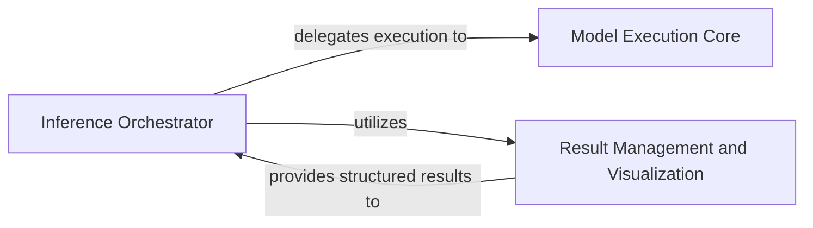

## Details

The `Inference & Post-processing Engine` subsystem is responsible for the complete lifecycle of model inference, from input preparation to the generation and management of structured, usable results. Its core functionality is encapsulated within the `doclayout_yolo/engine/predictor.py` and `doclayout_yolo/engine/results.py` files.

### Inference Orchestrator
This component acts as the central control unit for the entire inference pipeline. It manages the sequence of operations, including preparing inputs, delegating the actual model execution, overseeing post-processing steps, and handling the final output. It ensures a seamless flow from raw input data to structured detection results.

**Related Classes/Methods**:

- <a href="https://github.com/opendatalab/DocLayout-YOLO/blob/main/doclayout_yolo/engine/predictor.py" target="_blank" rel="noopener noreferrer">`doclayout_yolo/engine/predictor.py:Predictor`</a>
- <a href="https://github.com/opendatalab/DocLayout-YOLO/blob/main/doclayout_yolo/engine/predictor.py" target="_blank" rel="noopener noreferrer">`doclayout_yolo/engine/predictor.py:Predictor:preprocess`</a>
- <a href="https://github.com/opendatalab/DocLayout-YOLO/blob/main/doclayout_yolo/engine/predictor.py" target="_blank" rel="noopener noreferrer">`doclayout_yolo/engine/predictor.py:Predictor:inference`</a>
- <a href="https://github.com/opendatalab/DocLayout-YOLO/blob/main/doclayout_yolo/engine/predictor.py" target="_blank" rel="noopener noreferrer">`doclayout_yolo/engine/predictor.py:Predictor:postprocess`</a>
- <a href="https://github.com/opendatalab/DocLayout-YOLO/blob/main/doclayout_yolo/engine/predictor.py" target="_blank" rel="noopener noreferrer">`doclayout_yolo/engine/predictor.py:Predictor:write_results`</a>
- <a href="https://github.com/opendatalab/DocLayout-YOLO/blob/main/doclayout_yolo/engine/predictor.py" target="_blank" rel="noopener noreferrer">`doclayout_yolo/engine/predictor.py:Predictor:setup_source`</a>
- <a href="https://github.com/opendatalab/DocLayout-YOLO/blob/main/doclayout_yolo/engine/predictor.py" target="_blank" rel="noopener noreferrer">`doclayout_yolo/engine/predictor.py:Predictor:setup_model`</a>
- <a href="https://github.com/opendatalab/DocLayout-YOLO/blob/main/doclayout_yolo/engine/predictor.py" target="_blank" rel="noopener noreferrer">`doclayout_yolo/engine/predictor.py:Predictor:run_callbacks`</a>
- <a href="https://github.com/opendatalab/DocLayout-YOLO/blob/main/doclayout_yolo/engine/predictor.py" target="_blank" rel="noopener noreferrer">`doclayout_yolo/engine/predictor.py:pre_transform`</a>

### Model Execution Core
This component is dedicated to the fundamental task of loading the trained deep learning model (YOLO-v10) and executing the forward pass (inference) on the preprocessed input data. It serves as the direct interface with the underlying model architecture, handling the computational core of the prediction process.

**Related Classes/Methods**:

- <a href="https://github.com/opendatalab/DocLayout-YOLO/blob/main/doclayout_yolo/engine/model.py" target="_blank" rel="noopener noreferrer">`doclayout_yolo/engine/model.py`</a>

### Result Management and Visualization
This component provides a structured and usable representation of the model's raw outputs, transforming them into interpretable results such as bounding boxes, masks, or keypoints. It also offers utilities for manipulating, visualizing, and exporting these results in various formats, making the model's predictions accessible and actionable.

**Related Classes/Methods**:

- <a href="https://github.com/opendatalab/DocLayout-YOLO/blob/main/doclayout_yolo/engine/results.py" target="_blank" rel="noopener noreferrer">`doclayout_yolo/engine/results.py:Results`</a>
- <a href="https://github.com/opendatalab/DocLayout-YOLO/blob/main/doclayout_yolo/engine/results.py" target="_blank" rel="noopener noreferrer">`doclayout_yolo/engine/results.py:Results:cpu`</a>
- <a href="https://github.com/opendatalab/DocLayout-YOLO/blob/main/doclayout_yolo/engine/results.py" target="_blank" rel="noopener noreferrer">`doclayout_yolo/engine/results.py:Results:numpy`</a>
- <a href="https://github.com/opendatalab/DocLayout-YOLO/blob/main/doclayout_yolo/engine/results.py" target="_blank" rel="noopener noreferrer">`doclayout_yolo/engine/results.py:Results:cuda`</a>
- <a href="https://github.com/opendatalab/DocLayout-YOLO/blob/main/doclayout_yolo/engine/results.py" target="_blank" rel="noopener noreferrer">`doclayout_yolo/engine/results.py:Results:to`</a>
- <a href="https://github.com/opendatalab/DocLayout-YOLO/blob/main/doclayout_yolo/engine/results.py" target="_blank" rel="noopener noreferrer">`doclayout_yolo/engine/results.py:Results:_apply`</a>
- <a href="https://github.com/opendatalab/DocLayout-YOLO/blob/main/doclayout_yolo/engine/results.py" target="_blank" rel="noopener noreferrer">`doclayout_yolo/engine/results.py:Results:new`</a>
- <a href="https://github.com/opendatalab/DocLayout-YOLO/blob/main/doclayout_yolo/engine/results.py" target="_blank" rel="noopener noreferrer">`doclayout_yolo/engine/results.py:Results:plot`</a>
- <a href="https://github.com/opendatalab/DocLayout-YOLO/blob/main/doclayout_yolo/engine/results.py" target="_blank" rel="noopener noreferrer">`doclayout_yolo/engine/results.py:Results:show`</a>
- <a href="https://github.com/opendatalab/DocLayout-YOLO/blob/main/doclayout_yolo/engine/results.py" target="_blank" rel="noopener noreferrer">`doclayout_yolo/engine/results.py:Results:save`</a>
- <a href="https://github.com/opendatalab/DocLayout-YOLO/blob/main/doclayout_yolo/engine/results.py" target="_blank" rel="noopener noreferrer">`doclayout_yolo/engine/results.py:Results:save_txt`</a>
- <a href="https://github.com/opendatalab/DocLayout-YOLO/blob/main/doclayout_yolo/engine/results.py" target="_blank" rel="noopener noreferrer">`doclayout_yolo/engine/results.py:Results:tojson`</a>

### [FAQ](https://github.com/CodeBoarding/GeneratedOnBoardings/tree/main?tab=readme-ov-file#faq)