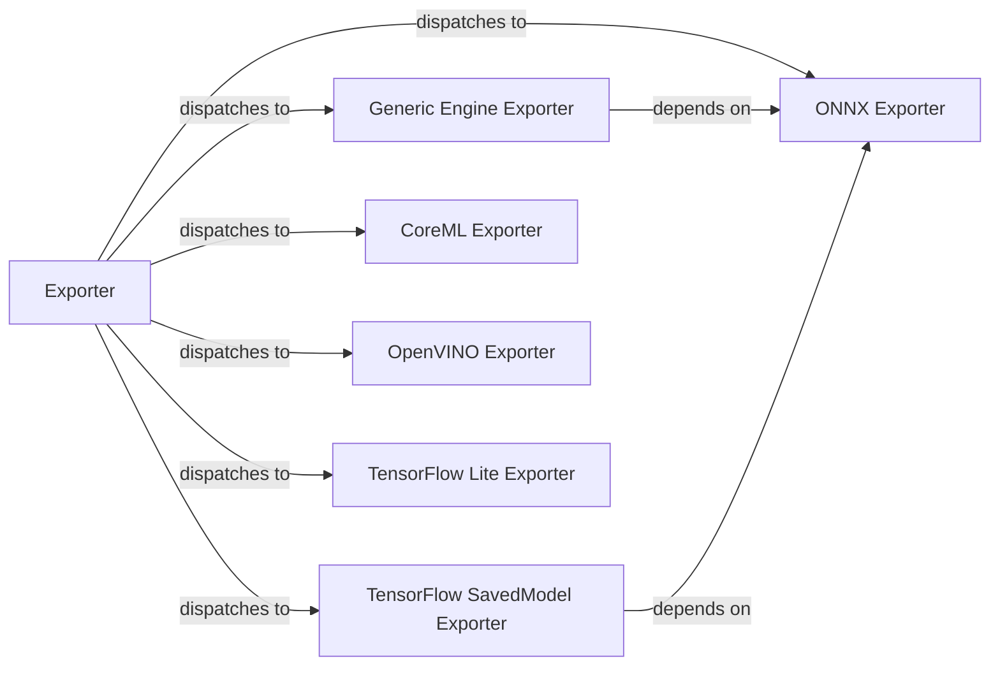

## Details

The `Model Export & Deployment` subsystem is primarily encapsulated within the `doclayout_yolo/engine/exporter.py` module. This module contains the core logic for converting trained models into various deployment-ready formats.

### Exporter
Acts as the central orchestrator for all model export functionalities. It provides a unified interface for initiating the conversion of a trained `DocLayout-YOLO` model into various target formats. This component embodies the "Model Export" aspect of the subsystem.

**Related Classes/Methods**:

- <a href="https://github.com/opendatalab/DocLayout-YOLO/blob/main/doclayout_yolo/engine/exporter.py#L143-L1125" target="_blank" rel="noopener noreferrer">`Exporter`:143-1125</a>

### ONNX Exporter
Responsible for converting the `DocLayout-YOLO` model into the Open Neural Network Exchange (ONNX) format. ONNX serves as a crucial intermediate representation, enabling interoperability across different ML frameworks and hardware.

**Related Classes/Methods**:

- <a href="https://github.com/opendatalab/DocLayout-YOLO/blob/main/doclayout_yolo/engine/exporter.py#L354-L413" target="_blank" rel="noopener noreferrer">`export_onnx`:354-413</a>

### Generic Engine Exporter
Converts the model to a highly optimized, generic engine format, likely for high-performance inference on specific hardware or runtime environments. This often involves further optimization beyond the ONNX format.

**Related Classes/Methods**:

- <a href="https://github.com/opendatalab/DocLayout-YOLO/blob/main/doclayout_yolo/engine/exporter.py#L656-L725" target="_blank" rel="noopener noreferrer">`export_engine`:656-725</a>

### TensorFlow SavedModel Exporter
Converts the model to TensorFlow's native SavedModel format, which is a universal serialization format for TensorFlow models, suitable for deployment with TensorFlow Serving, TensorFlow Lite, TensorFlow.js, or other TensorFlow environments.

**Related Classes/Methods**:

- <a href="https://github.com/opendatalab/DocLayout-YOLO/blob/main/doclayout_yolo/engine/exporter.py#L727-L826" target="_blank" rel="noopener noreferrer">`export_saved_model`:727-826</a>

### CoreML Exporter
Converts the model to Apple's CoreML format, enabling efficient on-device inference on Apple platforms (iOS, macOS, watchOS, tvOS).

**Related Classes/Methods**:

- <a href="https://github.com/opendatalab/DocLayout-YOLO/blob/main/doclayout_yolo/engine/exporter.py#L583-L654" target="_blank" rel="noopener noreferrer">`export_coreml`:583-654</a>

### OpenVINO Exporter
Converts the model to the OpenVINO format, optimizing it for deployment on Intel hardware (CPUs, GPUs, VPUs, FPGAs) using the OpenVINO toolkit.

**Related Classes/Methods**:

- <a href="https://github.com/opendatalab/DocLayout-YOLO/blob/main/doclayout_yolo/engine/exporter.py#L415-L498" target="_blank" rel="noopener noreferrer">`export_openvino`:415-498</a>

### TensorFlow Lite Exporter
Converts the model to TensorFlow Lite, a lightweight format designed for mobile and embedded devices, enabling on-device machine learning with low latency and small binary size.

**Related Classes/Methods**:

- <a href="https://github.com/opendatalab/DocLayout-YOLO/blob/main/doclayout_yolo/engine/exporter.py#L844-L857" target="_blank" rel="noopener noreferrer">`export_tflite`:844-857</a>

### [FAQ](https://github.com/CodeBoarding/GeneratedOnBoardings/tree/main?tab=readme-ov-file#faq)