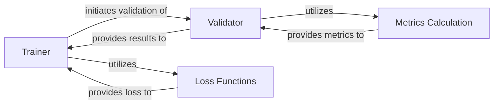

## Details

The Model Training & Evaluation Engine subsystem is responsible for orchestrating the entire model training and validation process, including managing training epochs, optimizing model parameters, calculating loss, and evaluating performance metrics on validation datasets.

### Trainer
Orchestrates the entire training lifecycle, including managing epochs, optimizing model parameters, and coordinating with the validation process. It sets up the training environment, configures the optimizer, and saves training progress.

**Related Classes/Methods**:

- <a href="https://github.com/opendatalab/DocLayout-YOLO/blob/main/doclayout_yolo/engine/trainer.py" target="_blank" rel="noopener noreferrer">`doclayout_yolo.engine.trainer`</a>

### Validator
Evaluates the model's performance on validation datasets. It processes predictions, calculates various metrics, and prepares results for reporting and plotting.

**Related Classes/Methods**:

- <a href="https://github.com/opendatalab/DocLayout-YOLO/blob/main/doclayout_yolo/engine/validator.py" target="_blank" rel="noopener noreferrer">`doclayout_yolo.engine.validator`</a>

### Loss Functions
Provides a collection of loss functions (e.g., detection, rotated bounding box, keypoint, segmentation losses) used to quantify the discrepancy between model predictions and ground truth during training.

**Related Classes/Methods**:

- <a href="https://github.com/opendatalab/DocLayout-YOLO/blob/main/doclayout_yolo/utils/loss.py" target="_blank" rel="noopener noreferrer">`doclayout_yolo.utils.loss`</a>

### Metrics Calculation
Computes and manages a comprehensive set of performance metrics (e.g., mAP, precision, recall) to assess the model's accuracy and effectiveness, and facilitates their plotting and reporting.

**Related Classes/Methods**:

- <a href="https://github.com/opendatalab/DocLayout-YOLO/blob/main/doclayout_yolo/utils/metrics.py" target="_blank" rel="noopener noreferrer">`doclayout_yolo.utils.metrics`</a>

### [FAQ](https://github.com/CodeBoarding/GeneratedOnBoardings/tree/main?tab=readme-ov-file#faq)