```mermaid
graph LR
    Configuration_Management["Configuration Management"]
    Dataset_Management_Preprocessing["Dataset Management & Preprocessing"]
    Model_Definition_Architecture["Model Definition & Architecture"]
    Model_Training_Evaluation_Engine["Model Training & Evaluation Engine"]
    Inference_Post_processing_Engine["Inference & Post-processing Engine"]
    Model_Export_Deployment["Model Export & Deployment"]
    External_Hub_Integration["External Hub Integration"]
    Application_Utility_Modules["Application & Utility Modules"]
    Configuration_Management -- "Provides dataset paths and augmentation parameters" --> Dataset_Management_Preprocessing
    Configuration_Management -- "Supplies hyperparameters and training regimes" --> Model_Training_Evaluation_Engine
    Configuration_Management -- "Delivers inference parameters and model paths" --> Inference_Post_processing_Engine
    Dataset_Management_Preprocessing -- "Supplies augmented training and validation batches" --> Model_Training_Evaluation_Engine
    Dataset_Management_Preprocessing -- "Provides preprocessed images for inference" --> Inference_Post_processing_Engine
    Model_Definition_Architecture -- "Provides the neural network structure for training" --> Model_Training_Evaluation_Engine
    Model_Definition_Architecture -- "Supplies the trained model structure for prediction" --> Inference_Post_processing_Engine
    Model_Training_Evaluation_Engine -- "Updates model weights during training" --> Model_Definition_Architecture
    Model_Training_Evaluation_Engine -- "Provides trained models for conversion" --> Model_Export_Deployment
    Model_Training_Evaluation_Engine -- "Logs training metrics and uploads trained models" --> External_Hub_Integration
    Inference_Post_processing_Engine -- "Outputs structured detection results (e.g., bounding boxes, masks)" --> Application_Utility_Modules
    Inference_Post_processing_Engine -- "Logs inference results or uploads predictions" --> External_Hub_Integration
    click Configuration_Management href "https://github.com/CodeBoarding/GeneratedOnBoardings/blob/main/DocLayout-YOLO/Configuration_Management.md" "Details"
    click Dataset_Management_Preprocessing href "https://github.com/CodeBoarding/GeneratedOnBoardings/blob/main/DocLayout-YOLO/Dataset_Management_Preprocessing.md" "Details"
    click Model_Training_Evaluation_Engine href "https://github.com/CodeBoarding/GeneratedOnBoardings/blob/main/DocLayout-YOLO/Model_Training_Evaluation_Engine.md" "Details"
    click Inference_Post_processing_Engine href "https://github.com/CodeBoarding/GeneratedOnBoardings/blob/main/DocLayout-YOLO/Inference_Post_processing_Engine.md" "Details"
    click Model_Export_Deployment href "https://github.com/CodeBoarding/GeneratedOnBoardings/blob/main/DocLayout-YOLO/Model_Export_Deployment.md" "Details"
    click External_Hub_Integration href "https://github.com/CodeBoarding/GeneratedOnBoardings/blob/main/DocLayout-YOLO/External_Hub_Integration.md" "Details"
```

## Details

The DocLayout-YOLO project implements a robust machine learning pipeline for document layout analysis, centered around its deep learning models. The Configuration Management component initializes the system, directing the Dataset Management & Preprocessing to prepare data. This data, along with the model structures from Model Definition & Architecture, feeds into the Model Training & Evaluation Engine for iterative learning and validation. Post-training, models can be deployed via the Inference & Post-processing Engine for real-world predictions, or optimized for various platforms by the Model Export & Deployment component. External Hub Integration provides seamless interaction with external model repositories, while Application & Utility Modules offer extended functionalities like object tracking and advanced analysis, building upon the core detection capabilities. This modular design ensures clear data flow and facilitates maintainability and extensibility.

### Configuration Management [[Expand]](./Configuration_Management.md)
Centralized module for managing and parsing all project-wide configuration settings, including dataset paths, model hyperparameters, training regimes, and inference parameters.

**Related Classes/Methods**:

- <a href="https://github.com/opendatalab/DocLayout-YOLO/blob/main/doclayout_yolo/cfg/" target="_blank" rel="noopener noreferrer">`doclayout_yolo/cfg/`</a>

### Dataset Management & Preprocessing [[Expand]](./Dataset_Management_Preprocessing.md)
Handles the entire lifecycle of data, from loading and caching to on-the-fly augmentation and format conversion. It ensures data is in the correct format and ready for model consumption.

**Related Classes/Methods**:

- <a href="https://github.com/opendatalab/DocLayout-YOLO/blob/main/doclayout_yolo/data/" target="_blank" rel="noopener noreferrer">`doclayout_yolo/data/`</a>

### Model Definition & Architecture
Defines the foundational neural network building blocks (e.g., convolutions, attention mechanisms, custom layers) and composes them into specific model architectures (e.g., YOLOv10, SAM, RT-DETR).

**Related Classes/Methods**:

- <a href="https://github.com/opendatalab/DocLayout-YOLO/blob/main/doclayout_yolo/nn/modules/" target="_blank" rel="noopener noreferrer">`doclayout_yolo/nn/modules/`</a>
- <a href="https://github.com/opendatalab/DocLayout-YOLO/blob/main/doclayout_yolo/models/" target="_blank" rel="noopener noreferrer">`doclayout_yolo/models/`</a>

### Model Training & Evaluation Engine [[Expand]](./Model_Training_Evaluation_Engine.md)
Orchestrates the entire model training and validation process. This includes managing training epochs, optimizing model parameters, calculating loss, and evaluating performance metrics on validation datasets.

**Related Classes/Methods**:

- <a href="https://github.com/opendatalab/DocLayout-YOLO/blob/main/doclayout_yolo/engine/trainer.py" target="_blank" rel="noopener noreferrer">`doclayout_yolo/engine/trainer.py`</a>
- <a href="https://github.com/opendatalab/DocLayout-YOLO/blob/main/doclayout_yolo/engine/validator.py" target="_blank" rel="noopener noreferrer">`doclayout_yolo/engine/validator.py`</a>
- <a href="https://github.com/opendatalab/DocLayout-YOLO/blob/main/doclayout_yolo/utils/loss.py" target="_blank" rel="noopener noreferrer">`doclayout_yolo/utils/loss.py`</a>
- <a href="https://github.com/opendatalab/DocLayout-YOLO/blob/main/doclayout_yolo/utils/metrics.py" target="_blank" rel="noopener noreferrer">`doclayout_yolo.utils.metrics.py`</a>

### Inference & Post-processing Engine [[Expand]](./Inference_Post_processing_Engine.md)
Manages the end-to-end inference pipeline. It takes raw inputs, preprocesses them, executes the trained model, and then post-processes the raw model outputs into structured, usable results (e.g., bounding boxes, masks, keypoints).

**Related Classes/Methods**:

- <a href="https://github.com/opendatalab/DocLayout-YOLO/blob/main/doclayout_yolo/engine/predictor.py" target="_blank" rel="noopener noreferrer">`doclayout_yolo/engine/predictor.py`</a>
- <a href="https://github.com/opendatalab/DocLayout-YOLO/blob/main/doclayout_yolo/engine/results.py" target="_blank" rel="noopener noreferrer">`doclayout_yolo/engine/results.py`</a>

### Model Export & Deployment [[Expand]](./Model_Export_Deployment.md)
Facilitates the conversion of trained models into various deployment-ready formats (e.g., ONNX, OpenVINO, TFLite, CoreML), enabling efficient deployment across different platforms.

**Related Classes/Methods**:

- <a href="https://github.com/opendatalab/DocLayout-YOLO/blob/main/doclayout_yolo/engine/exporter.py" target="_blank" rel="noopener noreferrer">`doclayout_yolo/engine/exporter.py`</a>

### External Hub Integration [[Expand]](./External_Hub_Integration.md)
Manages interactions with external model hubs (e.g., Hugging Face Hub). This includes authentication, loading pre-trained models, and uploading trained models or metrics.

**Related Classes/Methods**:

- <a href="https://github.com/opendatalab/DocLayout-YOLO/blob/main/doclayout_yolo/hub/" target="_blank" rel="noopener noreferrer">`doclayout_yolo/hub/`</a>

### Application & Utility Modules
Provides higher-level computer vision applications and general utilities built upon the core detection and segmentation capabilities. This includes object tracking, distance calculation, heatmap generation, and object counting.

**Related Classes/Methods**:

- <a href="https://github.com/opendatalab/DocLayout-YOLO/blob/main/doclayout_yolo/trackers/" target="_blank" rel="noopener noreferrer">`doclayout_yolo/trackers/`</a>
- <a href="https://github.com/opendatalab/DocLayout-YOLO/blob/main/doclayout_yolo/solutions/" target="_blank" rel="noopener noreferrer">`doclayout_yolo/solutions/`</a>

### [FAQ](https://github.com/CodeBoarding/GeneratedOnBoardings/tree/main?tab=readme-ov-file#faq)