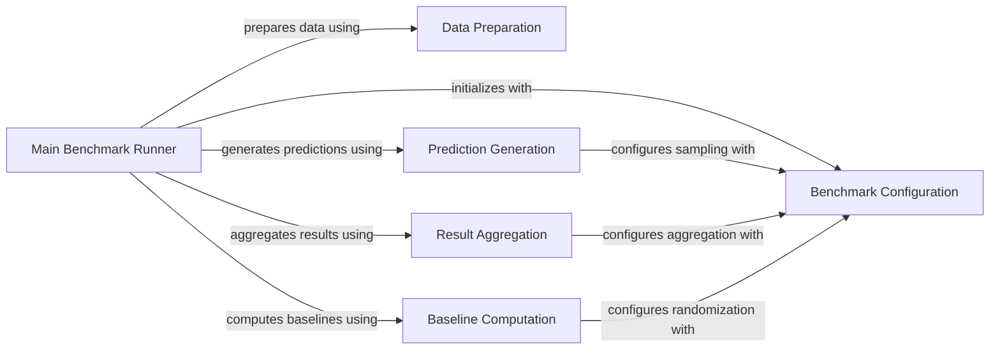

## Component Details

This subsystem provides the foundational framework for benchmarking, encompassing configuration settings, ground truth data loading, and essential utilities for computing similarities and processing predictions across various benchmarks. The main flow involves the 'Main Benchmark Runner' orchestrating the entire process, from data preparation and prediction generation to baseline computation and result aggregation, all guided by the 'Benchmark Configuration'.

### Main Benchmark Runner
This component orchestrates the entire compound-gene benchmarking workflow, coordinating data loading, similarity computation, prediction processing, baseline generation, and final result aggregation.

**Related Classes/Methods**:

- <a href="https://github.com/recursionpharma/EFAAR_benchmarking/blob/master/efaar_benchmarking/benchmarking.py#L884-L934" target="_blank" rel="noopener noreferrer">`EFAAR_benchmarking.efaar_benchmarking.benchmarking.compound_gene_benchmark` (884:934)</a>

### Data Preparation
Responsible for loading the ground truth interaction data and calculating the cosine similarities between compounds and genes based on their features.

**Related Classes/Methods**:

- <a href="https://github.com/recursionpharma/EFAAR_benchmarking/blob/master/efaar_benchmarking/benchmarking.py#L596-L606" target="_blank" rel="noopener noreferrer">`EFAAR_benchmarking.efaar_benchmarking.benchmarking.load_truth_data` (596:606)</a>
- <a href="https://github.com/recursionpharma/EFAAR_benchmarking/blob/master/efaar_benchmarking/benchmarking.py#L609-L649" target="_blank" rel="noopener noreferrer">`EFAAR_benchmarking.efaar_benchmarking.benchmarking.compute_similarities` (609:649)</a>

### Prediction Generation
Handles the transformation of raw similarity data into structured predictions by sampling relevant positive and negative examples for each item based on defined activity thresholds.

**Related Classes/Methods**:

- <a href="https://github.com/recursionpharma/EFAAR_benchmarking/blob/master/efaar_benchmarking/benchmarking.py#L798-L881" target="_blank" rel="noopener noreferrer">`EFAAR_benchmarking.efaar_benchmarking.benchmarking.process_predictions` (798:881)</a>
- <a href="https://github.com/recursionpharma/EFAAR_benchmarking/blob/master/efaar_benchmarking/benchmarking.py#L752-L795" target="_blank" rel="noopener noreferrer">`EFAAR_benchmarking.efaar_benchmarking.benchmarking.sample_for_item` (752:795)</a>

### Result Aggregation
Aggregates the processed predictions and computes performance metrics such as Average Precision (AP) and AUC-ROC, providing a summary of the benchmarking results.

**Related Classes/Methods**:

- <a href="https://github.com/recursionpharma/EFAAR_benchmarking/blob/master/efaar_benchmarking/benchmarking.py#L676-L731" target="_blank" rel="noopener noreferrer">`EFAAR_benchmarking.efaar_benchmarking.benchmarking.aggregate_predictions` (676:731)</a>
- <a href="https://github.com/recursionpharma/EFAAR_benchmarking/blob/master/efaar_benchmarking/benchmarking.py#L734-L749" target="_blank" rel="noopener noreferrer">`EFAAR_benchmarking.efaar_benchmarking.benchmarking.compute_ap_auc` (734:749)</a>
- <a href="https://github.com/recursionpharma/EFAAR_benchmarking/blob/master/efaar_benchmarking/benchmarking.py#L308-L321" target="_blank" rel="noopener noreferrer">`EFAAR_benchmarking.efaar_benchmarking.benchmarking.convert_metrics_to_df` (308:321)</a>

### Baseline Computation
Generates a set of baseline predictions by randomizing scores for the same true labels, serving as a reference for evaluating the significance of the actual model's performance.

**Related Classes/Methods**:

- <a href="https://github.com/recursionpharma/EFAAR_benchmarking/blob/master/efaar_benchmarking/benchmarking.py#L652-L673" target="_blank" rel="noopener noreferrer">`EFAAR_benchmarking.efaar_benchmarking.benchmarking.compute_baseline_predictions` (652:673)</a>

### Benchmark Configuration
Defines and manages the various parameters and settings that control the behavior and methodology of the benchmarking process, including aggregation types and random seeds.

**Related Classes/Methods**:

- <a href="https://github.com/recursionpharma/EFAAR_benchmarking/blob/master/efaar_benchmarking/benchmarking.py#L40-L60" target="_blank" rel="noopener noreferrer">`EFAAR_benchmarking.efaar_benchmarking.benchmarking.BenchmarkConfig` (40:60)</a>

### [FAQ](https://github.com/CodeBoarding/GeneratedOnBoardings/tree/main?tab=readme-ov-file#faq)