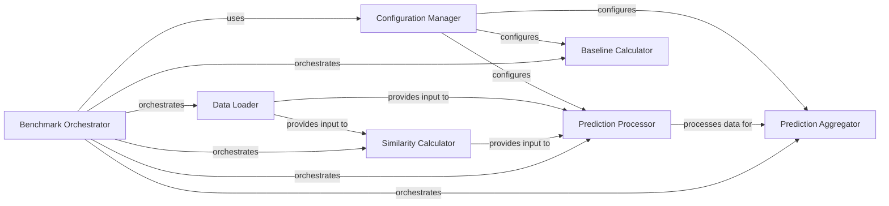

## Component Details

This graph illustrates the architecture of the Compound-Gene Interaction Benchmarking subsystem. The central component, 'Benchmark Orchestrator', manages the entire benchmarking workflow, from loading truth data and computing similarities to processing predictions, calculating baselines, and aggregating results. It interacts with specialized components like 'Data Loader' for data ingestion, 'Similarity Calculator' for generating interaction scores, 'Prediction Processor' for structuring raw predictions, 'Baseline Calculator' for establishing reference performance, and 'Prediction Aggregator' for computing final metrics. The 'Configuration Manager' provides essential settings across various stages, ensuring consistent and controlled execution of the benchmarking process.

### Benchmark Orchestrator
The central component responsible for orchestrating the entire benchmarking process. It loads truth data, computes similarities, processes predictions, computes baseline predictions, and aggregates the final results. This component acts as the main entry point for running the compound-gene benchmark.

**Related Classes/Methods**:

- <a href="https://github.com/recursionpharma/EFAAR_benchmarking/blob/master/efaar_benchmarking/benchmarking.py#L884-L934" target="_blank" rel="noopener noreferrer">`EFAAR_benchmarking.efaar_benchmarking.benchmarking.compound_gene_benchmark` (884:934)</a>

### Prediction Processor
This component handles the processing of raw similarity data into a structured format suitable for aggregation. It samples data for individual items (compounds or genes) based on activity and inactivity thresholds and organizes scores by concentration levels, including a 'max' concentration for aggregated scores.

**Related Classes/Methods**:

- <a href="https://github.com/recursionpharma/EFAAR_benchmarking/blob/master/efaar_benchmarking/benchmarking.py#L798-L881" target="_blank" rel="noopener noreferrer">`EFAAR_benchmarking.efaar_benchmarking.benchmarking.process_predictions` (798:881)</a>
- <a href="https://github.com/recursionpharma/EFAAR_benchmarking/blob/master/efaar_benchmarking/benchmarking.py#L752-L795" target="_blank" rel="noopener noreferrer">`EFAAR_benchmarking.efaar_benchmarking.benchmarking.sample_for_item` (752:795)</a>

### Prediction Aggregator
Responsible for aggregating the processed predictions and computing performance metrics like Average Precision (AP) and Area Under the Curve (AUC). It takes the structured prediction data and consolidates it into meaningful results.

**Related Classes/Methods**:

- <a href="https://github.com/recursionpharma/EFAAR_benchmarking/blob/master/efaar_benchmarking/benchmarking.py#L676-L731" target="_blank" rel="noopener noreferrer">`EFAAR_benchmarking.efaar_benchmarking.benchmarking.aggregate_predictions` (676:731)</a>
- <a href="https://github.com/recursionpharma/EFAAR_benchmarking/blob/master/efaar_benchmarking/benchmarking.py#L734-L749" target="_blank" rel="noopener noreferrer">`EFAAR_benchmarking.efaar_benchmarking.benchmarking.compute_ap_auc` (734:749)</a>

### Data Loader
This component is responsible for loading the ground truth data required for the benchmarking process. It ensures that the necessary reference data is available for comparison with predictions.

**Related Classes/Methods**:

- <a href="https://github.com/recursionpharma/EFAAR_benchmarking/blob/master/efaar_benchmarking/benchmarking.py#L596-L606" target="_blank" rel="noopener noreferrer">`EFAAR_benchmarking.efaar_benchmarking.benchmarking.load_truth_data` (596:606)</a>

### Similarity Calculator
This component computes the similarities between compounds and genes, which are crucial for generating predictions. It takes truth data and map data as input to derive these similarity scores.

**Related Classes/Methods**:

- <a href="https://github.com/recursionpharma/EFAAR_benchmarking/blob/master/efaar_benchmarking/benchmarking.py#L609-L649" target="_blank" rel="noopener noreferrer">`EFAAR_benchmarking.efaar_benchmarking.benchmarking.compute_similarities` (609:649)</a>

### Baseline Calculator
This component is responsible for computing baseline predictions, which are used as a reference point to evaluate the performance of the actual predictions. It helps in understanding the significance of the model's performance.

**Related Classes/Methods**:

- <a href="https://github.com/recursionpharma/EFAAR_benchmarking/blob/master/efaar_benchmarking/benchmarking.py#L652-L673" target="_blank" rel="noopener noreferrer">`EFAAR_benchmarking.efaar_benchmarking.benchmarking.compute_baseline_predictions` (652:673)</a>

### Configuration Manager
Manages and provides the configuration settings for the benchmarking process. It ensures that various parameters and options are consistently applied throughout the different stages of the benchmark.

**Related Classes/Methods**:

- <a href="https://github.com/recursionpharma/EFAAR_benchmarking/blob/master/efaar_benchmarking/benchmarking.py#L40-L60" target="_blank" rel="noopener noreferrer">`EFAAR_benchmarking.efaar_benchmarking.benchmarking.BenchmarkConfig` (40:60)</a>

### [FAQ](https://github.com/CodeBoarding/GeneratedOnBoardings/tree/main?tab=readme-ov-file#faq)