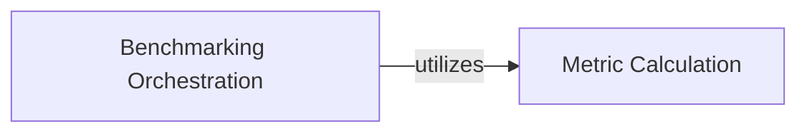

## Component Details

The Perturbation Signal Benchmarking subsystem evaluates the consistency and magnitude of perturbation signals within transformed data. It orchestrates the benchmarking process by preparing data, filtering, and performing parallel computations for both consistency and magnitude metrics. The core purpose is to calculate metrics like average cosine similarity and energy distance, often against a null distribution, to assess the quality of perturbation signals.

### Benchmarking Orchestration
This component is responsible for orchestrating the entire benchmarking process. It handles data preparation, filtering of perturbations, and parallel execution of metric calculations for both consistency and magnitude benchmarks. It also manages the generation and use of null distributions for p-value calculations.

**Related Classes/Methods**:

- <a href="https://github.com/recursionpharma/EFAAR_benchmarking/blob/master/efaar_benchmarking/benchmarking.py#L96-L140" target="_blank" rel="noopener noreferrer">`EFAAR_benchmarking.efaar_benchmarking.benchmarking.pert_signal_consistency_benchmark` (96:140)</a>
- <a href="https://github.com/recursionpharma/EFAAR_benchmarking/blob/master/efaar_benchmarking/benchmarking.py#L173-L230" target="_blank" rel="noopener noreferrer">`EFAAR_benchmarking.efaar_benchmarking.benchmarking.pert_signal_magnitude_benchmark` (173:230)</a>

### Metric Calculation
This component provides the fundamental functions for computing specific benchmarking metrics. It includes methods for calculating perturbation signal consistency (average cosine similarity) and perturbation signal magnitude (energy distance), along with their corresponding p-values against a provided null distribution. It handles edge cases such as insufficient input data.

**Related Classes/Methods**:

- <a href="https://github.com/recursionpharma/EFAAR_benchmarking/blob/master/efaar_benchmarking/benchmarking.py#L63-L93" target="_blank" rel="noopener noreferrer">`EFAAR_benchmarking.efaar_benchmarking.benchmarking.pert_signal_consistency_metric` (63:93)</a>
- <a href="https://github.com/recursionpharma/EFAAR_benchmarking/blob/master/efaar_benchmarking/benchmarking.py#L143-L170" target="_blank" rel="noopener noreferrer">`EFAAR_benchmarking.efaar_benchmarking.benchmarking.pert_signal_magnitude_metric` (143:170)</a>

### [FAQ](https://github.com/CodeBoarding/GeneratedOnBoardings/tree/main?tab=readme-ov-file#faq)