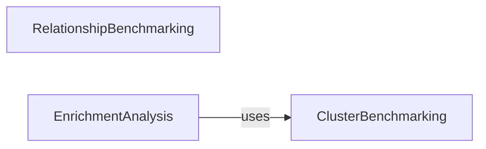

## Component Details

This subsystem focuses on benchmarking biological relationships and clusters. It includes components for retrieving and filtering known relationships, computing recall, and performing enrichment analysis on biological clusters. The main flow involves fetching benchmark data, processing it to identify relationships or clusters, and then evaluating performance metrics or conducting enrichment analysis.

### RelationshipBenchmarking
This component is responsible for performing benchmarking on aggregated map data against known biological relationships. It involves retrieving, filtering, and computing recall metrics for these relationships.

**Related Classes/Methods**:

- <a href="https://github.com/recursionpharma/EFAAR_benchmarking/blob/master/efaar_benchmarking/benchmarking.py#L252-L265" target="_blank" rel="noopener noreferrer">`efaar_benchmarking.benchmarking.get_benchmark_relationships` (252:265)</a>
- <a href="https://github.com/recursionpharma/EFAAR_benchmarking/blob/master/efaar_benchmarking/benchmarking.py#L233-L249" target="_blank" rel="noopener noreferrer">`efaar_benchmarking.benchmarking.filter_relationships` (233:249)</a>
- <a href="https://github.com/recursionpharma/EFAAR_benchmarking/blob/master/efaar_benchmarking/benchmarking.py#L324-L378" target="_blank" rel="noopener noreferrer">`efaar_benchmarking.benchmarking.known_relationship_benchmark` (324:378)</a>
- <a href="https://github.com/recursionpharma/EFAAR_benchmarking/blob/master/efaar_benchmarking/benchmarking.py#L268-L305" target="_blank" rel="noopener noreferrer">`efaar_benchmarking.benchmarking.compute_recall` (268:305)</a>
- <a href="https://github.com/recursionpharma/EFAAR_benchmarking/blob/master/efaar_benchmarking/benchmarking.py#L308-L321" target="_blank" rel="noopener noreferrer">`efaar_benchmarking.benchmarking.convert_metrics_to_df` (308:321)</a>

### ClusterBenchmarking
This component handles benchmarking related to biological clusters. It retrieves and processes benchmark clusters for performance evaluation.

**Related Classes/Methods**:

- <a href="https://github.com/recursionpharma/EFAAR_benchmarking/blob/master/efaar_benchmarking/benchmarking.py#L421-L484" target="_blank" rel="noopener noreferrer">`efaar_benchmarking.benchmarking.cluster_benchmark` (421:484)</a>
- <a href="https://github.com/recursionpharma/EFAAR_benchmarking/blob/master/efaar_benchmarking/benchmarking.py#L381-L418" target="_blank" rel="noopener noreferrer">`efaar_benchmarking.benchmarking.get_benchmark_clusters` (381:418)</a>

### EnrichmentAnalysis
This component performs enrichment analysis, utilizing benchmark clusters to identify enriched biological terms or pathways.

**Related Classes/Methods**:

- <a href="https://github.com/recursionpharma/EFAAR_benchmarking/blob/master/efaar_benchmarking/benchmarking.py#L487-L526" target="_blank" rel="noopener noreferrer">`efaar_benchmarking.benchmarking.enrichment` (487:526)</a>
- <a href="https://github.com/recursionpharma/EFAAR_benchmarking/blob/master/efaar_benchmarking/benchmarking.py#L381-L418" target="_blank" rel="noopener noreferrer">`efaar_benchmarking.benchmarking.get_benchmark_clusters` (381:418)</a>

### [FAQ](https://github.com/CodeBoarding/GeneratedOnBoardings/tree/main?tab=readme-ov-file#faq)