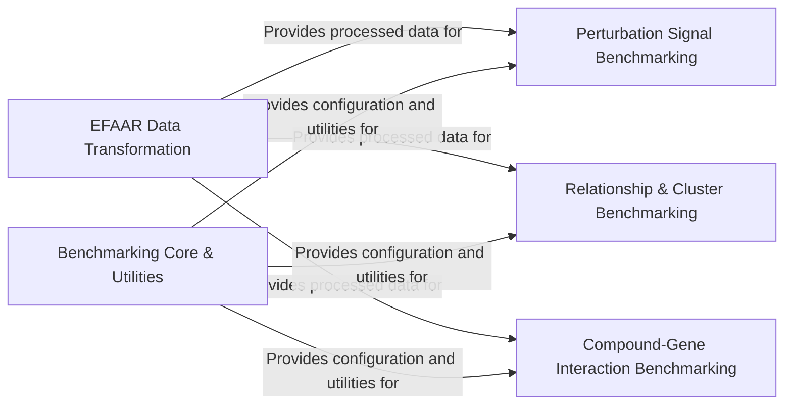

## Component Details

This architecture describes the `EFAAR_benchmarking` project, which focuses on evaluating the performance of the EFAAR method for analyzing biological perturbations. The main flow involves transforming raw biological data using various normalization and dimensionality reduction techniques, followed by comprehensive benchmarking against different criteria such as perturbation signal consistency, known biological relationships, cluster enrichment, and compound-gene interactions. A core utility component supports all benchmarking activities by providing configuration, truth data loading, and common computational functions.

### EFAAR Data Transformation
Handles core data processing steps of the EFAAR method, including dimensionality reduction using PCA and various normalization techniques (batch, control-based scaling/centering, TVN) to prepare raw biological data for downstream analysis.

**Related Classes/Methods**:

- <a href="https://github.com/recursionpharma/EFAAR_benchmarking/blob/master/efaar_benchmarking/efaar.py#L30-L47" target="_blank" rel="noopener noreferrer">`EFAAR_benchmarking.efaar_benchmarking.efaar.embed_by_pca_anndata` (30:47)</a>
- <a href="https://github.com/recursionpharma/EFAAR_benchmarking/blob/master/efaar_benchmarking/efaar.py#L78-L104" target="_blank" rel="noopener noreferrer">`EFAAR_benchmarking.efaar_benchmarking.efaar.embed_by_pca` (78:104)</a>
- <a href="https://github.com/recursionpharma/EFAAR_benchmarking/blob/master/efaar_benchmarking/efaar.py#L50-L75" target="_blank" rel="noopener noreferrer">`EFAAR_benchmarking.efaar_benchmarking.efaar.centerscale_by_batch` (50:75)</a>
- <a href="https://github.com/recursionpharma/EFAAR_benchmarking/blob/master/efaar_benchmarking/efaar.py#L141-L167" target="_blank" rel="noopener noreferrer">`EFAAR_benchmarking.efaar_benchmarking.efaar.pca_centerscale_on_controls` (141:167)</a>
- <a href="https://github.com/recursionpharma/EFAAR_benchmarking/blob/master/efaar_benchmarking/efaar.py#L107-L138" target="_blank" rel="noopener noreferrer">`EFAAR_benchmarking.efaar_benchmarking.efaar.centerscale_on_controls` (107:138)</a>
- <a href="https://github.com/recursionpharma/EFAAR_benchmarking/blob/master/efaar_benchmarking/efaar.py#L170-L206" target="_blank" rel="noopener noreferrer">`EFAAR_benchmarking.efaar_benchmarking.efaar.tvn_on_controls` (170:206)</a>

### Benchmarking Core & Utilities
Provides the foundational framework for benchmarking, including configuration settings, loading ground truth data, and general utilities for computing similarities and processing predictions across various benchmarks.

**Related Classes/Methods**:

- <a href="https://github.com/recursionpharma/EFAAR_benchmarking/blob/master/efaar_benchmarking/benchmarking.py#L40-L60" target="_blank" rel="noopener noreferrer">`EFAAR_benchmarking.efaar_benchmarking.benchmarking.BenchmarkConfig` (40:60)</a>
- <a href="https://github.com/recursionpharma/EFAAR_benchmarking/blob/master/efaar_benchmarking/benchmarking.py#L596-L606" target="_blank" rel="noopener noreferrer">`EFAAR_benchmarking.efaar_benchmarking.benchmarking.load_truth_data` (596:606)</a>
- <a href="https://github.com/recursionpharma/EFAAR_benchmarking/blob/master/efaar_benchmarking/benchmarking.py#L609-L649" target="_blank" rel="noopener noreferrer">`EFAAR_benchmarking.efaar_benchmarking.benchmarking.compute_similarities` (609:649)</a>
- <a href="https://github.com/recursionpharma/EFAAR_benchmarking/blob/master/efaar_benchmarking/benchmarking.py#L308-L321" target="_blank" rel="noopener noreferrer">`EFAAR_benchmarking.efaar_benchmarking.benchmarking.convert_metrics_to_df` (308:321)</a>
- <a href="https://github.com/recursionpharma/EFAAR_benchmarking/blob/master/efaar_benchmarking/benchmarking.py#L676-L731" target="_blank" rel="noopener noreferrer">`EFAAR_benchmarking.efaar_benchmarking.benchmarking.aggregate_predictions` (676:731)</a>
- <a href="https://github.com/recursionpharma/EFAAR_benchmarking/blob/master/efaar_benchmarking/benchmarking.py#L798-L881" target="_blank" rel="noopener noreferrer">`EFAAR_benchmarking.efaar_benchmarking.benchmarking.process_predictions` (798:881)</a>
- <a href="https://github.com/recursionpharma/EFAAR_benchmarking/blob/master/efaar_benchmarking/benchmarking.py#L652-L673" target="_blank" rel="noopener noreferrer">`EFAAR_benchmarking.efaar_benchmarking.benchmarking.compute_baseline_predictions` (652:673)</a>

### Perturbation Signal Benchmarking
Evaluates the consistency and magnitude of perturbation signals within the transformed data, calculating metrics like average cosine similarity and energy distance, often against a null distribution.

**Related Classes/Methods**:

- <a href="https://github.com/recursionpharma/EFAAR_benchmarking/blob/master/efaar_benchmarking/benchmarking.py#L96-L140" target="_blank" rel="noopener noreferrer">`EFAAR_benchmarking.efaar_benchmarking.benchmarking.pert_signal_consistency_benchmark` (96:140)</a>
- <a href="https://github.com/recursionpharma/EFAAR_benchmarking/blob/master/efaar_benchmarking/benchmarking.py#L63-L93" target="_blank" rel="noopener noreferrer">`EFAAR_benchmarking.efaar_benchmarking.benchmarking.pert_signal_consistency_metric` (63:93)</a>
- <a href="https://github.com/recursionpharma/EFAAR_benchmarking/blob/master/efaar_benchmarking/benchmarking.py#L173-L230" target="_blank" rel="noopener noreferrer">`EFAAR_benchmarking.efaar_benchmarking.benchmarking.pert_signal_magnitude_benchmark` (173:230)</a>
- <a href="https://github.com/recursionpharma/EFAAR_benchmarking/blob/master/efaar_benchmarking/benchmarking.py#L143-L170" target="_blank" rel="noopener noreferrer">`EFAAR_benchmarking.efaar_benchmarking.benchmarking.pert_signal_magnitude_metric` (143:170)</a>

### Relationship & Cluster Benchmarking
Assesses the recall of known biological relationships (e.g., compound-compound, gene-gene interactions) and evaluates performance based on known biological clusters of perturbations, including enrichment analysis.

**Related Classes/Methods**:

- <a href="https://github.com/recursionpharma/EFAAR_benchmarking/blob/master/efaar_benchmarking/benchmarking.py#L252-L265" target="_blank" rel="noopener noreferrer">`EFAAR_benchmarking.efaar_benchmarking.benchmarking.get_benchmark_relationships` (252:265)</a>
- <a href="https://github.com/recursionpharma/EFAAR_benchmarking/blob/master/efaar_benchmarking/benchmarking.py#L233-L249" target="_blank" rel="noopener noreferrer">`EFAAR_benchmarking.efaar_benchmarking.benchmarking.filter_relationships` (233:249)</a>
- <a href="https://github.com/recursionpharma/EFAAR_benchmarking/blob/master/efaar_benchmarking/benchmarking.py#L324-L378" target="_blank" rel="noopener noreferrer">`EFAAR_benchmarking.efaar_benchmarking.benchmarking.known_relationship_benchmark` (324:378)</a>
- <a href="https://github.com/recursionpharma/EFAAR_benchmarking/blob/master/efaar_benchmarking/benchmarking.py#L268-L305" target="_blank" rel="noopener noreferrer">`EFAAR_benchmarking.efaar_benchmarking.benchmarking.compute_recall` (268:305)</a>
- <a href="https://github.com/recursionpharma/EFAAR_benchmarking/blob/master/efaar_benchmarking/benchmarking.py#L421-L484" target="_blank" rel="noopener noreferrer">`EFAAR_benchmarking.efaar_benchmarking.benchmarking.cluster_benchmark` (421:484)</a>
- <a href="https://github.com/recursionpharma/EFAAR_benchmarking/blob/master/efaar_benchmarking/benchmarking.py#L381-L418" target="_blank" rel="noopener noreferrer">`EFAAR_benchmarking.efaar_benchmarking.benchmarking.get_benchmark_clusters` (381:418)</a>
- <a href="https://github.com/recursionpharma/EFAAR_benchmarking/blob/master/efaar_benchmarking/benchmarking.py#L487-L526" target="_blank" rel="noopener noreferrer">`EFAAR_benchmarking.efaar_benchmarking.benchmarking.enrichment` (487:526)</a>

### Compound-Gene Interaction Benchmarking
Manages the end-to-end process of predicting and evaluating compound-gene interactions, including processing predictions, sampling for items, computing average precision and AUC-ROC, and generating baseline predictions for comparison.

**Related Classes/Methods**:

- <a href="https://github.com/recursionpharma/EFAAR_benchmarking/blob/master/efaar_benchmarking/benchmarking.py#L752-L795" target="_blank" rel="noopener noreferrer">`EFAAR_benchmarking.efaar_benchmarking.benchmarking.sample_for_item` (752:795)</a>
- <a href="https://github.com/recursionpharma/EFAAR_benchmarking/blob/master/efaar_benchmarking/benchmarking.py#L734-L749" target="_blank" rel="noopener noreferrer">`EFAAR_benchmarking.efaar_benchmarking.benchmarking.compute_ap_auc` (734:749)</a>
- <a href="https://github.com/recursionpharma/EFAAR_benchmarking/blob/master/efaar_benchmarking/benchmarking.py#L884-L934" target="_blank" rel="noopener noreferrer">`EFAAR_benchmarking.efaar_benchmarking.benchmarking.compound_gene_benchmark` (884:934)</a>

### [FAQ](https://github.com/CodeBoarding/GeneratedOnBoardings/tree/main?tab=readme-ov-file#faq)