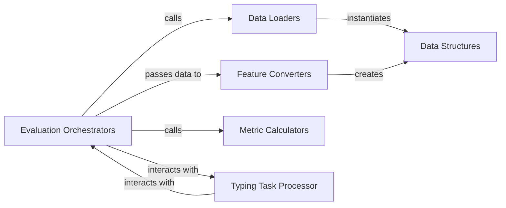

## Details

The `Evaluation & Metrics` subsystem provides a comprehensive framework for assessing model performance on various NLP benchmarks. It encompasses the entire evaluation lifecycle, from data loading and feature conversion to model inference and metric computation.

### Evaluation Orchestrators
These components serve as the main entry points for initiating and managing the evaluation process for specific NLP tasks (e.g., FewRel, FIGER, TACRED, Typing). They coordinate the overall data flow, model execution, and metric computation.

**Related Classes/Methods**:

- <a href="https://github.com/thunlp/ERNIE/blob/master/code/eval_fewrel.py#L298-L531" target="_blank" rel="noopener noreferrer">`code.eval_fewrel.main`:298-531</a>
- <a href="https://github.com/thunlp/ERNIE/blob/master/code/eval_figer.py#L316-L577" target="_blank" rel="noopener noreferrer">`code.eval_figer.main`:316-577</a>
- <a href="https://github.com/thunlp/ERNIE/blob/master/code/eval_tacred.py#L339-L594" target="_blank" rel="noopener noreferrer">`code.eval_tacred.main`:339-594</a>
- <a href="https://github.com/thunlp/ERNIE/blob/master/code/eval_typing.py#L316-L571" target="_blank" rel="noopener noreferrer">`code.eval_typing.main`:316-571</a>

### Data Loaders
Responsible for ingesting raw dataset examples from files (e.g., JSON) and structuring them into standardized `InputExample` objects. They abstract the specifics of data reading from the evaluation logic.

**Related Classes/Methods**:

- <a href="https://github.com/thunlp/ERNIE/blob/master/code/eval_fewrel.py#L101-L106" target="_blank" rel="noopener noreferrer">`code.eval_fewrel.get_train_examples`:101-106</a>
- <a href="https://github.com/thunlp/ERNIE/blob/master/code/eval_fewrel.py#L108-L111" target="_blank" rel="noopener noreferrer">`code.eval_fewrel.get_dev_examples`:108-111</a>
- <a href="https://github.com/thunlp/ERNIE/blob/master/code/eval_fewrel.py#L113-L116" target="_blank" rel="noopener noreferrer">`code.eval_fewrel.get_test_examples`:113-116</a>
- <a href="https://github.com/thunlp/ERNIE/blob/master/code/eval_fewrel.py#L93-L96" target="_blank" rel="noopener noreferrer">`code.eval_fewrel._read_json`:93-96</a>
- <a href="https://github.com/thunlp/ERNIE/blob/master/code/eval_fewrel.py#L123-L136" target="_blank" rel="noopener noreferrer">`code.eval_fewrel._create_examples`:123-136</a>
- <a href="https://github.com/thunlp/ERNIE/blob/master/code/eval_figer.py#L104-L118" target="_blank" rel="noopener noreferrer">`code.eval_figer.get_train_examples`:104-118</a>
- <a href="https://github.com/thunlp/ERNIE/blob/master/code/eval_figer.py#L120-L123" target="_blank" rel="noopener noreferrer">`code.eval_figer.get_dev_examples`:120-123</a>
- <a href="https://github.com/thunlp/ERNIE/blob/master/code/eval_figer.py#L124-L127" target="_blank" rel="noopener noreferrer">`code.eval_figer.get_test_examples`:124-127</a>
- <a href="https://github.com/thunlp/ERNIE/blob/master/code/eval_figer.py#L95-L98" target="_blank" rel="noopener noreferrer">`code.eval_figer._read_json`:95-98</a>
- <a href="https://github.com/thunlp/ERNIE/blob/master/code/eval_figer.py#L140-L152" target="_blank" rel="noopener noreferrer">`code.eval_figer._create_examples`:140-152</a>
- <a href="https://github.com/thunlp/ERNIE/blob/master/code/eval_tacred.py#L103-L108" target="_blank" rel="noopener noreferrer">`code.eval_tacred.get_train_examples`:103-108</a>
- <a href="https://github.com/thunlp/ERNIE/blob/master/code/eval_tacred.py#L110-L113" target="_blank" rel="noopener noreferrer">`code.eval_tacred.get_dev_examples`:110-113</a>
- <a href="https://github.com/thunlp/ERNIE/blob/master/code/eval_tacred.py#L115-L118" target="_blank" rel="noopener noreferrer">`code.eval_tacred.get_test_examples`:115-118</a>
- <a href="https://github.com/thunlp/ERNIE/blob/master/code/eval_tacred.py#L94-L97" target="_blank" rel="noopener noreferrer">`code.eval_tacred._read_json`:94-97</a>
- <a href="https://github.com/thunlp/ERNIE/blob/master/code/eval_tacred.py#L124-L137" target="_blank" rel="noopener noreferrer">`code.eval_tacred._create_examples`:124-137</a>
- <a href="https://github.com/thunlp/ERNIE/blob/master/code/eval_typing.py#L104-L118" target="_blank" rel="noopener noreferrer">`code.eval_typing.get_train_examples`:104-118</a>
- <a href="https://github.com/thunlp/ERNIE/blob/master/code/eval_typing.py#L120-L123" target="_blank" rel="noopener noreferrer">`code.eval_typing.get_dev_examples`:120-123</a>
- <a href="https://github.com/thunlp/ERNIE/blob/master/code/eval_typing.py#L124-L127" target="_blank" rel="noopener noreferrer">`code.eval_typing.get_test_examples`:124-127</a>
- <a href="https://github.com/thunlp/ERNIE/blob/master/code/eval_typing.py#L95-L98" target="_blank" rel="noopener noreferrer">`code.eval_typing._read_json`:95-98</a>
- <a href="https://github.com/thunlp/ERNIE/blob/master/code/eval_typing.py#L140-L152" target="_blank" rel="noopener noreferrer">`code.eval_typing._create_examples`:140-152</a>

### Feature Converters
Transform raw `InputExample` objects into numerical `InputFeatures` that are suitable for input to a machine learning model. This includes tasks like tokenization, sequence truncation, and mapping labels to IDs.

**Related Classes/Methods**:

- <a href="https://github.com/thunlp/ERNIE/blob/master/code/eval_fewrel.py#L139-L268" target="_blank" rel="noopener noreferrer">`code.eval_fewrel.convert_examples_to_features`:139-268</a>
- <a href="https://github.com/thunlp/ERNIE/blob/master/code/eval_fewrel.py#L271-L287" target="_blank" rel="noopener noreferrer">`code.eval_fewrel._truncate_seq_pair`:271-287</a>
- <a href="https://github.com/thunlp/ERNIE/blob/master/code/eval_figer.py#L155-L272" target="_blank" rel="noopener noreferrer">`code.eval_figer.convert_examples_to_features`:155-272</a>
- <a href="https://github.com/thunlp/ERNIE/blob/master/code/eval_figer.py#L275-L291" target="_blank" rel="noopener noreferrer">`code.eval_figer._truncate_seq_pair`:275-291</a>
- <a href="https://github.com/thunlp/ERNIE/blob/master/code/eval_tacred.py#L140-L277" target="_blank" rel="noopener noreferrer">`code.eval_tacred.convert_examples_to_features`:140-277</a>
- <a href="https://github.com/thunlp/ERNIE/blob/master/code/eval_tacred.py#L280-L296" target="_blank" rel="noopener noreferrer">`code.eval_tacred._truncate_seq_pair`:280-296</a>
- <a href="https://github.com/thunlp/ERNIE/blob/master/code/eval_typing.py#L155-L272" target="_blank" rel="noopener noreferrer">`code.eval_typing.convert_examples_to_features`:155-272</a>
- <a href="https://github.com/thunlp/ERNIE/blob/master/code/eval_typing.py#L275-L291" target="_blank" rel="noopener noreferrer">`code.eval_typing._truncate_seq_pair`:275-291</a>

### Metric Calculators
Compute various performance metrics (e.g., accuracy, F1 scores) based on the model's predictions and the ground truth labels. The `f1` function serves as a shared utility for F1 score computations.

**Related Classes/Methods**:

- <a href="https://github.com/thunlp/ERNIE/blob/master/code/eval_fewrel.py#L289-L291" target="_blank" rel="noopener noreferrer">`code.eval_fewrel.accuracy`:289-291</a>
- <a href="https://github.com/thunlp/ERNIE/blob/master/code/eval_fewrel.py" target="_blank" rel="noopener noreferrer">`code.eval_fewrel.loose_micro`</a>
- <a href="https://github.com/thunlp/ERNIE/blob/master/code/eval_fewrel.py" target="_blank" rel="noopener noreferrer">`code.eval_fewrel.loose_macro`</a>
- <a href="https://github.com/thunlp/ERNIE/blob/master/code/eval_fewrel.py" target="_blank" rel="noopener noreferrer">`code.eval_fewrel.f1`</a>
- <a href="https://github.com/thunlp/ERNIE/blob/master/code/eval_figer.py#L293-L309" target="_blank" rel="noopener noreferrer">`code.eval_figer.accuracy`:293-309</a>
- <a href="https://github.com/thunlp/ERNIE/blob/master/code/eval_figer.py#L541-L554" target="_blank" rel="noopener noreferrer">`code.eval_figer.loose_micro`:541-554</a>
- <a href="https://github.com/thunlp/ERNIE/blob/master/code/eval_figer.py#L529-L540" target="_blank" rel="noopener noreferrer">`code.eval_figer.loose_macro`:529-540</a>
- <a href="https://github.com/thunlp/ERNIE/blob/master/code/eval_figer.py#L525-L528" target="_blank" rel="noopener noreferrer">`code.eval_figer.f1`:525-528</a>
- <a href="https://github.com/thunlp/ERNIE/blob/master/code/eval_tacred.py#L305-L336" target="_blank" rel="noopener noreferrer">`code.eval_tacred.eval_result`:305-336</a>
- <a href="https://github.com/thunlp/ERNIE/blob/master/code/eval_tacred.py" target="_blank" rel="noopener noreferrer">`code.eval_tacred.accuracy`</a>
- <a href="https://github.com/thunlp/ERNIE/blob/master/code/eval_tacred.py" target="_blank" rel="noopener noreferrer">`code.eval_tacred.loose_micro`</a>
- <a href="https://github.com/thunlp/ERNIE/blob/master/code/eval_tacred.py" target="_blank" rel="noopener noreferrer">`code.eval_tacred.loose_macro`</a>
- <a href="https://github.com/thunlp/ERNIE/blob/master/code/eval_tacred.py" target="_blank" rel="noopener noreferrer">`code.eval_tacred.f1`</a>
- <a href="https://github.com/thunlp/ERNIE/blob/master/code/eval_typing.py#L293-L309" target="_blank" rel="noopener noreferrer">`code.eval_typing.accuracy`:293-309</a>
- <a href="https://github.com/thunlp/ERNIE/blob/master/code/eval_typing.py#L541-L554" target="_blank" rel="noopener noreferrer">`code.eval_typing.loose_micro`:541-554</a>
- <a href="https://github.com/thunlp/ERNIE/blob/master/code/eval_typing.py#L529-L540" target="_blank" rel="noopener noreferrer">`code.eval_typing.loose_macro`:529-540</a>
- <a href="https://github.com/thunlp/ERNIE/blob/master/code/eval_typing.py#L525-L528" target="_blank" rel="noopener noreferrer">`code.eval_typing.f1`:525-528</a>
- <a href="https://github.com/thunlp/ERNIE/blob/master/code/score.py" target="_blank" rel="noopener noreferrer">`code.score.f1`</a>

### Data Structures
Provide standardized data containers for representing raw input examples (`InputExample`) and processed, model-ready features (`InputFeatures`). These structures ensure consistency and facilitate data flow across different stages of the evaluation pipeline.

**Related Classes/Methods**:

- <a href="https://github.com/thunlp/ERNIE/blob/master/code/eval_fewrel.py#L45-L63" target="_blank" rel="noopener noreferrer">`code.eval_fewrel.InputExample`:45-63</a>
- <a href="https://github.com/thunlp/ERNIE/blob/master/code/eval_fewrel.py#L66-L75" target="_blank" rel="noopener noreferrer">`code.eval_fewrel.InputFeatures`:66-75</a>
- <a href="https://github.com/thunlp/ERNIE/blob/master/code/eval_figer.py#L47-L65" target="_blank" rel="noopener noreferrer">`code.eval_figer.InputExample`:47-65</a>
- <a href="https://github.com/thunlp/ERNIE/blob/master/code/eval_figer.py#L68-L77" target="_blank" rel="noopener noreferrer">`code.eval_figer.InputFeatures`:68-77</a>
- <a href="https://github.com/thunlp/ERNIE/blob/master/code/eval_tacred.py#L46-L64" target="_blank" rel="noopener noreferrer">`code.eval_tacred.InputExample`:46-64</a>
- <a href="https://github.com/thunlp/ERNIE/blob/master/code/eval_tacred.py#L67-L76" target="_blank" rel="noopener noreferrer">`code.eval_tacred.InputFeatures`:67-76</a>
- <a href="https://github.com/thunlp/ERNIE/blob/master/code/eval_typing.py#L47-L65" target="_blank" rel="noopener noreferrer">`code.eval_typing.InputExample`:47-65</a>
- <a href="https://github.com/thunlp/ERNIE/blob/master/code/eval_typing.py#L68-L77" target="_blank" rel="noopener noreferrer">`code.eval_typing.InputFeatures`:68-77</a>

### Typing Task Processor
Performs specialized data processing or pre/post-processing steps specifically required for typing tasks, indicating a task-specific customization point within the evaluation framework.

**Related Classes/Methods**:

- <a href="https://github.com/thunlp/ERNIE/blob/master/code/eval_typing.py#L101-L152" target="_blank" rel="noopener noreferrer">`code.eval_typing.TypingProcessor`:101-152</a>

### [FAQ](https://github.com/CodeBoarding/GeneratedOnBoardings/tree/main?tab=readme-ov-file#faq)