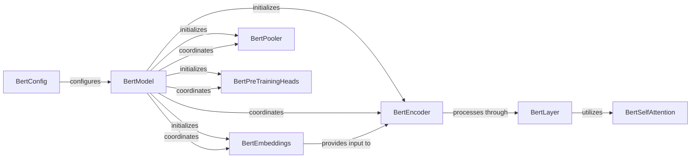

## Details

The BERT/ERNIE model architecture is orchestrated by the `BertModel`, which is configured by `BertConfig`. The `BertModel` initializes and coordinates its primary sub-components: `BertEmbeddings`, `BertEncoder`, `BertPooler`, and `BertPreTrainingHeads`. Input data is first transformed into dense vector representations by `BertEmbeddings`, which then provides this input to the `BertEncoder`. The `BertEncoder` processes the embedded input through a stack of `BertLayer` instances, each leveraging `BertSelfAttention` to capture contextual relationships. Finally, `BertModel` coordinates the output of the `BertEncoder` to either `BertPooler` for sentence-level representations or `BertPreTrainingHeads` for pre-training specific prediction tasks, completing the forward pass.

### BertConfig
Defines the architectural hyperparameters and configurations for the BERT/ERNIE model, such as hidden size, number of layers, and attention heads.

**Related Classes/Methods**:

- <a href="https://github.com/thunlp/ERNIE/blob/master/code/knowledge_bert/modeling.py#L66-L153" target="_blank" rel="noopener noreferrer">`BertConfig`:66-153</a>

### BertModel
The main model class that orchestrates the forward pass, integrating various sub-components like embeddings, encoder, and output layers. It serves as the top-level container for the entire BERT/ERNIE architecture.

**Related Classes/Methods**:

- <a href="https://github.com/thunlp/ERNIE/blob/master/code/knowledge_bert/modeling.py#L550-L682" target="_blank" rel="noopener noreferrer">`BertModel`:550-682</a>

### BertEmbeddings
Handles the initial transformation of input tokens, segment IDs, and position IDs into dense vector representations, which are then fed into the transformer encoder.

**Related Classes/Methods**:

- <a href="https://github.com/thunlp/ERNIE/blob/master/code/knowledge_bert/modeling.py#L174-L202" target="_blank" rel="noopener noreferrer">`BertEmbeddings`:174-202</a>

### BertEncoder
Processes the embedded input through a stack of multiple transformer layers. It is responsible for capturing contextual relationships within the input sequence.

**Related Classes/Methods**:

- <a href="https://github.com/thunlp/ERNIE/blob/master/code/knowledge_bert/modeling.py#L417-L449" target="_blank" rel="noopener noreferrer">`BertEncoder`:417-449</a>

### BertLayer
Represents a single transformer block within the `BertEncoder`, encompassing self-attention and feed-forward operations. Multiple `BertLayer` instances form the `BertEncoder` stack.

**Related Classes/Methods**:

- <a href="https://github.com/thunlp/ERNIE/blob/master/code/knowledge_bert/modeling.py#L388-L401" target="_blank" rel="noopener noreferrer">`BertLayer`:388-401</a>

### BertSelfAttention
Implements the multi-head self-attention mechanism, a core component within each `BertLayer` that allows the model to weigh the importance of different parts of the input sequence.

**Related Classes/Methods**:

- <a href="https://github.com/thunlp/ERNIE/blob/master/code/knowledge_bert/modeling.py#L205-L253" target="_blank" rel="noopener noreferrer">`BertSelfAttention`:205-253</a>

### BertPooler
Transforms the output of the `BertModel` (typically the `[CLS]` token's representation) into a fixed-size vector, often used as a sentence-level representation for downstream classification tasks.

**Related Classes/Methods**:

- <a href="https://github.com/thunlp/ERNIE/blob/master/code/knowledge_bert/modeling.py#L452-L464" target="_blank" rel="noopener noreferrer">`BertPooler`:452-464</a>

### BertPreTrainingHeads
Contains the prediction heads specifically used during the pre-training phase, such as the Masked Language Model (MLM) head for token prediction and the Next Sentence Prediction (NSP) head.

**Related Classes/Methods**:

- <a href="https://github.com/thunlp/ERNIE/blob/master/code/knowledge_bert/modeling.py#L536-L547" target="_blank" rel="noopener noreferrer">`BertPreTrainingHeads`:536-547</a>

### [FAQ](https://github.com/CodeBoarding/GeneratedOnBoardings/tree/main?tab=readme-ov-file#faq)