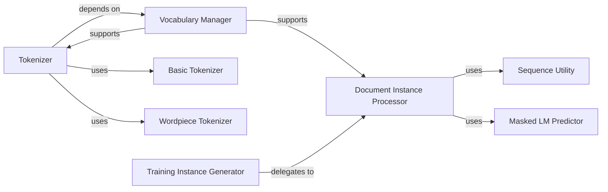

## Details

The `Text Preprocessing & Tokenization` subsystem is responsible for transforming raw text into a structured, tokenized format suitable for model input, including vocabulary management and instance generation.

### Tokenizer
The primary orchestrator for converting raw text into a sequence of subword tokens. It manages the overall tokenization process, leveraging specialized sub-components.

**Related Classes/Methods**:

- <a href="https://github.com/thunlp/ERNIE/blob/master/code/knowledge_bert/tokenization.py" target="_blank" rel="noopener noreferrer">`code.knowledge_bert.tokenization.Tokenizer`</a>
- <a href="https://github.com/thunlp/ERNIE/blob/master/pretrain_data/tokenization.py" target="_blank" rel="noopener noreferrer">`pretrain_data.tokenization.Tokenizer`</a>

### Vocabulary Manager
Handles the loading, storage, and mapping of tokens to their numerical IDs, serving as the central vocabulary authority for tokenization and instance generation.

**Related Classes/Methods**:

- <a href="https://github.com/thunlp/ERNIE/blob/master/code/knowledge_bert/tokenization.py#L51-L63" target="_blank" rel="noopener noreferrer">`code.knowledge_bert.tokenization.load_vocab`:51-63</a>
- <a href="https://github.com/thunlp/ERNIE/blob/master/pretrain_data/tokenization.py#L121-L134" target="_blank" rel="noopener noreferrer">`pretrain_data.tokenization.load_vocab`:121-134</a>
- <a href="https://github.com/thunlp/ERNIE/blob/master/pretrain_data/tokenization.py#L179-L180" target="_blank" rel="noopener noreferrer">`pretrain_data.tokenization.convert_tokens_to_ids`:179-180</a>
- <a href="https://github.com/thunlp/ERNIE/blob/master/pretrain_data/tokenization.py#L182-L183" target="_blank" rel="noopener noreferrer">`pretrain_data.tokenization.convert_ids_to_tokens`:182-183</a>
- <a href="https://github.com/thunlp/ERNIE/blob/master/pretrain_data/tokenization.py#L137-L142" target="_blank" rel="noopener noreferrer">`pretrain_data.tokenization.convert_by_vocab`:137-142</a>

### Basic Tokenizer
Performs initial, language-agnostic text processing steps, preparing the text for subword tokenization.

**Related Classes/Methods**:

- <a href="https://github.com/thunlp/ERNIE/blob/master/code/knowledge_bert/tokenization.py#L206-L328" target="_blank" rel="noopener noreferrer">`code.knowledge_bert.tokenization.BasicTokenizer`:206-328</a>
- <a href="https://github.com/thunlp/ERNIE/blob/master/pretrain_data/tokenization.py#L186-L298" target="_blank" rel="noopener noreferrer">`pretrain_data.tokenization.BasicTokenizer`:186-298</a>

### Wordpiece Tokenizer
Breaks down basic tokens into subword units based on a pre-defined vocabulary, crucial for handling out-of-vocabulary words and reducing vocabulary size.

**Related Classes/Methods**:

- <a href="https://github.com/thunlp/ERNIE/blob/master/code/knowledge_bert/tokenization.py#L331-L388" target="_blank" rel="noopener noreferrer">`code.knowledge_bert.tokenization.WordpieceTokenizer`:331-388</a>
- <a href="https://github.com/thunlp/ERNIE/blob/master/pretrain_data/tokenization.py#L301-L360" target="_blank" rel="noopener noreferrer">`pretrain_data.tokenization.WordpieceTokenizer`:301-360</a>

### Training Instance Generator
Manages the high-level workflow of creating structured training examples (instances) from a collection of input documents, suitable for pre-training objectives.

**Related Classes/Methods**:

- <a href="https://github.com/thunlp/ERNIE/blob/master/code/create_instances.py#L44-L100" target="_blank" rel="noopener noreferrer">`code.create_instances.create_training_instances`:44-100</a>

### Document Instance Processor
Focuses on processing a single document to generate specific training instances, including sequence segmentation and truncation.

**Related Classes/Methods**:

- <a href="https://github.com/thunlp/ERNIE/blob/master/code/create_instances.py#L109-L209" target="_blank" rel="noopener noreferrer">`code.create_instances.create_instances_from_document`:109-209</a>
- <a href="https://github.com/thunlp/ERNIE/blob/master/code/create_instances.py#L102-L107" target="_blank" rel="noopener noreferrer">`code.create_instances.jump_in_document`:102-107</a>

### Sequence Utility
Provides utility functions to ensure that token sequences adhere to maximum length constraints.

**Related Classes/Methods**:

- <a href="https://github.com/thunlp/ERNIE/blob/master/code/create_instances.py#L252-L265" target="_blank" rel="noopener noreferrer">`code.create_instances.truncate_seq_pair`:252-265</a>

### Masked LM Predictor
Selects tokens for masking and generates corresponding labels for the Masked Language Model pre-training objective.

**Related Classes/Methods**:

- <a href="https://github.com/thunlp/ERNIE/blob/master/code/create_instances.py#L211-L248" target="_blank" rel="noopener noreferrer">`code.create_instances.create_masked_lm_predictions`:211-248</a>

### [FAQ](https://github.com/CodeBoarding/GeneratedOnBoardings/tree/main?tab=readme-ov-file#faq)