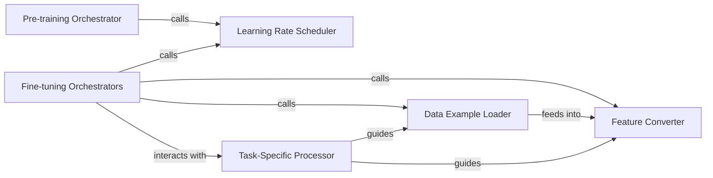

## Details

The ERNIE project's architecture is centered around two primary orchestration components: the Pre-training Orchestrator and Fine-tuning Orchestrators. The Pre-training Orchestrator manages the initial unsupervised learning phase, establishing the foundational language model. Subsequently, Fine-tuning Orchestrators adapt this pre-trained model for specific downstream NLP tasks. Both orchestration layers leverage a shared Learning Rate Scheduler for optimized training convergence. Data flow for fine-tuning tasks begins with the Data Example Loader, which parses raw data into a standardized format. This data is then transformed into numerical features by the Feature Converter before being fed into the model. The Task-Specific Processor provides crucial guidance to both the Data Example Loader and Feature Converter, ensuring that data preparation aligns with the unique requirements of each fine-tuning task. This modular design allows for efficient pre-training and flexible adaptation to diverse NLP applications.

### Pre-training Orchestrator
Manages the complete pre-training workflow for the ERNIE model. This includes initializing the model, setting up the training loop, calculating loss, applying optimization steps, and handling model checkpointing. It is the primary driver for the unsupervised learning phase, focusing on learning general language representations.

**Related Classes/Methods**:

- <a href="https://github.com/thunlp/ERNIE/blob/master/code/run_pretrain.py" target="_blank" rel="noopener noreferrer">`code/run_pretrain.py`</a>

### Fine-tuning Orchestrators
A collection of specialized orchestrators, each dedicated to managing the fine-tuning process for a specific downstream NLP task (e.g., FewRel, TACRED, Entity Typing). These orchestrators handle task-specific data loading, feature conversion, execution of task-specific training loops, optimization, and evaluation. They adapt the pre-trained ERNIE model to perform well on specific supervised tasks.

**Related Classes/Methods**:

- <a href="https://github.com/thunlp/ERNIE/blob/master/code/run_fewrel.py" target="_blank" rel="noopener noreferrer">`code/run_fewrel.py`</a>
- <a href="https://github.com/thunlp/ERNIE/blob/master/code/run_tacred.py" target="_blank" rel="noopener noreferrer">`code/run_tacred.py`</a>
- <a href="https://github.com/thunlp/ERNIE/blob/master/code/run_typing.py" target="_blank" rel="noopener noreferrer">`code/run_typing.py`</a>

### Learning Rate Scheduler
Implements a common learning rate scheduling strategy, such as linear warmup, to dynamically adjust the learning rate throughout both pre-training and fine-tuning phases. This component is crucial for optimizing the convergence of the model by controlling the step size of the optimization algorithm.

**Related Classes/Methods**:

- <a href="https://github.com/thunlp/ERNIE/blob/master/code/utils.py" target="_blank" rel="noopener noreferrer">`code/utils.py:warmup_linear`</a>

### Data Example Loader
Responsible for reading raw task-specific data from its source (e.g., JSON files) and converting it into a standardized InputExample object format. This component abstracts the initial data parsing, making the data ready for subsequent feature conversion.

**Related Classes/Methods**:

- <a href="https://github.com/thunlp/ERNIE/blob/master/code/run_fewrel.py" target="_blank" rel="noopener noreferrer">`code/run_fewrel.py:get_train_examples`</a>
- <a href="https://github.com/thunlp/ERNIE/blob/master/code/run_tacred.py" target="_blank" rel="noopener noreferrer">`code/run_tacred.py:get_train_examples`</a>
- <a href="https://github.com/thunlp/ERNIE/blob/master/code/run_typing.py" target="_blank" rel="noopener noreferrer">`code/run_typing.py:get_train_examples`</a>
- <a href="https://github.com/thunlp/ERNIE/blob/master/code/utils.py" target="_blank" rel="noopener noreferrer">`code/utils.py:_read_json`</a>
- <a href="https://github.com/thunlp/ERNIE/blob/master/code/utils.py" target="_blank" rel="noopener noreferrer">`code/utils.py:_create_examples`</a>

### Feature Converter
Transforms the standardized InputExample objects into numerical InputFeatures that can be directly fed into the ERNIE model. This involves critical steps like tokenization, sequence truncation, and padding to ensure uniform input dimensions and proper encoding for the model.

**Related Classes/Methods**:

- <a href="https://github.com/thunlp/ERNIE/blob/master/code/run_fewrel.py" target="_blank" rel="noopener noreferrer">`code/run_fewrel.py:convert_examples_to_features`</a>
- <a href="https://github.com/thunlp/ERNIE/blob/master/code/run_tacred.py" target="_blank" rel="noopener noreferrer">`code/run_tacred.py:convert_examples_to_features`</a>
- <a href="https://github.com/thunlp/ERNIE/blob/master/code/run_typing.py" target="_blank" rel="noopener noreferrer">`code/run_typing.py:convert_examples_to_features`</a>
- <a href="https://github.com/thunlp/ERNIE/blob/master/code/utils.py" target="_blank" rel="noopener noreferrer">`code/utils.py:_truncate_seq_pair`</a>

### Task-Specific Processor
Provides specialized data processing logic tailored to the unique input or output requirements of particular fine-tuning tasks. For instance, it might define how labels are mapped or how specific fields within the raw data are interpreted for a given task.

**Related Classes/Methods**:

- <a href="https://github.com/thunlp/ERNIE/blob/master/code/processors.py" target="_blank" rel="noopener noreferrer">`code/processors.py:TypingProcessor`</a>

### [FAQ](https://github.com/CodeBoarding/GeneratedOnBoardings/tree/main?tab=readme-ov-file#faq)