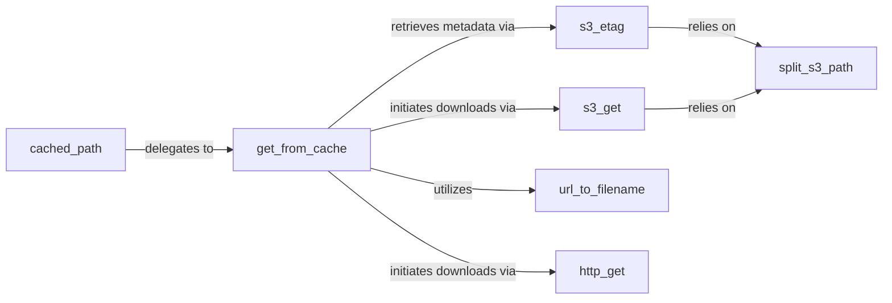

## Details

The Utility & File Management subsystem is designed around a robust caching mechanism. The `cached_path` function serves as the primary entry point, abstracting the complexities of file retrieval. It delegates the core logic to `get_from_cache`, which orchestrates the entire process: checking for local existence, determining if a download is needed, and then invoking the appropriate download handler (`http_get` for web URLs or `s3_get` for S3 URLs). For S3 operations, `get_from_cache` also leverages `s3_etag` for integrity checks. Both `s3_etag` and `s3_get` rely on `split_s3_path` to correctly parse S3 URLs. Finally, `url_to_filename` is a crucial helper used by `get_from_cache` to ensure consistent and unique local file naming for cached assets. This structure ensures efficient, reliable, and source-agnostic file access within the project.

### cached_path
Serves as the primary high-level interface for accessing files, abstracting away the underlying storage mechanisms (local, HTTP, S3) and ensuring local caching. It acts as the entry point for users needing to retrieve files.

**Related Classes/Methods**:

- <a href="https://github.com/thunlp/ERNIE/blob/master/code/knowledge_bert/file_utils.py#L74-L101" target="_blank" rel="noopener noreferrer">`code.knowledge_bert.file_utils.cached_path`:74-101</a>

### get_from_cache
Implements the core caching logic. It checks for the local existence of a file, determines if a download is necessary, and orchestrates the appropriate download method (HTTP or S3).

**Related Classes/Methods**:

- <a href="https://github.com/thunlp/ERNIE/blob/master/code/knowledge_bert/file_utils.py#L165-L221" target="_blank" rel="noopener noreferrer">`code.knowledge_bert.file_utils.get_from_cache`:165-221</a>

### s3_etag
Fetches the ETag (entity tag) metadata for objects stored in Amazon S3. This is primarily used by the caching mechanism to verify file integrity and determine if a cached file is still valid.

**Related Classes/Methods**:

- <a href="https://github.com/thunlp/ERNIE/blob/master/code/knowledge_bert/file_utils.py#L136-L142" target="_blank" rel="noopener noreferrer">`code.knowledge_bert.file_utils.s3_etag`:136-142</a>

### s3_get
Handles the direct download of files from specified Amazon S3 locations, managing the streaming and saving of content.

**Related Classes/Methods**:

- <a href="https://github.com/thunlp/ERNIE/blob/master/code/knowledge_bert/file_utils.py#L145-L150" target="_blank" rel="noopener noreferrer">`code.knowledge_bert.file_utils.s3_get`:145-150</a>

### url_to_filename
Converts a given URL into a standardized and unique local filename. This is crucial for maintaining a consistent and collision-free local cache directory.

**Related Classes/Methods**:

- <a href="https://github.com/thunlp/ERNIE/blob/master/code/knowledge_bert/file_utils.py#L30-L45" target="_blank" rel="noopener noreferrer">`code.knowledge_bert.file_utils.url_to_filename`:30-45</a>

### http_get
Manages the retrieval of files from standard HTTP and HTTPS sources, handling network requests and content streaming.

**Related Classes/Methods**:

- <a href="https://github.com/thunlp/ERNIE/blob/master/code/knowledge_bert/file_utils.py#L153-L162" target="_blank" rel="noopener noreferrer">`code.knowledge_bert.file_utils.http_get`:153-162</a>

### split_s3_path
A utility function that parses an S3 URL string and extracts its constituent bucket name and object key, facilitating targeted S3 operations.

**Related Classes/Methods**:

- <a href="https://github.com/thunlp/ERNIE/blob/master/code/knowledge_bert/file_utils.py#L104-L114" target="_blank" rel="noopener noreferrer">`code.knowledge_bert.file_utils.split_s3_path`:104-114</a>

### [FAQ](https://github.com/CodeBoarding/GeneratedOnBoardings/tree/main?tab=readme-ov-file#faq)