```mermaid
graph LR
    Data_Ingestion_Extraction["Data Ingestion & Extraction"]
    Text_Preprocessing_Tokenization["Text Preprocessing & Tokenization"]
    Dataset_Data_Loading["Dataset & Data Loading"]
    Model_Architecture_ERNIE_BERT_["Model Architecture (ERNIE/BERT)"]
    Training_Fine_tuning_Engine["Training & Fine-tuning Engine"]
    Evaluation_Metrics["Evaluation & Metrics"]
    Utility_File_Management["Utility & File Management"]
    Data_Ingestion_Extraction -- "provides raw textual data to" --> Text_Preprocessing_Tokenization
    Text_Preprocessing_Tokenization -- "generates tokenized and structured instances for" --> Dataset_Data_Loading
    Dataset_Data_Loading -- "supplies batched and indexed data to" --> Training_Fine_tuning_Engine
    Training_Fine_tuning_Engine -- "interacts with" --> Model_Architecture_ERNIE_BERT_
    Training_Fine_tuning_Engine -- "passes trained model to" --> Evaluation_Metrics
    Dataset_Data_Loading -- "provides evaluation-specific datasets to" --> Evaluation_Metrics
    Utility_File_Management -- "loads pre-trained model weights/config for" --> Model_Architecture_ERNIE_BERT_
    Utility_File_Management -- "accesses vocabulary files for" --> Text_Preprocessing_Tokenization
    click Text_Preprocessing_Tokenization href "https://github.com/CodeBoarding/GeneratedOnBoardings/blob/main/ERNIE/Text_Preprocessing_Tokenization.md" "Details"
    click Dataset_Data_Loading href "https://github.com/CodeBoarding/GeneratedOnBoardings/blob/main/ERNIE/Dataset_Data_Loading.md" "Details"
    click Model_Architecture_ERNIE_BERT_ href "https://github.com/CodeBoarding/GeneratedOnBoardings/blob/main/ERNIE/Model_Architecture_ERNIE_BERT_.md" "Details"
    click Training_Fine_tuning_Engine href "https://github.com/CodeBoarding/GeneratedOnBoardings/blob/main/ERNIE/Training_Fine_tuning_Engine.md" "Details"
    click Evaluation_Metrics href "https://github.com/CodeBoarding/GeneratedOnBoardings/blob/main/ERNIE/Evaluation_Metrics.md" "Details"
    click Utility_File_Management href "https://github.com/CodeBoarding/GeneratedOnBoardings/blob/main/ERNIE/Utility_File_Management.md" "Details"
```

## Details

The ERNIE project implements a robust ML pipeline for natural language processing, designed around a clear separation of concerns. The process initiates with Data Ingestion & Extraction, which prepares raw text for subsequent stages. This raw data flows into Text Preprocessing & Tokenization, where it's transformed into a structured, tokenized format. The Dataset & Data Loading component then efficiently manages and provides this processed data to the Training & Fine-tuning Engine. This engine, in conjunction with the Model Architecture (ERNIE/BERT), handles the core machine learning tasks of model training and fine-tuning. Post-training, the Evaluation & Metrics component assesses model performance. Throughout this entire workflow, the Utility & File Management component provides crucial support services, including asset loading and file caching. This modular design facilitates extensibility, allowing for easy integration of new data sources, models, or evaluation metrics, making it ideal for experimentation and deployment in various NLP tasks.

### Data Ingestion & Extraction
Handles the initial acquisition and extraction of raw data from sources like Wikipedia dumps, performing preliminary cleaning.

**Related Classes/Methods**:

- <a href="https://github.com/thunlp/ERNIE/blob/master/pretrain_data/WikiExtractor.py" target="_blank" rel="noopener noreferrer">`WikiExtractor.py`</a>

### Text Preprocessing & Tokenization [[Expand]](./Text_Preprocessing_Tokenization.md)
Transforms raw text into a structured, tokenized format suitable for model input, including vocabulary management and instance generation.

**Related Classes/Methods**:

- <a href="https://github.com/thunlp/ERNIE/blob/master/pretrain_data/tokenization.py" target="_blank" rel="noopener noreferrer">`tokenization.py`</a>
- <a href="https://github.com/thunlp/ERNIE/blob/master/code/knowledge_bert/tokenization.py" target="_blank" rel="noopener noreferrer">`tokenization.py`</a>
- <a href="https://github.com/thunlp/ERNIE/blob/master/code/create_instances.py" target="_blank" rel="noopener noreferrer">`create_instances.py`</a>

### Dataset & Data Loading [[Expand]](./Dataset_Data_Loading.md)
Manages the storage, indexing, loading, and efficient batching of processed datasets, providing iterators for training and evaluation.

**Related Classes/Methods**:

- <a href="https://github.com/thunlp/ERNIE/blob/master/code/indexed_dataset.py" target="_blank" rel="noopener noreferrer">`indexed_dataset.py`</a>
- <a href="https://github.com/thunlp/ERNIE/blob/master/code/data_utils.py" target="_blank" rel="noopener noreferrer">`data_utils.py`</a>
- <a href="https://github.com/thunlp/ERNIE/blob/master/code/iterators.py" target="_blank" rel="noopener noreferrer">`iterators.py`</a>

### Model Architecture (ERNIE/BERT) [[Expand]](./Model_Architecture_ERNIE_BERT_.md)
Defines the core neural network structure, including embedding layers, attention mechanisms, and various prediction heads for pre-training and downstream tasks.

**Related Classes/Methods**:

- <a href="https://github.com/thunlp/ERNIE/blob/master/code/knowledge_bert/modeling.py" target="_blank" rel="noopener noreferrer">`modeling.py`</a>

### Training & Fine-tuning Engine [[Expand]](./Training_Fine_tuning_Engine.md)
Orchestrates the entire training and fine-tuning process for pre-training and various downstream tasks, managing optimization, loss calculation, and checkpointing.

**Related Classes/Methods**:

- <a href="https://github.com/thunlp/ERNIE/blob/master/code/run_pretrain.py" target="_blank" rel="noopener noreferrer">`run_pretrain.py`</a>
- <a href="https://github.com/thunlp/ERNIE/blob/master/code/run_fewrel.py" target="_blank" rel="noopener noreferrer">`run_fewrel.py`</a>
- <a href="https://github.com/thunlp/ERNIE/blob/master/code/run_tacred.py" target="_blank" rel="noopener noreferrer">`run_tacred.py`</a>
- <a href="https://github.com/thunlp/ERNIE/blob/master/code/run_typing.py" target="_blank" rel="noopener noreferrer">`run_typing.py`</a>

### Evaluation & Metrics [[Expand]](./Evaluation_Metrics.md)
Provides a framework for evaluating model performance on NLP benchmarks, including scripts for running evaluations and computing relevant metrics.

**Related Classes/Methods**:

- <a href="https://github.com/thunlp/ERNIE/blob/master/code/eval_fewrel.py" target="_blank" rel="noopener noreferrer">`eval_fewrel.py`</a>
- <a href="https://github.com/thunlp/ERNIE/blob/master/code/eval_figer.py" target="_blank" rel="noopener noreferrer">`eval_figer.py`</a>
- <a href="https://github.com/thunlp/ERNIE/blob/master/code/eval_tacred.py" target="_blank" rel="noopener noreferrer">`eval_tacred.py`</a>
- <a href="https://github.com/thunlp/ERNIE/blob/master/code/eval_typing.py" target="_blank" rel="noopener noreferrer">`eval_typing.py`</a>
- <a href="https://github.com/thunlp/ERNIE/blob/master/code/score.py" target="_blank" rel="noopener noreferrer">`score.py`</a>

### Utility & File Management [[Expand]](./Utility_File_Management.md)
Contains general utility functions, including file caching, path handling, and other helper functions used across different components, facilitating efficient access to local and remote assets.

**Related Classes/Methods**:

- <a href="https://github.com/thunlp/ERNIE/blob/master/code/knowledge_bert/file_utils.py" target="_blank" rel="noopener noreferrer">`file_utils.py`</a>
- <a href="https://github.com/thunlp/ERNIE/blob/master/code/knowledge_bert/file_utils.py" target="_blank" rel="noopener noreferrer">`utils.py`</a>

### [FAQ](https://github.com/CodeBoarding/GeneratedOnBoardings/tree/main?tab=readme-ov-file#faq)