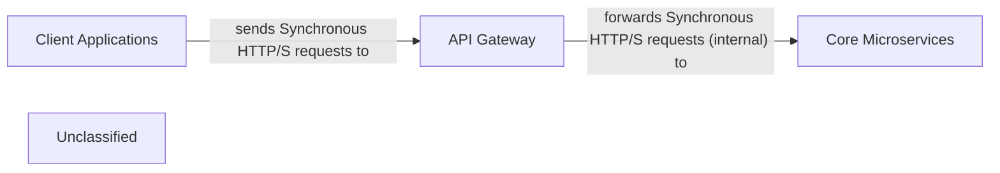

## Details

The EShopMicroservices architecture is designed around a central `API Gateway` that acts as the primary entry point for all `Client Applications`. This gateway intelligently routes incoming synchronous HTTP/S requests to the appropriate `Core Microservices`, such as the Basket API and Catalog API. Beyond routing, the API Gateway centralizes cross-cutting concerns like authentication, authorization, and rate limiting, thereby simplifying client interactions and enhancing the overall security and manageability of the microservices landscape. The `Core Microservices` are responsible for encapsulating specific business capabilities and exposing their functionalities through well-defined HTTP/S endpoints, which the API Gateway then orchestrates.

### API Gateway [[Expand]](./API_Gateway.md)
The API Gateway serves as the single, unified entry point for all client requests into the EShopMicroservices system. It is responsible for intelligently routing incoming requests to the appropriate backend microservices. Beyond simple routing, it centralizes critical cross-cutting concerns such as authentication, authorization, rate limiting, and potentially request aggregation or transformation, thereby offloading these responsibilities from individual microservices. This approach simplifies client-side interactions and enhances the overall security and manageability of the microservices landscape.

**Related Classes/Methods**:

- <a href="https://github.com/HanyGoda/EShopMicroservices/blob/mainsrc/Services/Basket/Basket.API/Program.cs" target="_blank" rel="noopener noreferrer">`src/Services/Basket/Basket.API/Program.cs`</a>
- <a href="https://github.com/HanyGoda/EShopMicroservices/blob/mainsrc/Services/Catalog/Catalog.API/Program.cs" target="_blank" rel="noopener noreferrer">`src/Services/Catalog/Catalog.API/Program.cs`</a>

### Client Applications
These represent external applications (e.g., web, mobile, desktop) that consume the services exposed by the EShopMicroservices system. They interact with the system exclusively through the API Gateway.

**Related Classes/Methods**:

- <a href="https://github.com/HanyGoda/EShopMicroservices/blob/mainsrc/Services/Basket/Basket.API/Program.cs" target="_blank" rel="noopener noreferrer">`src/Services/Basket/Basket.API/Program.cs`</a>
- <a href="https://github.com/HanyGoda/EShopMicroservices/blob/mainsrc/Services/Catalog/Catalog.API/Program.cs" target="_blank" rel="noopener noreferrer">`src/Services/Catalog/Catalog.API/Program.cs`</a>

### Core Microservices
This component encompasses the individual, independently deployable microservices that implement the core business logic of the EShopMicroservices system. Examples include the Basket API, Catalog API, etc. These services expose their functionalities via HTTP/S endpoints, which are then consumed by the API Gateway.

**Related Classes/Methods**:

- <a href="https://github.com/HanyGoda/EShopMicroservices/blob/mainsrc/Services/Basket/Basket.API/Program.cs" target="_blank" rel="noopener noreferrer">`src/Services/Basket/Basket.API/Program.cs`</a>
- <a href="https://github.com/HanyGoda/EShopMicroservices/blob/mainsrc/Services/Catalog/Catalog.API/Program.cs" target="_blank" rel="noopener noreferrer">`src/Services/Catalog/Catalog.API/Program.cs`</a>

### Unclassified
Component for all unclassified files and utility functions (Utility functions/External Libraries/Dependencies)

**Related Classes/Methods**: _None_

### [FAQ](https://github.com/CodeBoarding/GeneratedOnBoardings/tree/main?tab=readme-ov-file#faq)