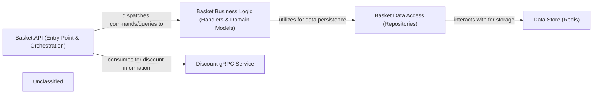

## Details

The Basket Microservice is structured around a single `Basket.API` project, which acts as the central hub for all shopping cart functionalities. This `Basket.API` component serves as the entry point for client requests, handling HTTP communication and orchestrating the flow of operations. It dispatches commands and queries to the `Basket Business Logic` component, which encapsulates the core business rules, domain models (like `ShoppingCart` and `ShoppingCartItem`), and MediatR handlers responsible for processing these operations. For data persistence, the `Basket Business Logic` relies on the `Basket Data Access` component, which includes repository implementations and a caching layer. The `Basket Data Access` component, in turn, interacts directly with the `Data Store (Redis)` for high-performance storage and retrieval of basket data. Additionally, the `Basket.API` component integrates with an external `Discount gRPC Service` to apply discounts to shopping carts, demonstrating an interaction with an external dependency. This architecture emphasizes a consolidated approach where API, business logic, and data access concerns are managed within a single service, while leveraging external services for specialized functionalities like discounts and a dedicated data store for persistence.

### Basket.API (Entry Point & Orchestration)
Serves as the primary entry point for client requests, exposing RESTful endpoints for managing shopping cart operations (e.g., adding, retrieving, deleting items). It handles HTTP request/response cycles, authentication, and authorization. This component also orchestrates the overall business logic by dispatching commands and queries to internal handlers using MediatR.

**Related Classes/Methods**:

- <a href="https://github.com/HanyGoda/EShopMicroservices/blob/mainsrc/Services/Basket/Basket.API/Program.cs" target="_blank" rel="noopener noreferrer">`Program.cs`</a>
- <a href="https://github.com/HanyGoda/EShopMicroservices/blob/mainsrc/Services/Basket/Basket.API/Basket/StoreBasket/StoreBasketEndpoints.cs" target="_blank" rel="noopener noreferrer">`StoreBasketEndpoints.cs`</a>
- <a href="https://github.com/HanyGoda/EShopMicroservices/blob/mainsrc/Services/Basket/Basket.API/Basket/GetBasket/GetBasketEndpoints.cs" target="_blank" rel="noopener noreferrer">`GetBasketEndpoints.cs`</a>
- <a href="https://github.com/HanyGoda/EShopMicroservices/blob/mainsrc/Services/Basket/Basket.API/Basket/DeleteBasket/DeleteBasketEndpoints.cs" target="_blank" rel="noopener noreferrer">`DeleteBasketEndpoints.cs`</a>

### Basket Business Logic (Handlers & Domain Models)
Encapsulates the core business rules and entities related to the shopping cart. This component processes commands and queries for basket operations, ensuring business invariants are maintained. It includes the MediatR handlers that implement the specific logic for each basket action and the domain models representing the structure of a shopping cart and its items.

**Related Classes/Methods**:

- <a href="https://github.com/HanyGoda/EShopMicroservices/blob/mainsrc/Services/Basket/Basket.API/Basket/StoreBasket/StoreBasketHandler.cs" target="_blank" rel="noopener noreferrer">`StoreBasketHandler.cs`</a>
- <a href="https://github.com/HanyGoda/EShopMicroservices/blob/mainsrc/Services/Basket/Basket.API/Basket/GetBasket/GetBasketHandler.cs" target="_blank" rel="noopener noreferrer">`GetBasketHandler.cs`</a>
- <a href="https://github.com/HanyGoda/EShopMicroservices/blob/mainsrc/Services/Basket/Basket.API/Basket/DeleteBasket/DeleteBasketHandler.cs" target="_blank" rel="noopener noreferrer">`DeleteBasketHandler.cs`</a>
- <a href="https://github.com/HanyGoda/EShopMicroservices/blob/mainsrc/Services/Basket/Basket.API/Models/ShoppingCart.cs" target="_blank" rel="noopener noreferrer">`ShoppingCart.cs`</a>
- <a href="https://github.com/HanyGoda/EShopMicroservices/blob/mainsrc/Services/Basket/Basket.API/Models/ShoppingCartItem.cs" target="_blank" rel="noopener noreferrer">`ShoppingCartItem.cs`</a>

### Basket Data Access (Repositories)
Provides concrete implementations for data access, managing the persistence and retrieval of shopping cart data. This component includes the primary repository responsible for interacting with the underlying data store and a caching layer to optimize performance for frequent basket operations.

**Related Classes/Methods**:

- <a href="https://github.com/HanyGoda/EShopMicroservices/blob/mainsrc/Services/Basket/Basket.API/Data/IBasketRepository.cs" target="_blank" rel="noopener noreferrer">`IBasketRepository.cs`</a>
- <a href="https://github.com/HanyGoda/EShopMicroservices/blob/mainsrc/Services/Basket/Basket.API/Data/BasketRepository.cs" target="_blank" rel="noopener noreferrer">`BasketRepository.cs`</a>
- <a href="https://github.com/HanyGoda/EShopMicroservices/blob/mainsrc/Services/Basket/Basket.API/Data/CachedBasketRepository.cs" target="_blank" rel="noopener noreferrer">`CachedBasketRepository.cs`</a>

### Data Store (Redis)
An external, high-performance key-value data store used for persisting shopping cart data. It offers fast read/write capabilities essential for dynamic and frequently accessed basket operations.

**Related Classes/Methods**:

- <a href="https://github.com/HanyGoda/EShopMicroservices/blob/mainsrc/Services/Basket/Basket.API/Data/BasketRepository.cs" target="_blank" rel="noopener noreferrer">`BasketRepository.cs`</a>
- <a href="https://github.com/HanyGoda/EShopMicroservices/blob/mainsrc/Services/Basket/Basket.API/Data/CachedBasketRepository.cs" target="_blank" rel="noopener noreferrer">`CachedBasketRepository.cs`</a>
- <a href="https://github.com/HanyGoda/EShopMicroservices/blob/mainsrc/Services/Basket/Basket.API/Program.cs" target="_blank" rel="noopener noreferrer">`Program.cs`</a>

### Discount gRPC Service
An external gRPC service that provides discount information. The Basket microservice consumes this service to apply relevant discounts to shopping carts during various operations.

**Related Classes/Methods**:

- <a href="https://github.com/HanyGoda/EShopMicroservices/blob/mainsrc/Services/Basket/Basket.API/Program.cs" target="_blank" rel="noopener noreferrer">`DiscountProtoServiceClient`</a>

### Unclassified
Component for all unclassified files and utility functions (Utility functions/External Libraries/Dependencies)

**Related Classes/Methods**: _None_

### [FAQ](https://github.com/CodeBoarding/GeneratedOnBoardings/tree/main?tab=readme-ov-file#faq)