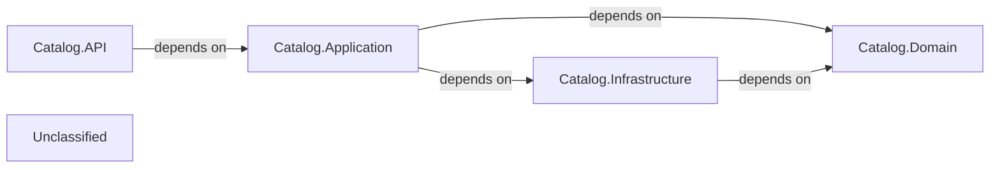

## Details

The Catalog Microservice is structured into four main components: Catalog.API, Catalog.Application, Catalog.Domain, and Catalog.Infrastructure. The Catalog.API serves as the external entry point, handling HTTP requests and configuring core services. It dispatches requests to the Catalog.Application layer, which orchestrates business logic through MediatR command and query handlers. The Catalog.Application layer interacts with Catalog.Domain for core business entities and rules, and with Catalog.Infrastructure for data persistence using Marten. The Catalog.Infrastructure component provides concrete implementations for data access, operating on entities defined within the Catalog.Domain (which, in this project, are co-located or represented within the Catalog.API project). This architecture ensures a clear separation of concerns, with the API handling external communication, the Application layer managing business workflows, the Domain layer enforcing business rules, and the Infrastructure layer managing technical concerns like data storage.

### Catalog.API
This component serves as the external interface for the Catalog Microservice. It handles incoming HTTP requests, validates input, and translates them into commands or queries for the application layer. It acts as the entry point for consumers of the microservice and also configures core services like MediatR and Marten.

**Related Classes/Methods**:

- <a href="https://github.com/HanyGoda/EShopMicroservices/blob/mainsrc/Services/Catalog/Catalog.API/Program.cs" target="_blank" rel="noopener noreferrer">`Program.Main`</a>

### Catalog.Application
This layer orchestrates the business logic, processing commands and queries. It uses MediatR (configured in Catalog.API) to dispatch these messages to their respective handlers, coordinating interactions between the Domain and Infrastructure layers. It defines Data Transfer Objects (DTOs) for data exchange and contains the concrete implementations of command and query handlers.

**Related Classes/Methods**:

- <a href="https://github.com/HanyGoda/EShopMicroservices/blob/mainsrc/Services/Catalog/Catalog.API/Products/CreateProduct/CreateProductHandler.cs" target="_blank" rel="noopener noreferrer">`CreateProductHandler`</a>

### Catalog.Domain
This is the heart of the microservice, encapsulating the core business logic, domain entities (e.g., Product), value objects, aggregates, and domain services. It enforces business rules and invariants, ensuring the integrity of the catalog data. While a dedicated Catalog.Domain project might be intended, the Product entity appears to be defined within the Catalog.API project.

**Related Classes/Methods**:

- <a href="https://github.com/HanyGoda/EShopMicroservices/blob/mainsrc/Services/Catalog/Catalog.API/Models/Product.cs" target="_blank" rel="noopener noreferrer">`Product`</a>

### Catalog.Infrastructure
This component provides the concrete implementations for technical concerns such as data persistence using Marten (a document database), and other technical utilities. It depends on the Domain Layer to interact with domain entities.

**Related Classes/Methods**:

- <a href="https://github.com/HanyGoda/EShopMicroservices/blob/mainsrc/Services/Catalog/Catalog.API/Data/CatalogInitialData.cs" target="_blank" rel="noopener noreferrer">`CatalogInitialData`</a>

### Unclassified
Component for all unclassified files and utility functions (Utility functions/External Libraries/Dependencies)

**Related Classes/Methods**: _None_

### [FAQ](https://github.com/CodeBoarding/GeneratedOnBoardings/tree/main?tab=readme-ov-file#faq)