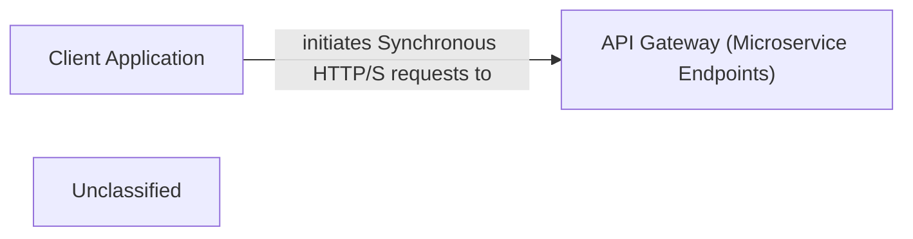

## Details

The e-commerce system operates on a microservices architecture, where external Client Applications interact with various domain-specific services. The API Gateway (Microservice Endpoints) component, represented by the Program.cs files within each individual API project (e.g., Basket.API, Catalog.API, Ordering.API), serves as the primary interface for these client applications. Each microservice exposes its own set of RESTful APIs, which the client applications consume to perform operations such as managing shopping baskets, browsing product catalogs, and placing orders. The Program.cs files are crucial as they define the entry point for each microservice, configuring the web host, services, and middleware necessary for handling incoming HTTP requests.

### Client Application [[Expand]](./Client_Application.md)
Represents the external user interface (e.g., web, mobile applications) that provides the user experience for the e-commerce system. These applications are responsible for presenting data to users and capturing user input, interacting with the microservices architecture primarily through the exposed API endpoints.

**Related Classes/Methods**:

- `External`

### API Gateway (Microservice Endpoints)
Acts as the collective entry point for client applications, routing requests to appropriate microservices and handling cross-cutting concerns like authentication, rate limiting, and load balancing. In this architecture, the individual microservice API projects (e.g., Basket.API, Catalog.API) collectively fulfill this role by exposing their own endpoints.

**Related Classes/Methods**:

- <a href="https://github.com/HanyGoda/EShopMicroservices/blob/mainsrc/Services/Basket/Basket.API/Program.cs" target="_blank" rel="noopener noreferrer">`src.Services.Basket.Basket.API.Program`</a>
- <a href="https://github.com/HanyGoda/EShopMicroservices/blob/mainsrc/Services/Catalog/Catalog.API/Program.cs" target="_blank" rel="noopener noreferrer">`src.Services.Catalog.Catalog.API.Program`</a>
- `src.Services.Ordering.Ordering.API.Program`

### Unclassified
Component for all unclassified files and utility functions (Utility functions/External Libraries/Dependencies)

**Related Classes/Methods**: _None_

### [FAQ](https://github.com/CodeBoarding/GeneratedOnBoardings/tree/main?tab=readme-ov-file#faq)