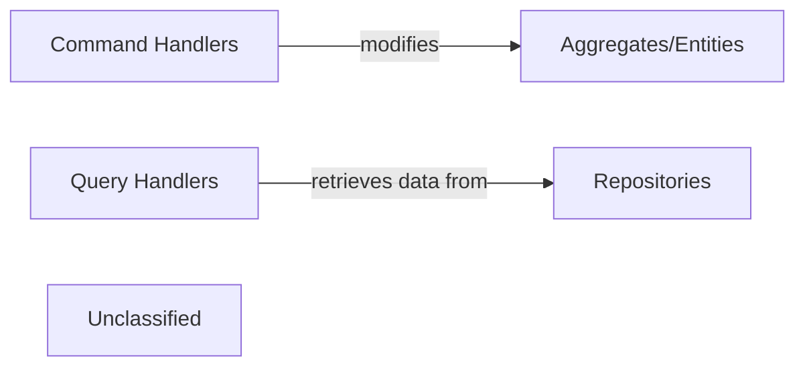

## Details

The Identity Microservice is a central component responsible for managing user identities, authentication, and authorization within the system. External requests are routed through an API Gateway to the Identity Microservice. Internally, the microservice employs a Command Query Responsibility Segregation (CQRS) pattern, where Command Handlers process state-changing operations on Aggregates/Entities, and Query Handlers retrieve data through Repositories. Data persistence is handled by a dedicated Data Store, accessed by Repositories. For authentication and authorization, the Identity Microservice integrates with external Authentication/Authorization Providers. Asynchronous communication and event propagation are managed via a Message Broker, allowing the Identity Microservice to publish events like user registrations to other interested services.

### Command Handlers
Process commands (e.g., RegisterUserCommand, LoginUserCommand, AssignRoleCommand) using MediatR within the Application Layer of the Identity Microservice. They orchestrate changes to the domain model.

**Related Classes/Methods**:

- <a href="https://github.com/HanyGoda/EShopMicroservices/blob/mainsrc/Services/Basket/Basket.API/Basket/StoreBasket/StoreBasketHandler.cs" target="_blank" rel="noopener noreferrer">`StoreBasketHandler`</a>

### Query Handlers
Process queries (e.g., GetUserByIdQuery, GetRolesQuery) using MediatR within the Application Layer of the Identity Microservice. They retrieve data from the domain model or read models.

**Related Classes/Methods**:

- <a href="https://github.com/HanyGoda/EShopMicroservices/blob/mainsrc/Services/Basket/Basket.API/Basket/GetBasket/GetBasketHandler.cs" target="_blank" rel="noopener noreferrer">`GetBasketHandler`</a>

### Aggregates/Entities
Encapsulate business logic and invariants for User and Role within the Domain Layer of the Identity Microservice. These are the core building blocks of the domain model.

**Related Classes/Methods**:

- <a href="https://github.com/HanyGoda/EShopMicroservices/blob/mainsrc/Services/Basket/Basket.API/Models/ShoppingCart.cs" target="_blank" rel="noopener noreferrer">`ShoppingCart`</a>

### Repositories
Implement data access logic for User and Role aggregates, interacting with the dedicated Data Store within the Infrastructure Layer of the Identity Microservice. They abstract data persistence details from the domain.

**Related Classes/Methods**:

- <a href="https://github.com/HanyGoda/EShopMicroservices/blob/mainsrc/Services/Basket/Basket.API/Data/BasketRepository.cs" target="_blank" rel="noopener noreferrer">`BasketRepository`</a>

### Unclassified
Component for all unclassified files and utility functions (Utility functions/External Libraries/Dependencies)

**Related Classes/Methods**: _None_

### [FAQ](https://github.com/CodeBoarding/GeneratedOnBoardings/tree/main?tab=readme-ov-file#faq)