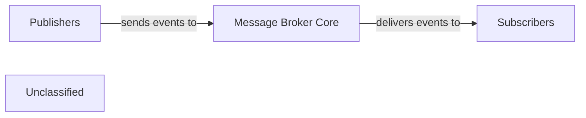

## Details

The messaging subsystem facilitates asynchronous communication between microservices using an event-driven approach. The IEventBus acts as the central messaging backbone, abstracting the underlying message broker. Microservices publish IntegrationEvent objects to the IEventBus, which then routes these events to interested subscribers. Each microservice defines its own IIntegrationEventHandler implementations to process specific events, enabling loose coupling and scalability across the distributed system. The Program.cs file in each service is responsible for setting up and configuring its interaction with the event bus, including registering event handlers for the events it needs to consume.

### Message Broker Core
The central component responsible for receiving, storing, and delivering messages/events, acting as the underlying messaging technology. It ensures reliable message delivery and persistence.

**Related Classes/Methods**:

- `EventBus`

### Publishers
Mechanisms within each microservice responsible for sending events to the Message Broker Core. These components encapsulate the logic for formatting and dispatching messages.

**Related Classes/Methods**:

- <a href="https://github.com/HanyGoda/EShopMicroservices/blob/mainsrc/Services/Basket/Basket.API/Program.cs" target="_blank" rel="noopener noreferrer">`Program.cs`</a>
- <a href="https://github.com/HanyGoda/EShopMicroservices/blob/mainsrc/Services/Catalog/Catalog.API/Program.cs" target="_blank" rel="noopener noreferrer">`Program.cs`</a>

### Subscribers
Mechanisms within each microservice responsible for receiving and processing events from the Message Broker Core. These components handle message consumption and subsequent business logic execution.

**Related Classes/Methods**:

- `IIntegrationEventHandler`
- <a href="https://github.com/HanyGoda/EShopMicroservices/blob/mainsrc/Services/Basket/Basket.API/Program.cs" target="_blank" rel="noopener noreferrer">`Program.cs`</a>

### Unclassified
Component for all unclassified files and utility functions (Utility functions/External Libraries/Dependencies)

**Related Classes/Methods**: _None_

### [FAQ](https://github.com/CodeBoarding/GeneratedOnBoardings/tree/main?tab=readme-ov-file#faq)