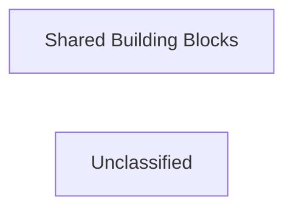

## Details

This analysis focuses on the 'Shared Building Blocks' component of the project, detailing its purpose and key referenced source code. A complete analysis of the 'Ordering' microservice, including its boundaries, central components, responsibilities, interactions, and internal relationships, could not be performed due to the absence of the 'Ordering' service at the expected paths within the provided project context.

### Shared Building Blocks
Contains common infrastructure components, base abstractions (like `ICommand`, `IQuery`), and cross-cutting behaviors (e.g., `ValidationBehavior`) that are reused across different layers of the microservice.

**Related Classes/Methods**:

- <a href="https://github.com/HanyGoda/EShopMicroservices/blob/mainsrc/BuildingBlocks/BuildingBlocks/CQRS/ICommand.cs" target="_blank" rel="noopener noreferrer">`ICommand`</a>
- <a href="https://github.com/HanyGoda/EShopMicroservices/blob/mainsrc/BuildingBlocks/BuildingBlocks/CQRS/IQuery.cs" target="_blank" rel="noopener noreferrer">`IQuery`</a>
- <a href="https://github.com/HanyGoda/EShopMicroservices/blob/mainsrc/BuildingBlocks/BuildingBlocks/Behaviors/ValidationBehavior.cs" target="_blank" rel="noopener noreferrer">`ValidationBehavior`</a>

### Unclassified
Component for all unclassified files and utility functions (Utility functions/External Libraries/Dependencies)

**Related Classes/Methods**: _None_

### [FAQ](https://github.com/CodeBoarding/GeneratedOnBoardings/tree/main?tab=readme-ov-file#faq)