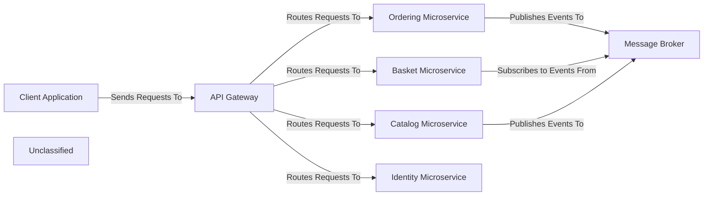

## Details

The microservice architecture of the eShop project is designed around several distinct components, each with a clear responsibility, facilitating a scalable and maintainable system. The `Client Application` serves as the primary user interface, interacting with the system through the `API Gateway`. The `API Gateway` acts as a unified entry point, routing requests to the appropriate microservices and handling cross-cutting concerns like authentication. Core business functionalities are encapsulated within dedicated microservices: the `Basket Microservice` manages shopping cart logic, the `Catalog Microservice` handles product information, the `Ordering Microservice` orchestrates the order lifecycle, and the `Identity Microservice` is responsible for user authentication and authorization. Asynchronous communication between these services is facilitated by a `Message Broker`, ensuring loose coupling and resilience. This setup allows for independent development, deployment, and scaling of each service, contributing to the overall agility of the system.

### Client Application [[Expand]](./Client_Application.md)
Represents the external user interface (e.g., web, mobile) interacting with the microservices.

**Related Classes/Methods**:

- `Client Application_Conceptual`

### API Gateway [[Expand]](./API_Gateway.md)
The single entry point for all client requests, responsible for routing, authentication, and potentially request aggregation.

**Related Classes/Methods**:

- `API Gateway_Conceptual`

### Basket Microservice [[Expand]](./Basket_Microservice.md)
Manages shopping cart operations, including adding, retrieving, and deleting items.

**Related Classes/Methods**:

- <a href="https://github.com/HanyGoda/EShopMicroservices/blob/mainsrc/Services/Basket/Basket.API/Program.cs" target="_blank" rel="noopener noreferrer">`Basket.API.Program`</a>

### Catalog Microservice [[Expand]](./Catalog_Microservice.md)
Manages product information, including creation, retrieval, update, and deletion of products, organized by categories.

**Related Classes/Methods**:

- <a href="https://github.com/HanyGoda/EShopMicroservices/blob/mainsrc/Services/Catalog/Catalog.API/Program.cs" target="_blank" rel="noopener noreferrer">`Catalog.API.Program`</a>

### Ordering Microservice [[Expand]](./Ordering_Microservice.md)
Manages the order lifecycle, from creation to fulfillment, including order processing and status updates.

**Related Classes/Methods**:

- `Ordering Microservice_Conceptual`

### Identity Microservice [[Expand]](./Identity_Microservice.md)
Handles user authentication and authorization, managing user accounts and roles.

**Related Classes/Methods**:

- `Identity Microservice_Conceptual`

### Message Broker [[Expand]](./Message_Broker.md)
Facilitates asynchronous, event-driven communication between microservices, enabling loose coupling and scalability.

**Related Classes/Methods**:

- `Message Broker_Conceptual`

### Unclassified
Component for all unclassified files and utility functions (Utility functions/External Libraries/Dependencies)

**Related Classes/Methods**: _None_

### [FAQ](https://github.com/CodeBoarding/GeneratedOnBoardings/tree/main?tab=readme-ov-file#faq)