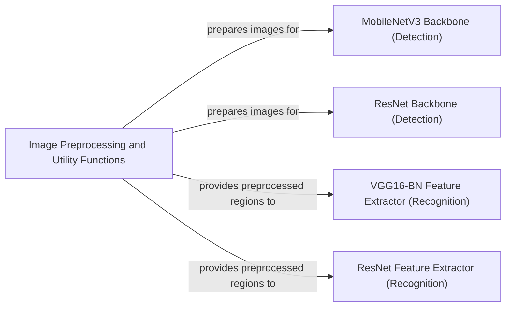

## Component Details

This section provides an overview of the core utility and backbone components within the EasyOCR system, detailing their structure, purpose, and interactions. These components are fundamental as they handle the initial data preparation and the crucial feature extraction steps for both text detection and recognition.

### Image Preprocessing and Utility Functions
This component is the initial gateway for all image data entering the OCR pipeline. It is responsible for standardizing diverse input image formats (e.g., file paths, URLs, bytes, NumPy arrays) into a consistent format suitable for processing. Beyond basic formatting, it plays a critical role in preparing detected text regions. It applies geometric transformations to bounding boxes, calculates aspect ratios, and resizes individual text crops, ensuring they are optimally prepared for the subsequent recognition stage. It also includes functionalities for grouping and sorting detected text boxes, which is vital for coherent output.

**Related Classes/Methods**:

- <a href="https://github.com/JaidedAI/EasyOCR/blob/master/easyocr/utils.py#L731-L768" target="_blank" rel="noopener noreferrer">`easyocr.utils.reformat_input` (731:768)</a>
- <a href="https://github.com/JaidedAI/EasyOCR/blob/master/easyocr/utils.py#L579-L622" target="_blank" rel="noopener noreferrer">`easyocr.utils.get_image_list` (579:622)</a>
- <a href="https://github.com/JaidedAI/EasyOCR/blob/master/easyocr/utils.py#L449-L554" target="_blank" rel="noopener noreferrer">`easyocr.utils.group_text_box` (449:554)</a>
- <a href="https://github.com/JaidedAI/EasyOCR/blob/master/easyocr/imgproc.py#L1-L1" target="_blank" rel="noopener noreferrer">`easyocr.imgproc` (1:1)</a>

### MobileNetV3 Backbone (Detection)
This component implements the MobileNetV3 architecture, a highly efficient and lightweight convolutional neural network. Its primary role is to serve as a feature extraction backbone within the text detection part of the EasyOCR system, specifically for the DBNet detector. It extracts hierarchical features from input images, offering different model sizes ('large' or 'small') to balance performance and computational cost.

**Related Classes/Methods**:

- <a href="https://github.com/JaidedAI/EasyOCR/blob/master/easyocr/DBNet/backbones/mobilenetv3.py#L118-L234" target="_blank" rel="noopener noreferrer">`easyocr.DBNet.backbones.mobilenetv3.MobileNetV3` (118:234)</a>

### ResNet Backbone (Detection)
This component provides the ResNet architecture, a widely recognized and robust deep convolutional neural network, to act as a feature extraction backbone for text detection within the DBNet framework. It constructs multiple residual layers, enabling the extraction of powerful and discriminative features. It can also incorporate deformable convolutions for enhanced feature learning, which is particularly beneficial for handling complex and irregular text layouts.

**Related Classes/Methods**:

- <a href="https://github.com/JaidedAI/EasyOCR/blob/master/easyocr/DBNet/backbones/resnet.py#L181-L247" target="_blank" rel="noopener noreferrer">`easyocr.DBNet.backbones.resnet.ResNet` (181:247)</a>

### VGG16-BN Feature Extractor (Recognition)
This component is a specialized feature extractor built upon the VGG16 architecture, enhanced with Batch Normalization. It is designed to extract multi-scale feature maps from various layers of the VGG network, which are critical for the text recognition task. It supports leveraging pre-trained weights for faster convergence and improved accuracy and allows for freezing early layers to preserve general learned features, optimizing for specific recognition challenges.

**Related Classes/Methods**:

- <a href="https://github.com/JaidedAI/EasyOCR/blob/master/easyocr/model/modules.py#L22-L79" target="_blank" rel="noopener noreferrer">`easyocr.model.modules.vgg16_bn` (22:79)</a>

### ResNet Feature Extractor (Recognition)
This component acts as an adapter or wrapper for a ResNet model, specifically tailoring it to function as a feature extractor within the text recognition pipeline. It receives preprocessed image inputs, typically cropped text regions obtained from the detection stage, and generates compact and informative feature representations. These features are then fed into the recognition head for character sequence prediction.

**Related Classes/Methods**:

- <a href="https://github.com/JaidedAI/EasyOCR/blob/master/easyocr/model/modules.py#L125-L133" target="_blank" rel="noopener noreferrer">`easyocr.model.modules.ResNet_FeatureExtractor` (125:133)</a>

### [FAQ](https://github.com/CodeBoarding/GeneratedOnBoardings/tree/main?tab=readme-ov-file#faq)