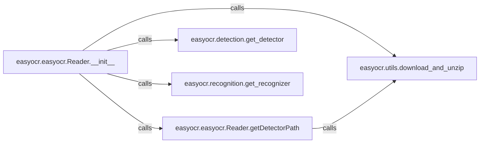

## Component Details

Overview of the core components responsible for Model Management & Loading within the easyocr project. These components are fundamental as they collectively manage the entire lifecycle of deep learning models, from initial configuration and path determination to downloading, integrity verification, and loading into memory for inference.

### easyocr.easyocr.Reader.__init__
This is the primary orchestrator for the model initialization process. It sets up the model storage directories, determines the optimal processing device (CPU, GPU, or MPS), and intelligently selects the appropriate detection and recognition models based on the provided language list and network configurations. It initiates the download, integrity checks, and loading of these models.

**Related Classes/Methods**:

- <a href="https://github.com/JaidedAI/EasyOCR/blob/master/easyocr/easyocr.py#L31-L232" target="_blank" rel="noopener noreferrer">`easyocr.easyocr.Reader.__init__` (31:232)</a>

### easyocr.easyocr.Reader.getDetectorPath
This component is specifically responsible for managing the detection model's lifecycle. It identifies the correct detection network (e.g., CRAFT or DBNet), dynamically imports the necessary loading functions, and ensures the detection model file is present and valid (via MD5 checksum). If the model is missing or corrupt, it triggers a download.

**Related Classes/Methods**:

- <a href="https://github.com/JaidedAI/EasyOCR/blob/master/easyocr/easyocr.py#L234-L267" target="_blank" rel="noopener noreferrer">`easyocr.easyocr.Reader.getDetectorPath` (234:267)</a>

### easyocr.utils.download_and_unzip
A crucial utility function that handles the secure downloading of model files from a specified URL and their subsequent extraction from a zip archive to the designated model storage directory. It includes functionality for reporting download progress.

**Related Classes/Methods**:

- <a href="https://github.com/JaidedAI/EasyOCR/blob/master/easyocr/utils.py#L624-L630" target="_blank" rel="noopener noreferrer">`easyocr.utils.download_and_unzip` (624:630)</a>

### easyocr.detection.get_detector
This component is responsible for the actual instantiation and loading of the chosen detection model (e.g., CRAFT) into memory. It handles the placement of the model on the correct device (CPU/GPU) and applies dynamic quantization for performance optimization if enabled.

**Related Classes/Methods**:

- <a href="https://github.com/JaidedAI/EasyOCR/blob/master/easyocr/detection.py#L73-L89" target="_blank" rel="noopener noreferrer">`easyocr.detection.get_detector` (73:89)</a>

### easyocr.recognition.get_recognizer
This component instantiates and loads the selected recognition model (e.g., `generation1`, `generation2`, or a custom model) along with its character converter. It dynamically imports the appropriate model architecture, loads its weights from the file path, and manages device placement and quantization for efficient inference.

**Related Classes/Methods**:

- <a href="https://github.com/JaidedAI/EasyOCR/blob/master/easyocr/recognition.py#L152-L183" target="_blank" rel="noopener noreferrer">`easyocr.recognition.get_recognizer` (152:183)</a>

### [FAQ](https://github.com/CodeBoarding/GeneratedOnBoardings/tree/main?tab=readme-ov-file#faq)