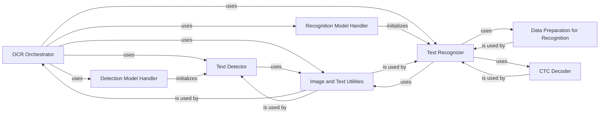

## Component Details

Component Overview for OCR Orchestrator subsystem, outlining its core components, their responsibilities, and their interactions. The selection of these components is based on their fundamental role in the end-to-end OCR pipeline, as identified through analysis of the `easyocr.easyocr.Reader` class and related modules.

### OCR Orchestrator
This is the central control unit of EasyOCR, encapsulating the entire end-to-end OCR pipeline. It handles device selection (CPU/GPU), manages model loading, and orchestrates the sequential execution of text detection and recognition. It provides the primary user-facing methods like `readtext` and `readtext_batched`.

**Related Classes/Methods**:

- <a href="https://github.com/JaidedAI/EasyOCR/blob/master/easyocr/easyocr.py#L29-L578" target="_blank" rel="noopener noreferrer">`easyocr.easyocr.Reader` (29:578)</a>
- <a href="https://github.com/JaidedAI/EasyOCR/blob/master/easyocr/easyocr.py#L439-L473" target="_blank" rel="noopener noreferrer">`easyocr.easyocr.Reader:readtext` (439:473)</a>
- <a href="https://github.com/JaidedAI/EasyOCR/blob/master/easyocr/easyocr.py#L537-L578" target="_blank" rel="noopener noreferrer">`easyocr.easyocr.Reader:readtext_batched` (537:578)</a>

### Detection Model Handler
Responsible for locating, downloading (if necessary), and loading the appropriate text detection model files (e.g., CRAFT, DBNet) based on the user's configuration. It initializes the detector object, making it ready for use.

**Related Classes/Methods**:

- <a href="https://github.com/JaidedAI/EasyOCR/blob/master/easyocr/easyocr.py#L234-L267" target="_blank" rel="noopener noreferrer">`easyocr.easyocr.Reader:getDetectorPath` (234:267)</a>
- <a href="https://github.com/JaidedAI/EasyOCR/blob/master/easyocr/easyocr.py#L269-L274" target="_blank" rel="noopener noreferrer">`easyocr.easyocr.Reader:initDetector` (269:274)</a>
- <a href="https://github.com/JaidedAI/EasyOCR/blob/master/easyocr/detection.py#L73-L89" target="_blank" rel="noopener noreferrer">`easyocr.detection.get_detector` (73:89)</a>
- <a href="https://github.com/JaidedAI/EasyOCR/blob/master/easyocr/detection_db.py#L0-L0" target="_blank" rel="noopener noreferrer">`easyocr.detection_db.get_detector` (0:0)</a>

### Text Detector
Performs the actual text detection on input images. It takes an image and a loaded detection model, then identifies and outputs bounding boxes or polygons that delineate text regions. It also includes functionality to group these detected text boxes into more coherent units.

**Related Classes/Methods**:

- <a href="https://github.com/JaidedAI/EasyOCR/blob/master/easyocr/easyocr.py#L310-L350" target="_blank" rel="noopener noreferrer">`easyocr.easyocr.Reader:detect` (310:350)</a>
- <a href="https://github.com/JaidedAI/EasyOCR/blob/master/easyocr/detection.py#L91-L109" target="_blank" rel="noopener noreferrer">`easyocr.detection.get_textbox` (91:109)</a>
- <a href="https://github.com/JaidedAI/EasyOCR/blob/master/easyocr/detection_db.py#L0-L0" target="_blank" rel="noopener noreferrer">`easyocr.detection_db.get_textbox` (0:0)</a>

### Recognition Model Handler
Manages the selection, loading, and initialization of text recognition models. It determines the correct model based on the specified languages, handles model file paths, downloads models if they are not present, and instantiates the recognizer network along with its character converter.

**Related Classes/Methods**:

- <a href="https://github.com/JaidedAI/EasyOCR/blob/master/easyocr/easyocr.py#L31-L232" target="_blank" rel="noopener noreferrer">`easyocr.easyocr.Reader:__init__` (31:232)</a>
- <a href="https://github.com/JaidedAI/EasyOCR/blob/master/easyocr/easyocr.py#L294-L308" target="_blank" rel="noopener noreferrer">`easyocr.easyocr.Reader:setLanguageList` (294:308)</a>
- <a href="https://github.com/JaidedAI/EasyOCR/blob/master/easyocr/recognition.py#L152-L183" target="_blank" rel="noopener noreferrer">`easyocr.recognition.get_recognizer` (152:183)</a>

### Text Recognizer
Executes the optical character recognition process on cropped image regions identified by the `Text Detector`. It processes these image patches through the loaded recognition model and decodes the model's output probabilities into readable text strings, providing associated confidence scores. It also handles a second pass for low-confidence results with adjusted contrast.

**Related Classes/Methods**:

- <a href="https://github.com/JaidedAI/EasyOCR/blob/master/easyocr/easyocr.py#L352-L437" target="_blank" rel="noopener noreferrer">`easyocr.easyocr.Reader:recognize` (352:437)</a>
- <a href="https://github.com/JaidedAI/EasyOCR/blob/master/easyocr/recognition.py#L185-L232" target="_blank" rel="noopener noreferrer">`easyocr.recognition.get_text` (185:232)</a>
- <a href="https://github.com/JaidedAI/EasyOCR/blob/master/easyocr/recognition.py#L98-L150" target="_blank" rel="noopener noreferrer">`easyocr.recognition.recognizer_predict` (98:150)</a>

### Data Preparation for Recognition
Handles the necessary preprocessing and batching of image data specifically for the recognition model. This includes tasks such as resizing, padding, and optional contrast adjustment to normalize image batches. It also provides a PyTorch `Dataset` implementation to wrap image lists for efficient data loading.

**Related Classes/Methods**:

- <a href="https://github.com/JaidedAI/EasyOCR/blob/master/easyocr/recognition.py#L61-L96" target="_blank" rel="noopener noreferrer">`easyocr.recognition.AlignCollate` (61:96)</a>
- <a href="https://github.com/JaidedAI/EasyOCR/blob/master/easyocr/recognition.py#L48-L59" target="_blank" rel="noopener noreferrer">`easyocr.recognition.ListDataset` (48:59)</a>

### CTC Decoder
Implements the Connectionist Temporal Classification (CTC) decoding algorithms, such as greedy search and beam search. Its purpose is to convert the raw output probabilities from the recognition model into a sequence of characters, effectively translating the model's predictions into human-readable text. It can optionally incorporate a language model for improved accuracy.

**Related Classes/Methods**:

- <a href="https://github.com/JaidedAI/EasyOCR/blob/master/easyocr/utils.py#L180-L269" target="_blank" rel="noopener noreferrer">`easyocr.utils.ctcBeamSearch` (180:269)</a>
- <a href="https://github.com/JaidedAI/EasyOCR/blob/master/easyocr/utils.py#L272-L383" target="_blank" rel="noopener noreferrer">`easyocr.utils.CTCLabelConverter` (272:383)</a>

### Image and Text Utilities
A collection of general-purpose helper functions that support various stages of the OCR pipeline. This includes utilities for reformatting input images, creating image lists from detected bounding boxes, grouping text boxes, handling image rotations, and formatting the final OCR output.

**Related Classes/Methods**:

- <a href="https://github.com/JaidedAI/EasyOCR/blob/master/easyocr/utils.py#L449-L554" target="_blank" rel="noopener noreferrer">`easyocr.utils.group_text_box` (449:554)</a>
- <a href="https://github.com/JaidedAI/EasyOCR/blob/master/easyocr/utils.py#L579-L622" target="_blank" rel="noopener noreferrer">`easyocr.utils.get_image_list` (579:622)</a>
- <a href="https://github.com/JaidedAI/EasyOCR/blob/master/easyocr/utils.py#L731-L768" target="_blank" rel="noopener noreferrer">`easyocr.utils.reformat_input` (731:768)</a>
- <a href="https://github.com/JaidedAI/EasyOCR/blob/master/easyocr/utils.py#L801-L815" target="_blank" rel="noopener noreferrer">`easyocr.utils.make_rotated_img_list` (801:815)</a>
- <a href="https://github.com/JaidedAI/EasyOCR/blob/master/easyocr/utils.py#L818-L834" target="_blank" rel="noopener noreferrer">`easyocr.utils.set_result_with_confidence` (818:834)</a>

### [FAQ](https://github.com/CodeBoarding/GeneratedOnBoardings/tree/main?tab=readme-ov-file#faq)