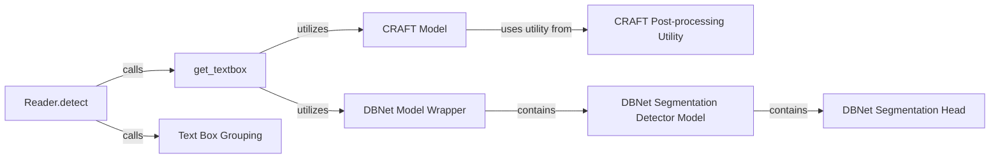

## Component Details

The Text Detection Subsystem in `easyocr` is designed to accurately identify and localize text within images, supporting multiple advanced detection algorithms and robust post-processing.

### Reader.detect
This is the primary high-level entry point for text detection within the EasyOCR `Reader` class. It orchestrates the overall detection process by first reformatting the input image, then calling `get_textbox` to obtain raw text box predictions from the chosen detection model (CRAFT or DBNet), and finally applying `group_text_box` for post-processing and grouping the detected text regions.

**Related Classes/Methods**:

- <a href="https://github.com/JaidedAI/EasyOCR/blob/master/easyocr/easyocr.py#L310-L350" target="_blank" rel="noopener noreferrer">`easyocr.easyocr.Reader:detect` (310:350)</a>

### get_textbox
This function acts as a coordinator for the underlying text detection models. It takes the input image and the chosen detector model (either CRAFT or DBNet) and executes the forward pass of the model. It then applies initial post-processing steps specific to the model to convert the model's output (e.g., heatmaps, probability maps) into preliminary bounding boxes or polygons.

**Related Classes/Methods**:

- <a href="https://github.com/JaidedAI/EasyOCR/blob/master/easyocr/detection.py#L91-L109" target="_blank" rel="noopener noreferrer">`easyocr.detection.get_textbox` (91:109)</a>

### CRAFT Model
This class implements the CRAFT (Character Region Awareness for Text detection) neural network architecture. It takes an image as input and predicts character region score maps and affinity score maps, which are then used to form text bounding boxes.

**Related Classes/Methods**:

- <a href="https://github.com/JaidedAI/EasyOCR/blob/master/easyocr/craft.py#L-1-L-1" target="_blank" rel="noopener noreferrer">`easyocr.craft.CRAFT` (-1:-1)</a>

### CRAFT Post-processing Utility
This utility function is specifically designed to process the output (textmap and linkmap) from the `CRAFT Model`. It applies various thresholds and algorithms to convert these raw score maps into precise bounding boxes or polygons, effectively extracting the detected text regions.

**Related Classes/Methods**:

- <a href="https://github.com/JaidedAI/EasyOCR/blob/master/easyocr/craft_utils.py#L-1-L-1" target="_blank" rel="noopener noreferrer">`easyocr.craft_utils.getDetBoxes` (-1:-1)</a>

### DBNet Model Wrapper
This class serves as a high-level wrapper for the DBNet text detection model. It handles the initialization of the DBNet model, loading of pre-trained weights, and manages the overall inference pipeline for DBNet, including image preprocessing (resizing, normalization) and post-processing of the heatmap output into bounding boxes.

**Related Classes/Methods**:

- <a href="https://github.com/JaidedAI/EasyOCR/blob/master/easyocr/DBNet/DBNet.py#L-1-L-1" target="_blank" rel="noopener noreferrer">`easyocr.DBNet.DBNet.DBNet` (-1:-1)</a>

### DBNet Segmentation Detector Model
This class encapsulates the core segmentation detection logic for DBNet. It wraps the `BasicModel` (the backbone and detection head) and integrates the loss function. Its primary responsibility is to perform the forward pass of the DBNet neural network, taking preprocessed image tensors and producing probability heatmaps.

**Related Classes/Methods**:

- <a href="https://github.com/JaidedAI/EasyOCR/blob/master/easyocr/DBNet/model/model.py#L33-L70" target="_blank" rel="noopener noreferrer">`easyocr.DBNet.model.model.SegDetectorModel` (33:70)</a>

### DBNet Segmentation Head
This module defines the specific network architecture for the segmentation head of the DBNet model. It takes feature maps from a backbone network and processes them through a series of convolutions and upsampling layers to generate the final binary segmentation map and, optionally, a threshold map.

**Related Classes/Methods**:

- <a href="https://github.com/JaidedAI/EasyOCR/blob/master/easyocr/DBNet/decoders/seg_detector.py#L6-L151" target="_blank" rel="noopener noreferrer">`easyocr.DBNet.decoders.seg_detector.SegDetector` (6:151)</a>

### Text Box Grouping
This function performs the final post-processing step, taking the raw bounding boxes or polygons from either CRAFT or DBNet and grouping them into coherent lines or larger text regions. It uses spatial heuristics like slope, y-center, height, width, and margins to achieve this grouping, significantly improving the readability and usability of the detection results.

**Related Classes/Methods**:

- <a href="https://github.com/JaidedAI/EasyOCR/blob/master/easyocr/detection.py#L-1-L-1" target="_blank" rel="noopener noreferrer">`easyocr.detection.group_text_box` (-1:-1)</a>

### [FAQ](https://github.com/CodeBoarding/GeneratedOnBoardings/tree/main?tab=readme-ov-file#faq)