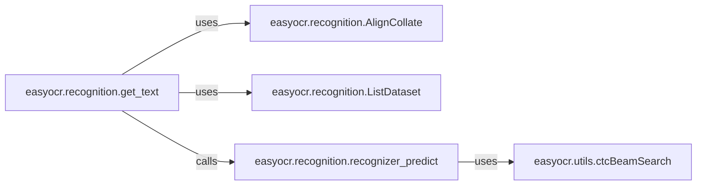

## Component Details

This subsystem is responsible for converting detected text regions (bounding boxes) into readable character sequences. It encompasses the entire process from preparing image data for the recognition model to decoding the model's probabilistic output into final text.

### easyocr.recognition.get_text
This function serves as the primary entry point and orchestrator for the text recognition pipeline. It manages the entire flow, from preparing image data for the recognition model to decoding the model's output into readable text. It handles initial predictions and can perform a second pass with adjusted contrast for low-confidence results, enhancing accuracy.

**Related Classes/Methods**:

- <a href="https://github.com/JaidedAI/EasyOCR/blob/master/easyocr/recognition.py#L185-L232" target="_blank" rel="noopener noreferrer">`easyocr.recognition.get_text` (185:232)</a>

### easyocr.recognition.AlignCollate
This class is a custom collation function designed for use with PyTorch's `DataLoader`. Its main responsibility is to preprocess batches of images before they are fed into the recognition model. This includes resizing images to a uniform dimension, padding them to ensure consistent input shapes, and optionally adjusting image contrast (e.g., `adjust_contrast_grey`) to optimize recognition performance, especially for challenging images.

**Related Classes/Methods**:

- <a href="https://github.com/JaidedAI/EasyOCR/blob/master/easyocr/recognition.py#L61-L96" target="_blank" rel="noopener noreferrer">`easyocr.recognition.AlignCollate` (61:96)</a>

### easyocr.recognition.ListDataset
This class implements a PyTorch `Dataset` interface, allowing a list of image tensors to be easily consumed by `torch.utils.data.DataLoader`. It acts as an adapter, making raw image data compatible with PyTorch's data loading utilities, which are essential for batch processing during inference.

**Related Classes/Methods**:

- <a href="https://github.com/JaidedAI/EasyOCR/blob/master/easyocr/recognition.py#L48-L59" target="_blank" rel="noopener noreferrer">`easyocr.recognition.ListDataset` (48:59)</a>

### easyocr.recognition.recognizer_predict
This function is responsible for executing the forward pass of the text recognition neural network. It takes a batch of preprocessed images, feeds them to the model, applies a softmax function to the model's raw predictions, and then decodes these probabilistic outputs into actual text strings. It supports different decoding strategies, including greedy decoding and beam search, and calculates confidence scores for the recognized text.

**Related Classes/Methods**:

- <a href="https://github.com/JaidedAI/EasyOCR/blob/master/easyocr/recognition.py#L98-L150" target="_blank" rel="noopener noreferrer">`easyocr.recognition.recognizer_predict` (98:150)</a>

### easyocr.utils.ctcBeamSearch
This function implements the Connectionist Temporal Classification (CTC) beam search algorithm. It is used to decode the output of the recognition model (which are typically probability distributions over characters at each time step) into a sequence of characters. Unlike greedy decoding, beam search explores multiple possible paths through the output, often leading to more accurate transcriptions, especially when combined with a language model.

**Related Classes/Methods**:

- <a href="https://github.com/JaidedAI/EasyOCR/blob/master/easyocr/utils.py#L180-L269" target="_blank" rel="noopener noreferrer">`easyocr.utils.ctcBeamSearch` (180:269)</a>

### [FAQ](https://github.com/CodeBoarding/GeneratedOnBoardings/tree/main?tab=readme-ov-file#faq)