```mermaid
graph LR
    CLI_Interface["CLI Interface"]
    OCR_Orchestrator["OCR Orchestrator"]
    Model_Management_Loading["Model Management & Loading"]
    Text_Detection_Subsystem["Text Detection Subsystem"]
    Text_Recognition_Subsystem["Text Recognition Subsystem"]
    Core_Utilities_Backbones["Core Utilities & Backbones"]
    CLI_Interface -- "Initializes" --> OCR_Orchestrator
    CLI_Interface -- "Invokes main methods of" --> OCR_Orchestrator
    OCR_Orchestrator -- "Manages" --> Model_Management_Loading
    OCR_Orchestrator -- "Invokes" --> Text_Detection_Subsystem
    OCR_Orchestrator -- "Invokes" --> Text_Recognition_Subsystem
    OCR_Orchestrator -- "Utilizes (for image preprocessing)" --> Core_Utilities_Backbones
    Model_Management_Loading -- "Provides models to" --> Text_Detection_Subsystem
    Model_Management_Loading -- "Provides models to" --> Text_Recognition_Subsystem
    Text_Detection_Subsystem -- "Uses models from" --> Model_Management_Loading
    Text_Detection_Subsystem -- "Utilizes (for backbones and image processing)" --> Core_Utilities_Backbones
    Text_Recognition_Subsystem -- "Uses models from" --> Model_Management_Loading
    Text_Recognition_Subsystem -- "Utilizes (for backbones and image processing)" --> Core_Utilities_Backbones
    Core_Utilities_Backbones -- "Supports" --> OCR_Orchestrator
    Core_Utilities_Backbones -- "Supports" --> Text_Detection_Subsystem
    Core_Utilities_Backbones -- "Supports" --> Text_Recognition_Subsystem
    click OCR_Orchestrator href "https://github.com/CodeBoarding/GeneratedOnBoardings/blob/main//EasyOCR/OCR_Orchestrator.md" "Details"
    click Model_Management_Loading href "https://github.com/CodeBoarding/GeneratedOnBoardings/blob/main//EasyOCR/Model_Management_Loading.md" "Details"
    click Text_Detection_Subsystem href "https://github.com/CodeBoarding/GeneratedOnBoardings/blob/main//EasyOCR/Text_Detection_Subsystem.md" "Details"
    click Text_Recognition_Subsystem href "https://github.com/CodeBoarding/GeneratedOnBoardings/blob/main//EasyOCR/Text_Recognition_Subsystem.md" "Details"
    click Core_Utilities_Backbones href "https://github.com/CodeBoarding/GeneratedOnBoardings/blob/main//EasyOCR/Core_Utilities_Backbones.md" "Details"
```

## Component Details

Final architecture analysis for EasyOCR, consolidating insights from both the Control Flow Graph (CFG) and Source Analysis. This analysis identifies six fundamental components: CLI Interface, OCR Orchestrator, Model Management & Loading, Text Detection Subsystem, Text Recognition Subsystem, and Core Utilities & Backbones. Each component's role, associated source files, and relationships with other components are detailed, highlighting their critical contributions to EasyOCR's end-to-end OCR pipeline. The explanation emphasizes why each component is indispensable for the system's operation, from user interaction to core intelligent processing and foundational infrastructure.

### CLI Interface
Serves as the primary command-line entry point for EasyOCR. It parses user-provided arguments (e.g., image path, language, GPU usage, model paths) and initiates the OCR process by creating and interacting with the OCR Orchestrator.

**Related Classes/Methods**:

- <a href="https://github.com/JaidedAI/EasyOCR/blob/master/easyocr/cli.py#L240-L278" target="_blank" rel="noopener noreferrer">`easyocr.cli.main` (240:278)</a>

### OCR Orchestrator
This is the central control unit of EasyOCR, encapsulating the entire end-to-end OCR pipeline. It handles device selection (CPU/GPU), manages model loading, and orchestrates the sequential execution of text detection and recognition.

**Related Classes/Methods**:

- <a href="https://github.com/JaidedAI/EasyOCR/blob/master/easyocr/easyocr.py#L29-L578" target="_blank" rel="noopener noreferrer">`easyocr.easyocr.Reader` (29:578)</a>

### Model Management & Loading
Responsible for the lifecycle of deep learning models. This includes determining model paths, downloading models if not present, verifying their integrity (MD5 checksums), and loading them into memory for inference. It supports both detection and recognition models.

**Related Classes/Methods**:

- <a href="https://github.com/JaidedAI/EasyOCR/blob/master/easyocr/easyocr.py#L31-L232" target="_blank" rel="noopener noreferrer">`easyocr.easyocr.Reader.__init__` (31:232)</a>
- <a href="https://github.com/JaidedAI/EasyOCR/blob/master/easyocr/easyocr.py#L234-L267" target="_blank" rel="noopener noreferrer">`easyocr.easyocr.Reader.getDetectorPath` (234:267)</a>
- <a href="https://github.com/JaidedAI/EasyOCR/blob/master/easyocr/utils.py#L624-L630" target="_blank" rel="noopener noreferrer">`easyocr.utils.download_and_unzip` (624:630)</a>
- <a href="https://github.com/JaidedAI/EasyOCR/blob/master/easyocr/detection.py#L73-L89" target="_blank" rel="noopener noreferrer">`easyocr.detection.get_detector` (73:89)</a>
- <a href="https://github.com/JaidedAI/EasyOCR/blob/master/easyocr/recognition.py#L152-L183" target="_blank" rel="noopener noreferrer">`easyocr.recognition.get_recognizer` (152:183)</a>

### Text Detection Subsystem
Focuses on identifying and localizing text regions within an input image. It incorporates different detection algorithms (e.g., CRAFT, DBNet) and includes the necessary post-processing steps to refine raw model outputs into precise bounding boxes or polygons.

**Related Classes/Methods**:

- <a href="https://github.com/JaidedAI/EasyOCR/blob/master/easyocr/craft_utils.py#L0-L0" target="_blank" rel="noopener noreferrer">`easyocr.craft_utils.getDetBoxes` (0:0)</a>
- <a href="https://github.com/JaidedAI/EasyOCR/blob/master/easyocr/easyocr.py#L310-L350" target="_blank" rel="noopener noreferrer">`easyocr.easyocr.Reader.detect` (310:350)</a>
- <a href="https://github.com/JaidedAI/EasyOCR/blob/master/easyocr/craft.py#L0-L0" target="_blank" rel="noopener noreferrer">`easyocr.craft.CRAFT` (0:0)</a>
- <a href="https://github.com/JaidedAI/EasyOCR/blob/master/easyocr/DBNet/DBNet.py#L0-L0" target="_blank" rel="noopener noreferrer">`easyocr.DBNet.DBNet.DBNet` (0:0)</a>
- <a href="https://github.com/JaidedAI/EasyOCR/blob/master/easyocr/DBNet/model/model.py#L33-L70" target="_blank" rel="noopener noreferrer">`easyocr.DBNet.model.model.SegDetectorModel` (33:70)</a>
- <a href="https://github.com/JaidedAI/EasyOCR/blob/master/easyocr/DBNet/decoders/seg_detector.py#L6-L151" target="_blank" rel="noopener noreferrer">`easyocr.DBNet.decoders.seg_detector.SegDetector` (6:151)</a>
- <a href="https://github.com/JaidedAI/EasyOCR/blob/master/easyocr/detection.py#L91-L109" target="_blank" rel="noopener noreferrer">`easyocr.detection.get_textbox` (91:109)</a>

### Text Recognition Subsystem
Converts the detected text regions (bounding boxes) into actual, readable character sequences. This involves preparing the cropped image regions, feeding them to a recognition model, and decoding the model's probabilistic output into text using algorithms like CTC.

**Related Classes/Methods**:

- <a href="https://github.com/JaidedAI/EasyOCR/blob/master/easyocr/easyocr.py#L352-L437" target="_blank" rel="noopener noreferrer">`easyocr.easyocr.Reader.recognize` (352:437)</a>
- <a href="https://github.com/JaidedAI/EasyOCR/blob/master/easyocr/recognition.py#L185-L232" target="_blank" rel="noopener noreferrer">`easyocr.recognition.get_text` (185:232)</a>
- <a href="https://github.com/JaidedAI/EasyOCR/blob/master/easyocr/recognition.py#L61-L96" target="_blank" rel="noopener noreferrer">`easyocr.recognition.AlignCollate` (61:96)</a>
- <a href="https://github.com/JaidedAI/EasyOCR/blob/master/easyocr/recognition.py#L98-L150" target="_blank" rel="noopener noreferrer">`easyocr.recognition.recognizer_predict` (98:150)</a>
- <a href="https://github.com/JaidedAI/EasyOCR/blob/master/easyocr/utils.py#L180-L269" target="_blank" rel="noopener noreferrer">`easyocr.utils.ctcBeamSearch` (180:269)</a>

### Core Utilities & Backbones
Provides foundational neural network architectures (e.g., ResNet, VGG16, MobileNetV3) that serve as feature extractors within both the detection and recognition models. It also includes a collection of essential utility functions for manipulating and preparing image data throughout the OCR pipeline.

**Related Classes/Methods**:

- <a href="https://github.com/JaidedAI/EasyOCR/blob/master/easyocr/utils.py#L731-L768" target="_blank" rel="noopener noreferrer">`easyocr.utils.reformat_input` (731:768)</a>
- <a href="https://github.com/JaidedAI/EasyOCR/blob/master/easyocr/utils.py#L579-L622" target="_blank" rel="noopener noreferrer">`easyocr.utils.get_image_list` (579:622)</a>
- <a href="https://github.com/JaidedAI/EasyOCR/blob/master/easyocr/utils.py#L449-L554" target="_blank" rel="noopener noreferrer">`easyocr.utils.group_text_box` (449:554)</a>
- <a href="https://github.com/JaidedAI/EasyOCR/blob/master/easyocr/model/modules.py#L125-L133" target="_blank" rel="noopener noreferrer">`easyocr.model.modules.ResNet_FeatureExtractor` (125:133)</a>
- <a href="https://github.com/JaidedAI/EasyOCR/blob/master/easyocr/model/modules.py#L22-L79" target="_blank" rel="noopener noreferrer">`easyocr.model.modules.vgg16_bn` (22:79)</a>
- <a href="https://github.com/JaidedAI/EasyOCR/blob/master/easyocr/DBNet/backbones/mobilenetv3.py#L118-L234" target="_blank" rel="noopener noreferrer">`easyocr.DBNet.backbones.mobilenetv3.MobileNetV3` (118:234)</a>
- <a href="https://github.com/JaidedAI/EasyOCR/blob/master/easyocr/DBNet/backbones/resnet.py#L181-L247" target="_blank" rel="noopener noreferrer">`easyocr.DBNet.backbones.resnet.ResNet` (181:247)</a>

### [FAQ](https://github.com/CodeBoarding/GeneratedOnBoardings/tree/main?tab=readme-ov-file#faq)