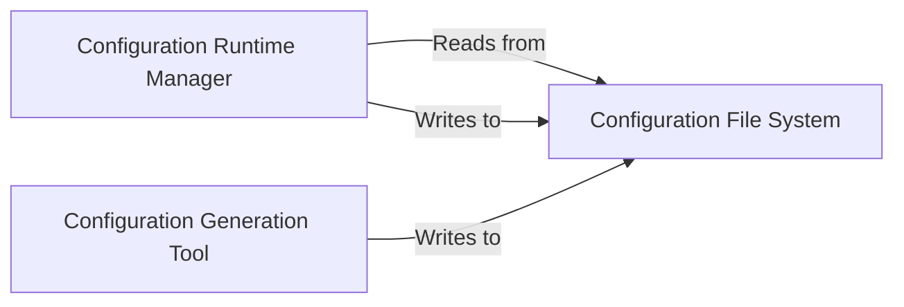

## Details

The EasyRec system leverages a robust configuration-driven architecture, centralizing its operational logic around well-defined configuration files. The Configuration File System serves as the persistent backbone, storing all pipeline configurations. The Configuration Generation Tool streamlines the initial setup by automating the creation of these configuration files, ensuring consistency and reducing manual effort. At runtime, the Configuration Runtime Manager dynamically interacts with these configurations, handling their loading, processing, and modification to drive the core functionalities of the EasyRec pipeline, such as model building, training, and evaluation. This clear separation of concerns between configuration generation, storage, and runtime management ensures flexibility, reproducibility, and efficient deployment of machine learning experiments.

### Configuration Runtime Manager
This is the core runtime component for programmatic interaction with EasyRec's pipeline configurations. It handles loading existing configurations, processing them (e.g., expanding shared features, handling negative sampler paths), saving modified configurations, and providing utilities for editing specific configuration attributes. It ensures that the configuration data is correctly interpreted and available for other parts of the system (e.g., model building, training, evaluation).

**Related Classes/Methods**:

- <a href="https://github.com/alibaba/EasyRec/blob/master/easy_rec/python/utils/config_util.py" target="_blank" rel="noopener noreferrer">`easy_rec.python.utils.config_util`</a>

### Configuration Generation Tool
This component automates the initial creation of EasyRec pipeline configuration files. It parses structured input (e.g., from an Excel spreadsheet) and translates it into the required EasyRec configuration format, generating various sections like data, feature, model, and training/evaluation configurations. This tool streamlines the setup process for users, aligning with the "Configuration-Driven" architectural pattern.

**Related Classes/Methods**:

- <a href="https://github.com/alibaba/EasyRec/blob/master/easy_rec/python/tools/create_config_from_excel.py" target="_blank" rel="noopener noreferrer">`easy_rec.python.tools.create_config_from_excel`</a>

### Configuration File System
Acts as the persistent storage for all EasyRec configuration files. It decouples the configuration generation and runtime management processes, allowing configurations to be created offline and then loaded by the runtime system. This component ensures the durability, versioning, and accessibility of configuration data, which is critical for reproducibility and deployment in an ML pipeline.

**Related Classes/Methods**:

- <a href="https://github.com/alibaba/EasyRec/blob/master/easy_rec/python/utils/config_util.py" target="_blank" rel="noopener noreferrer">`easy_rec.python.utils.config_util`</a>
- <a href="https://github.com/alibaba/EasyRec/blob/master/easy_rec/python/tools/create_config_from_excel.py" target="_blank" rel="noopener noreferrer">`easy_rec.python.tools.create_config_from_excel`</a>

### [FAQ](https://github.com/CodeBoarding/GeneratedOnBoardings/tree/main?tab=readme-ov-file#faq)