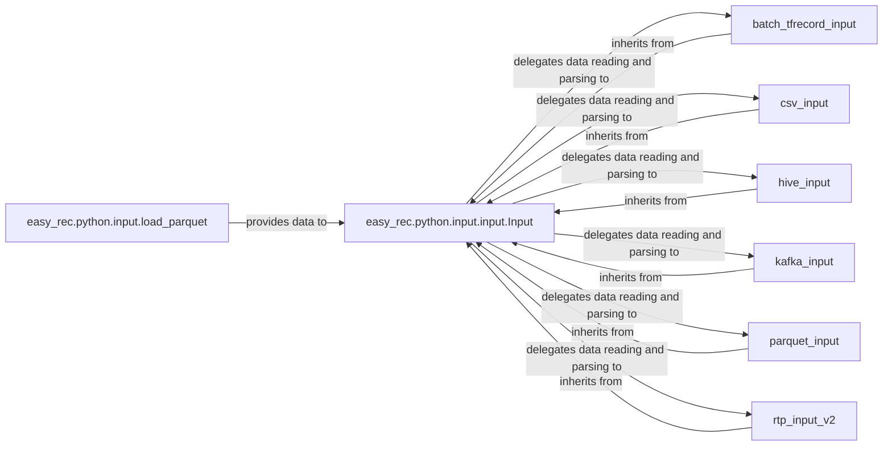

## Details

The `easy_rec.python.input` subsystem is designed around an extensible data ingestion pipeline, centered on the abstract `easy_rec.python.input.input.Input` class. This abstract class establishes the common interface and lifecycle for all data input handlers, orchestrating the overall data flow from source to feature preparation. Concrete input components, such as `batch_tfrecord_input`, `csv_input`, `hive_input`, `kafka_input`, `parquet_input`, and `rtp_input_v2`, extend this base class. Each specialized input component is responsible for implementing the specific logic required to read and parse data from its respective source, adhering to the contract defined by the `Input` class. The `Input` class delegates the actual data reading and parsing operations to these specialized implementations, ensuring a flexible and modular design. Additionally, utility components like `easy_rec.python.input.load_parquet` provide specific data loading capabilities that feed into the broader input processing framework. This architecture promotes reusability and simplifies the integration of new data sources by requiring only the implementation of the `Input` interface.

### easy_rec.python.input.input.Input
This is the central abstract base class for the entire data ingestion subsystem. It defines the common interface and lifecycle for all input handlers, including methods for building the input pipeline (`_build`), parsing various feature types (`_parse_*_feature`), and managing input stopping criteria. It acts as the orchestrator for data flow from source to feature preparation by delegating specific reading and parsing tasks to its concrete implementations.

**Related Classes/Methods**:

- <a href="https://github.com/alibaba/EasyRec/blob/master/easy_rec/python/input/input.py#L36-L1064" target="_blank" rel="noopener noreferrer">`easy_rec.python.input.input.Input`:36-1064</a>
- <a href="https://github.com/alibaba/EasyRec/blob/master/easy_rec/python/input/input.py" target="_blank" rel="noopener noreferrer">`easy_rec.python.input.input.Input:_build`</a>
- <a href="https://github.com/alibaba/EasyRec/blob/master/easy_rec/python/input/input.py" target="_blank" rel="noopener noreferrer">`easy_rec.python.input.input.Input:_parse_feature`</a>

### batch_tfrecord_input
A specialized implementation of the `Input` abstract base class, designed to handle data from TFRecord files. It implements the `_build` method and specific parsing logic for its respective data types, fulfilling the data reading and parsing responsibilities delegated by the `Input` class.

**Related Classes/Methods**:

- <a href="https://github.com/alibaba/EasyRec/blob/master/easy_rec/python/input/batch_tfrecord_input.py#L14-L117" target="_blank" rel="noopener noreferrer">`easy_rec.python.input.batch_tfrecord_input.BatchTFRecordInput`:14-117</a>
- <a href="https://github.com/alibaba/EasyRec/blob/master/easy_rec/python/input/batch_tfrecord_input.py" target="_blank" rel="noopener noreferrer">`easy_rec.python.input.batch_tfrecord_input.BatchTFRecordInput:_build`</a>

### csv_input
A specialized implementation of the `Input` abstract base class, designed to handle data from CSV files. It implements the `_build` method and specific parsing logic for its respective data types, fulfilling the data reading and parsing responsibilities delegated by the `Input` class.

**Related Classes/Methods**:

- <a href="https://github.com/alibaba/EasyRec/blob/master/easy_rec/python/input/csv_input.py#L17-L175" target="_blank" rel="noopener noreferrer">`easy_rec.python.input.csv_input.CSVInput`:17-175</a>
- <a href="https://github.com/alibaba/EasyRec/blob/master/easy_rec/python/input/csv_input.py" target="_blank" rel="noopener noreferrer">`easy_rec.python.input.csv_input.CSVInput:_build`</a>

### hive_input
A specialized implementation of the `Input` abstract base class, designed to handle data from Hive tables. It implements the `_build` method and specific parsing logic for its respective data types, fulfilling the data reading and parsing responsibilities delegated by the `Input` class.

**Related Classes/Methods**:

- <a href="https://github.com/alibaba/EasyRec/blob/master/easy_rec/python/input/hive_input.py#L11-L123" target="_blank" rel="noopener noreferrer">`easy_rec.python.input.hive_input.HiveInput`:11-123</a>
- <a href="https://github.com/alibaba/EasyRec/blob/master/easy_rec/python/input/hive_input.py" target="_blank" rel="noopener noreferrer">`easy_rec.python.input.hive_input.HiveInput:_build`</a>

### kafka_input
A specialized implementation of the `Input` abstract base class, designed to handle data from Kafka topics. It implements the `_build` method and specific parsing logic for its respective data types, fulfilling the data reading and parsing responsibilities delegated by the `Input` class.

**Related Classes/Methods**:

- <a href="https://github.com/alibaba/EasyRec/blob/master/easy_rec/python/input/kafka_input.py#L33-L235" target="_blank" rel="noopener noreferrer">`easy_rec.python.input.kafka_input.KafkaInput`:33-235</a>
- <a href="https://github.com/alibaba/EasyRec/blob/master/easy_rec/python/input/kafka_input.py" target="_blank" rel="noopener noreferrer">`easy_rec.python.input.kafka_input.KafkaInput:_build`</a>

### parquet_input
A specialized implementation of the `Input` abstract base class, designed to handle data from Parquet files. It implements the `_build` method and specific parsing logic for its respective data types, fulfilling the data reading and parsing responsibilities delegated by the `Input` class.

**Related Classes/Methods**:

- <a href="https://github.com/alibaba/EasyRec/blob/master/easy_rec/python/input/parquet_input.py#L19-L397" target="_blank" rel="noopener noreferrer">`easy_rec.python.input.parquet_input.ParquetInput`:19-397</a>
- <a href="https://github.com/alibaba/EasyRec/blob/master/easy_rec/python/input/parquet_input.py" target="_blank" rel="noopener noreferrer">`easy_rec.python.input.parquet_input.ParquetInput:_build`</a>

### rtp_input_v2
A specialized input handler for real-time prediction (RTP) scenarios, likely involving specific data formats or low-latency requirements for inference. It implements the `_build` method and specific parsing logic, fulfilling the data reading and parsing responsibilities delegated by the `Input` class.

**Related Classes/Methods**:

- <a href="https://github.com/alibaba/EasyRec/blob/master/easy_rec/python/input/rtp_input_v2.py#L14-L145" target="_blank" rel="noopener noreferrer">`easy_rec.python.input.rtp_input_v2.RTPInputV2`:14-145</a>
- <a href="https://github.com/alibaba/EasyRec/blob/master/easy_rec/python/input/rtp_input_v2.py" target="_blank" rel="noopener noreferrer">`easy_rec.python.input.rtp_input_v2.RTPInputV2:_build`</a>

### easy_rec.python.input.load_parquet
This component is a utility specifically for loading Parquet data, potentially managing data queues for asynchronous or buffered processing, and provides this data to the `Input` class for further processing.

**Related Classes/Methods**:

- <a href="https://github.com/alibaba/EasyRec/blob/master/easy_rec/python/input/load_parquet.py" target="_blank" rel="noopener noreferrer">`easy_rec.python.input.load_parquet.LoadParquet`</a>

### [FAQ](https://github.com/CodeBoarding/GeneratedOnBoardings/tree/main?tab=readme-ov-file#faq)