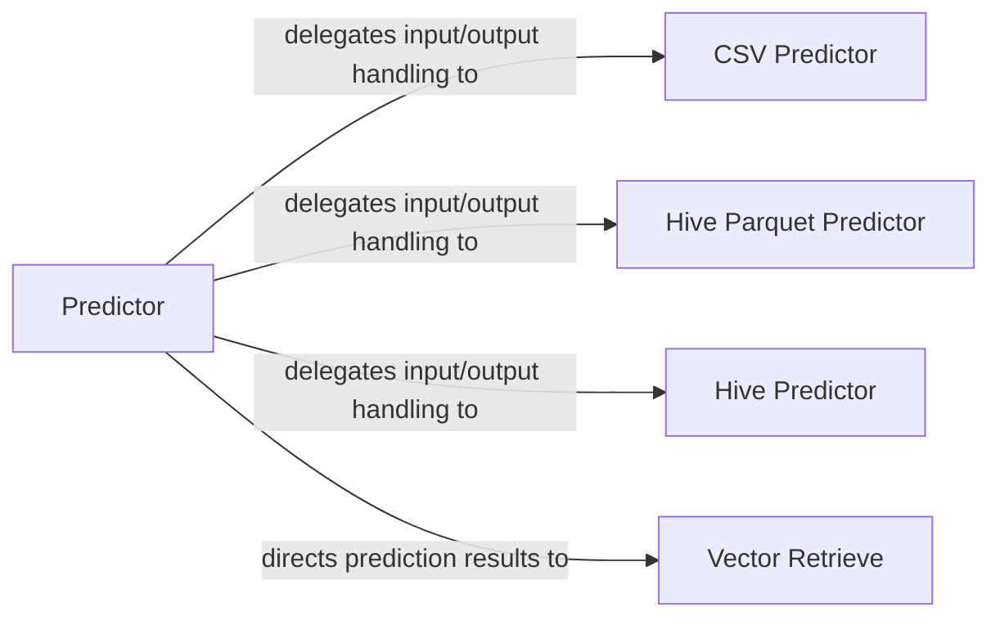

## Details

The `Deployment & Serving` subsystem is encapsulated within the `easy_rec.python.inference` package. This package is responsible for loading trained models, performing real-time or batch inference, and outputting predictions, aligning with the project's focus on an end-to-end recommendation framework.

### Predictor
Serves as the core inference engine. It orchestrates the entire prediction workflow, including loading the trained model, constructing the TensorFlow graph for inference, managing input/output tensors, executing the model, and handling prediction results. It acts as the primary interface for users to perform predictions.

**Related Classes/Methods**:

- <a href="https://github.com/alibaba/EasyRec/blob/master/easy_rec/python/inference/predictor.py" target="_blank" rel="noopener noreferrer">`easy_rec.python.inference.predictor`</a>

### Vector Retrieve
Specializes in post-processing model outputs into numerical vector representations. This is crucial for recommendation systems that rely on vector similarity search for candidate generation or retrieval tasks.

**Related Classes/Methods**:

- <a href="https://github.com/alibaba/EasyRec/blob/master/easy_rec/python/inference/vector_retrieve.py" target="_blank" rel="noopener noreferrer">`easy_rec.python.inference.vector_retrieve`</a>

### CSV Predictor
Handles the specific logic for performing predictions when the input data is provided in CSV format. It manages CSV-specific data reading and parsing, and output writing.

**Related Classes/Methods**:

- <a href="https://github.com/alibaba/EasyRec/blob/master/easy_rec/python/inference/csv_predictor.py" target="_blank" rel="noopener noreferrer">`easy_rec.python.inference.csv_predictor`</a>

### Hive Parquet Predictor
Manages the prediction workflow for input and output data stored in Hive tables using the Parquet format. This component is optimized for large-scale, columnar data storage prevalent in big data ecosystems.

**Related Classes/Methods**:

- <a href="https://github.com/alibaba/EasyRec/blob/master/easy_rec/python/inference/hive_parquet_predictor.py" target="_blank" rel="noopener noreferrer">`easy_rec.python.inference.hive_parquet_predictor`</a>

### Hive Predictor
Provides the general prediction logic for interacting with Hive tables, handling various Hive table inputs and outputs beyond just Parquet.

**Related Classes/Methods**:

- <a href="https://github.com/alibaba/EasyRec/blob/master/easy_rec/python/inference/hive_predictor.py" target="_blank" rel="noopener noreferrer">`easy_rec.python.inference.hive_predictor`</a>

### [FAQ](https://github.com/CodeBoarding/GeneratedOnBoardings/tree/main?tab=readme-ov-file#faq)