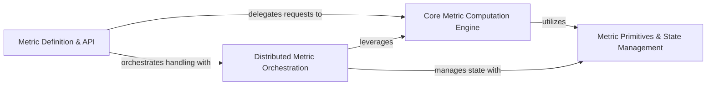

## Details

The metric subsystem in EasyRec is structured around a clear separation of concerns, facilitating both ease of use and robust distributed computation. The `Metric Definition & API` acts as the primary entry point, allowing users to define and configure various evaluation metrics. This component then delegates the actual computation to the `Core Metric Computation Engine`, which houses the fundamental algorithms for individual metrics like AUC and F1-score. For distributed environments, the `Distributed Metric Orchestration` component takes over, coordinating metric calculations and aggregations across multiple workers or replicas, leveraging the core computation engine as needed. Both the core computation and distributed orchestration rely heavily on the `Metric Primitives & State Management` component, which provides the necessary low-level utilities for managing metric-related state and TensorFlow variables, ensuring accurate and consistent metric accumulation throughout the training and evaluation processes. This layered architecture ensures modularity, scalability, and maintainability of the metric evaluation framework.

### Metric Definition & API
This component serves as the high-level public interface for users to define, configure, and access various evaluation metrics (e.g., AUC, GAUC, Session AUC). It acts as a facade, abstracting the underlying metric implementations and providing a clean entry point for metric configuration.

**Related Classes/Methods**:

- <a href="https://github.com/alibaba/EasyRec/blob/master/easy_rec/python/core/metrics.py#L25-L56" target="_blank" rel="noopener noreferrer">`easy_rec.python.core.metrics.max_f1`:25-56</a>
- <a href="https://github.com/alibaba/EasyRec/blob/master/easy_rec/python/core/metrics.py#L260-L277" target="_blank" rel="noopener noreferrer">`easy_rec.python.core.metrics.gauc`:260-277</a>
- <a href="https://github.com/alibaba/EasyRec/blob/master/easy_rec/python/core/metrics.py#L280-L297" target="_blank" rel="noopener noreferrer">`easy_rec.python.core.metrics.session_auc`:280-297</a>

### Core Metric Computation Engine
This is the central hub containing the fundamental logic and implementations for a wide range of individual metrics (e.g., AUC, Precision, Recall, Mean). It performs the actual calculations based on model predictions and ground truth labels. This component is primarily accessed through the `Metric Definition & API`.

**Related Classes/Methods**:

- <a href="https://github.com/alibaba/EasyRec/blob/master/easy_rec/python/core/metrics.py#L111-L155" target="_blank" rel="noopener noreferrer">`easy_rec.python.core.metrics.fast_auc`:111-155</a>
- <a href="https://github.com/alibaba/EasyRec/blob/master/easy_rec/python/core/metrics.py#L59-L108" target="_blank" rel="noopener noreferrer">`easy_rec.python.core.metrics._separated_auc_impl`:59-108</a>

### Distributed Metric Orchestration
This component manages the orchestration, execution, and aggregation of metric computations specifically tailored for distributed environments, including Alibaba Cloud PAI and generic TensorFlow distributed setups. It ensures metrics are correctly calculated and combined across multiple workers or replicas.

**Related Classes/Methods**:

- <a href="https://github.com/alibaba/EasyRec/blob/master/easy_rec/python/core/easyrec_metrics/distribute_metrics_impl_pai.py" target="_blank" rel="noopener noreferrer">`easy_rec.python.core.easyrec_metrics.distribute_metrics_impl_pai`</a>
- <a href="https://github.com/alibaba/EasyRec/blob/master/easy_rec/python/core/easyrec_metrics/distribute_metrics_impl_tf.py" target="_blank" rel="noopener noreferrer">`easy_rec.python.core.easyrec_metrics.distribute_metrics_impl_tf`</a>
- <a href="https://github.com/alibaba/EasyRec/blob/master/easy_rec/python/core/metrics.py#L158-L257" target="_blank" rel="noopener noreferrer">`easy_rec.python.core.metrics._distribute_separated_auc_impl`:158-257</a>

### Metric Primitives & State Management
This component provides foundational utilities for accumulating metric-related state (e.g., confusion matrix components, running sums) and managing TensorFlow variables used to maintain this state across batches and steps during the training and evaluation phases. These primitives are utilized by the `Core Metric Computation Engine` and `Distributed Metric Orchestration` for their calculations.

**Related Classes/Methods**:

### [FAQ](https://github.com/CodeBoarding/GeneratedOnBoardings/tree/main?tab=readme-ov-file#faq)