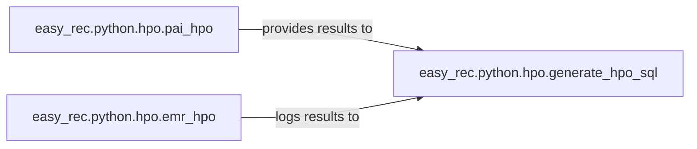

## Details

The Hyperparameter Optimization (HPO) subsystem is primarily defined by the easy_rec.python.hpo package. It encapsulates the logic for automated hyperparameter search, specifically tailored for different execution environments within the EasyRec framework.

### easy_rec.python.hpo.pai_hpo
This component is responsible for orchestrating and managing Hyperparameter Optimization (HPO) experiments specifically on Alibaba Cloud's PAI platform. Its responsibilities include processing HPO configurations, submitting experiments to PAI, monitoring the lifecycle of these experiments, and providing detailed execution results and logs.

**Related Classes/Methods**:

- <a href="https://github.com/alibaba/EasyRec/blob/master/easy_rec/python/hpo/pai_hpo.py" target="_blank" rel="noopener noreferrer">`easy_rec.python.hpo.pai_hpo`</a>

### easy_rec.python.hpo.emr_hpo
This component provides HPO orchestration and management capabilities tailored for the EMR (Elastic MapReduce) platform. It handles the preparation and execution of HPO jobs, manages the lifecycle of experiment runs, and logs the results of these optimization trials.

**Related Classes/Methods**:

- <a href="https://github.com/alibaba/EasyRec/blob/master/easy_rec/python/hpo/emr_hpo.py" target="_blank" rel="noopener noreferrer">`easy_rec.python.hpo.emr_hpo`</a>

### easy_rec.python.hpo.generate_hpo_sql
This component is responsible for generating SQL queries or scripts. Its primary function is to persist HPO trial information, retrieve optimal hyperparameter sets from the database, and facilitate post-analysis of HPO results that are stored in various database systems. It acts as a data interface for HPO results.

**Related Classes/Methods**:

- <a href="https://github.com/alibaba/EasyRec/blob/master/easy_rec/python/hpo/generate_hpo_sql.py" target="_blank" rel="noopener noreferrer">`easy_rec.python.hpo.generate_hpo_sql`</a>

### [FAQ](https://github.com/CodeBoarding/GeneratedOnBoardings/tree/main?tab=readme-ov-file#faq)