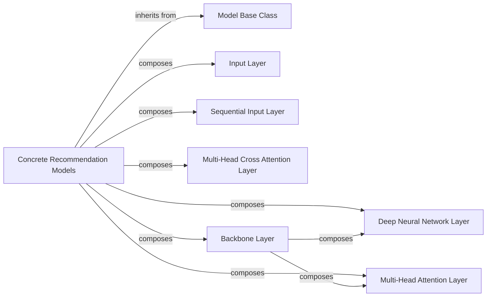

## Details

The Model Library (Model Zoo) subsystem is primarily defined by the easy_rec.python.model and easy_rec.python.layers packages, containing core model definitions, abstract base models, concrete recommendation model implementations, and reusable neural network layers.

### Model Base Class
Serves as the foundational abstract class for all recommendation models, providing common functionalities and a standardized interface. It defines the contract for how models are built and interact within the EasyRec framework.

**Related Classes/Methods**:

- <a href="https://github.com/alibaba/EasyRec/blob/master/easy_rec/python/model/easy_rec_model.py" target="_blank" rel="noopener noreferrer">`easy_rec.python.model.easy_rec_model`</a>

### Concrete Recommendation Models
These are the concrete implementations of various deep learning recommendation model architectures (e.g., DCN, ESMM, MIND, PLE). They extend the Model Base Class and compose various layers to form complete recommendation models.

**Related Classes/Methods**:

- <a href="https://github.com/alibaba/EasyRec/blob/master/easy_rec/python/model/dcn.py" target="_blank" rel="noopener noreferrer">`easy_rec.python.model.dcn`</a>
- <a href="https://github.com/alibaba/EasyRec/blob/master/easy_rec/python/model/esmm.py" target="_blank" rel="noopener noreferrer">`easy_rec.python.model.esmm`</a>
- <a href="https://github.com/alibaba/EasyRec/blob/master/easy_rec/python/model/mind.py" target="_blank" rel="noopener noreferrer">`easy_rec.python.model.mind`</a>
- <a href="https://github.com/alibaba/EasyRec/blob/master/easy_rec/python/model/multi_tower_din.py" target="_blank" rel="noopener noreferrer">`easy_rec.python.model.multi_tower_din`</a>
- <a href="https://github.com/alibaba/EasyRec/blob/master/easy_rec/python/model/ple.py" target="_blank" rel="noopener noreferrer">`easy_rec.python.model.ple`</a>
- <a href="https://github.com/alibaba/EasyRec/blob/master/easy_rec/python/model/rank_model.py" target="_blank" rel="noopener noreferrer">`easy_rec.python.model.rank_model`</a>

### Input Layer
Responsible for processing raw input features and transforming them into appropriate tensor formats for model consumption. It handles the initial stage of data preparation within the model's graph.

**Related Classes/Methods**:

- <a href="https://github.com/alibaba/EasyRec/blob/master/easy_rec/python/layers/input_layer.py" target="_blank" rel="noopener noreferrer">`easy_rec.python.layers.input_layer`</a>

### Sequential Input Layer
Specifically designed for processing sequential input features, transforming them into suitable tensor formats for models that handle sequence data (e.g., user behavior sequences).

**Related Classes/Methods**:

- <a href="https://github.com/alibaba/EasyRec/blob/master/easy_rec/python/layers/seq_input_layer.py" target="_blank" rel="noopener noreferrer">`easy_rec.python.layers.seq_input_layer`</a>

### Deep Neural Network Layer
A generic Deep Neural Network (DNN) layer, serving as a fundamental and widely used building block for creating dense representations and non-linear transformations within models.

**Related Classes/Methods**:

- <a href="https://github.com/alibaba/EasyRec/blob/master/easy_rec/python/layers/dnn.py" target="_blank" rel="noopener noreferrer">`easy_rec.python.layers.dnn`</a>

### Multi-Head Attention Layer
Implements the multi-head attention mechanism, crucial for models processing sequential data or capturing complex relationships between different parts of the input, often used in transformer-based architectures.

**Related Classes/Methods**:

- <a href="https://github.com/alibaba/EasyRec/blob/master/easy_rec/python/layers/multihead_attention.py" target="_blank" rel="noopener noreferrer">`easy_rec.python.layers.multihead_attention`</a>

### Multi-Head Cross Attention Layer
Implements a multi-head cross-attention mechanism, enabling a model to attend to different parts of a second sequence or set of features, facilitating interaction between distinct input modalities or representations.

**Related Classes/Methods**:

- <a href="https://github.com/alibaba/EasyRec/blob/master/easy_rec/python/layers/multihead_cross_attention.py" target="_blank" rel="noopener noreferrer">`easy_rec.python.layers.multihead_cross_attention`</a>

### Backbone Layer
Provides a flexible mechanism to define and integrate various backbone network architectures into the recommendation models. It allows for modularity in constructing the main feature processing part of a model.

**Related Classes/Methods**:

- <a href="https://github.com/alibaba/EasyRec/blob/master/easy_rec/python/layers/backbone.py" target="_blank" rel="noopener noreferrer">`easy_rec.python.layers.backbone`</a>

### [FAQ](https://github.com/CodeBoarding/GeneratedOnBoardings/tree/main?tab=readme-ov-file#faq)