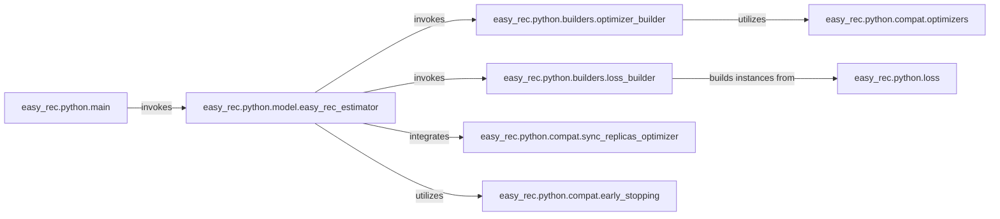

## Details

The `easy_rec.python` subsystem orchestrates the training and evaluation of machine learning models within the EasyRec framework. The `easy_rec.python.main` component serves as the primary entry point, initiating the training process by invoking the `easy_rec.python.model.easy_rec_estimator`. This estimator, a core TensorFlow component, manages the entire training lifecycle, including model training, evaluation, and export. It dynamically configures optimizers and loss functions through interactions with `easy_rec.python.builders.optimizer_builder` and `easy_rec.python.builders.loss_builder`, respectively. These builders abstract the creation of various optimizers and loss functions, leveraging compatibility utilities provided by `easy_rec.python.compat.optimizers` and concrete loss implementations from `easy_rec.python.loss`. For distributed training, the `easy_rec_estimator` integrates with `easy_rec.python.compat.sync_replicas_optimizer` to ensure synchronized gradient updates. Additionally, it utilizes `easy_rec.python.compat.early_stopping` to prevent overfitting and optimize training duration. This structured interaction ensures a robust and flexible training pipeline.

### easy_rec.python.main
Primary entry point for initiating training and evaluation tasks, orchestrating the training environment. It sets up the overall training flow.

**Related Classes/Methods**:

- <a href="https://github.com/alibaba/EasyRec/blob/master/easy_rec/python/model/easy_rec_estimator.py" target="_blank" rel="noopener noreferrer">`easy_rec.python.model.easy_rec_estimator`</a>

### easy_rec.python.model.easy_rec_estimator
Core TensorFlow Estimator encapsulating the model's training loop, evaluation, and export, managing optimizers, loss, and distributed training. This is the heart of the training process.

**Related Classes/Methods**:

- <a href="https://github.com/alibaba/EasyRec/blob/master/easy_rec/python/builders/optimizer_builder.py" target="_blank" rel="noopener noreferrer">`easy_rec.python.builders.optimizer_builder`</a>
- <a href="https://github.com/alibaba/EasyRec/blob/master/easy_rec/python/builders/loss_builder.py" target="_blank" rel="noopener noreferrer">`easy_rec.python.builders.loss_builder`</a>
- <a href="https://github.com/alibaba/EasyRec/blob/master/easy_rec/python/compat/sync_replicas_optimizer.py" target="_blank" rel="noopener noreferrer">`easy_rec.python.compat.sync_replicas_optimizer`</a>
- <a href="https://github.com/alibaba/EasyRec/blob/master/easy_rec/python/compat/early_stopping.py" target="_blank" rel="noopener noreferrer">`easy_rec.python.compat.early_stopping`</a>

### easy_rec.python.builders.optimizer_builder
Responsible for constructing and configuring various TensorFlow optimizers based on the provided training configuration. It abstracts the creation of optimizers.

**Related Classes/Methods**:

- <a href="https://github.com/alibaba/EasyRec/blob/master/easy_rec/python/compat/optimizers.py" target="_blank" rel="noopener noreferrer">`easy_rec.python.compat.optimizers`</a>

### easy_rec.python.builders.loss_builder
Responsible for constructing and configuring different loss functions based on the training configuration. It abstracts the creation of loss functions.

**Related Classes/Methods**:

- <a href="https://github.com/alibaba/EasyRec/blob/master/easy_rec/python/loss/__init__.py" target="_blank" rel="noopener noreferrer">`easy_rec.python.loss`</a>

### easy_rec.python.loss
Contains concrete implementations of various loss functions used during training. These are the actual mathematical functions for calculating training error.

**Related Classes/Methods**:

- <a href="https://github.com/alibaba/EasyRec/blob/master/easy_rec/python/loss/__init__.py" target="_blank" rel="noopener noreferrer">`easy_rec.python.loss`</a>

### easy_rec.python.compat.optimizers
Provides compatibility utilities and wrappers for TensorFlow optimizers, including gradient manipulation functionalities. It ensures optimizers work correctly across different TensorFlow versions or configurations.

**Related Classes/Methods**:

- <a href="https://github.com/alibaba/EasyRec/blob/master/easy_rec/python/compat/optimizers.py" target="_blank" rel="noopener noreferrer">`easy_rec.python.compat.optimizers`</a>

### easy_rec.python.compat.sync_replicas_optimizer
An optimizer wrapper specifically designed for synchronized distributed training, ensuring proper gradient aggregation across multiple training replicas. Crucial for large-scale distributed training.

**Related Classes/Methods**:

- <a href="https://github.com/alibaba/EasyRec/blob/master/easy_rec/python/compat/sync_replicas_optimizer.py" target="_blank" rel="noopener noreferrer">`easy_rec.python.compat.sync_replicas_optimizer`</a>

### easy_rec.python.compat.early_stopping
Implements logic for early stopping during training to prevent overfitting and optimize training duration by monitoring performance metrics.

**Related Classes/Methods**:

- <a href="https://github.com/alibaba/EasyRec/blob/master/easy_rec/python/compat/early_stopping.py" target="_blank" rel="noopener noreferrer">`easy_rec.python.compat.early_stopping`</a>

### [FAQ](https://github.com/CodeBoarding/GeneratedOnBoardings/tree/main?tab=readme-ov-file#faq)