```mermaid
graph LR
    Configuration_Management["Configuration Management"]
    Data_Ingestion["Data Ingestion"]
    Feature_Engineering["Feature Engineering"]
    Model_Library_Model_Zoo_["Model Library (Model Zoo)"]
    Training_Optimization_Engine["Training & Optimization Engine"]
    Evaluation_Metrics["Evaluation & Metrics"]
    Deployment_Serving["Deployment & Serving"]
    Hyperparameter_Optimization_HPO_["Hyperparameter Optimization (HPO)"]
    Configuration_Management -- "configures data sources for" --> Data_Ingestion
    Configuration_Management -- "defines feature transformations for" --> Feature_Engineering
    Configuration_Management -- "specifies model architectures for" --> Model_Library_Model_Zoo_
    Configuration_Management -- "configures training parameters for" --> Training_Optimization_Engine
    Configuration_Management -- "defines serving schemas for" --> Deployment_Serving
    Hyperparameter_Optimization_HPO_ -- "generates/modifies configurations for" --> Configuration_Management
    Data_Ingestion -- "feeds raw data to" --> Feature_Engineering
    Feature_Engineering -- "provides processed features to" --> Training_Optimization_Engine
    Model_Library_Model_Zoo_ -- "provides model architecture to" --> Training_Optimization_Engine
    Training_Optimization_Engine -- "consumes processed features from" --> Feature_Engineering
    Training_Optimization_Engine -- "sends predictions & labels to" --> Evaluation_Metrics
    Training_Optimization_Engine -- "exports trained models to" --> Deployment_Serving
    Evaluation_Metrics -- "reports performance metrics back to" --> Training_Optimization_Engine
    Deployment_Serving -- "loads trained models from" --> Training_Optimization_Engine
    click Configuration_Management href "https://github.com/CodeBoarding/GeneratedOnBoardings/blob/main/EasyRec/Configuration_Management.md" "Details"
    click Data_Ingestion href "https://github.com/CodeBoarding/GeneratedOnBoardings/blob/main/EasyRec/Data_Ingestion.md" "Details"
    click Feature_Engineering href "https://github.com/CodeBoarding/GeneratedOnBoardings/blob/main/EasyRec/Feature_Engineering.md" "Details"
    click Model_Library_Model_Zoo_ href "https://github.com/CodeBoarding/GeneratedOnBoardings/blob/main/EasyRec/Model_Library_Model_Zoo_.md" "Details"
    click Training_Optimization_Engine href "https://github.com/CodeBoarding/GeneratedOnBoardings/blob/main/EasyRec/Training_Optimization_Engine.md" "Details"
    click Evaluation_Metrics href "https://github.com/CodeBoarding/GeneratedOnBoardings/blob/main/EasyRec/Evaluation_Metrics.md" "Details"
    click Deployment_Serving href "https://github.com/CodeBoarding/GeneratedOnBoardings/blob/main/EasyRec/Deployment_Serving.md" "Details"
    click Hyperparameter_Optimization_HPO_ href "https://github.com/CodeBoarding/GeneratedOnBoardings/blob/main/EasyRec/Hyperparameter_Optimization_HPO_.md" "Details"
```

## Details

The `easy_rec` architecture is designed for building and deploying deep learning recommendation models, centered around a configurable and modular pipeline. `Configuration Management` serves as the central hub, dictating parameters for data handling, feature engineering, model selection, training, and serving. Raw data is processed by `Data Ingestion` and transformed into suitable features by `Feature Engineering`. The `Model Library` provides a repository of model architectures and reusable layers. The `Training & Optimization Engine` orchestrates the model training, consuming processed features and model blueprints, with `Evaluation & Metrics` continuously assessing performance. Optimized models are then exported from the `Training & Optimization Engine` to `Deployment & Serving` for inference. `Hyperparameter Optimization (HPO)` iteratively refines the system's configurations to maximize overall model effectiveness. This structure facilitates clear data and control flow, making it ideal for visual representation in a flow graph.

### Configuration Management [[Expand]](./Configuration_Management.md)
Centralized management of project settings, including data sources, feature definitions, model parameters, and training/evaluation configurations.

**Related Classes/Methods**:

- <a href="https://github.com/alibaba/EasyRec/blob/master/easy_rec/python/utils/config_util.py" target="_blank" rel="noopener noreferrer">`easy_rec.python.utils.config_util`</a>
- <a href="https://github.com/alibaba/EasyRec/blob/master/easy_rec/python/tools/create_config_from_excel.py" target="_blank" rel="noopener noreferrer">`easy_rec.python.tools.create_config_from_excel`</a>

### Data Ingestion [[Expand]](./Data_Ingestion.md)
Responsible for reading raw data from diverse sources and performing initial data parsing.

**Related Classes/Methods**:

- <a href="https://github.com/alibaba/EasyRec/blob/master/easy_rec/python/input/input.py" target="_blank" rel="noopener noreferrer">`easy_rec.python.input.input`</a>
- <a href="https://github.com/alibaba/EasyRec/blob/master/easy_rec/python/input" target="_blank" rel="noopener noreferrer">`easy_rec.python.input`</a>

### Feature Engineering [[Expand]](./Feature_Engineering.md)
Transforms raw input features into numerical representations suitable for deep learning models.

**Related Classes/Methods**:

- <a href="https://github.com/alibaba/EasyRec/blob/master/easy_rec/python/feature_column/feature_column.py" target="_blank" rel="noopener noreferrer">`easy_rec.python.feature_column.feature_column`</a>
- <a href="https://github.com/alibaba/EasyRec/blob/master/easy_rec/python/feature_column/feature_group.py" target="_blank" rel="noopener noreferrer">`easy_rec.python.feature_column.feature_group`</a>
- <a href="https://github.com/alibaba/EasyRec/blob/master/easy_rec/python/feature_column" target="_blank" rel="noopener noreferrer">`easy_rec.python.feature_column`</a>

### Model Library (Model Zoo) [[Expand]](./Model_Library_Model_Zoo_.md)
Contains a collection of pre-implemented deep learning recommendation models and reusable neural network layers.

**Related Classes/Methods**:

- <a href="https://github.com/alibaba/EasyRec/blob/master/easy_rec/python/model/easy_rec_model.py" target="_blank" rel="noopener noreferrer">`easy_rec.python.model.easy_rec_model`</a>
- <a href="https://github.com/alibaba/EasyRec/blob/master/easy_rec/python/model" target="_blank" rel="noopener noreferrer">`easy_rec.python.model`</a>
- <a href="https://github.com/alibaba/EasyRec/blob/master/easy_rec/python/layers" target="_blank" rel="noopener noreferrer">`easy_rec.python.layers`</a>

### Training & Optimization Engine [[Expand]](./Training_Optimization_Engine.md)
Orchestrates the model training process, including optimizer selection, loss function application, and distributed training setup.

**Related Classes/Methods**:

- <a href="https://github.com/alibaba/EasyRec/blob/master/easy_rec/python/main.py" target="_blank" rel="noopener noreferrer">`easy_rec.python.main`</a>
- <a href="https://github.com/alibaba/EasyRec/blob/master/easy_rec/python/model/easy_rec_estimator.py" target="_blank" rel="noopener noreferrer">`easy_rec.python.model.easy_rec_estimator`</a>
- <a href="https://github.com/alibaba/EasyRec/blob/master/easy_rec/python/builders" target="_blank" rel="noopener noreferrer">`easy_rec.python.builders`</a>
- <a href="https://github.com/alibaba/EasyRec/blob/master/easy_rec/python/loss" target="_blank" rel="noopener noreferrer">`easy_rec.python.loss`</a>

### Evaluation & Metrics [[Expand]](./Evaluation_Metrics.md)
Computes and reports various performance metrics to assess the quality of trained models.

**Related Classes/Methods**:

- <a href="https://github.com/alibaba/EasyRec/blob/master/easy_rec/python/core/metrics.py" target="_blank" rel="noopener noreferrer">`easy_rec.python.core.metrics`</a>
- <a href="https://github.com/alibaba/EasyRec/blob/master/easy_rec/python/core/easyrec_metrics" target="_blank" rel="noopener noreferrer">`easy_rec.python.core.easyrec_metrics`</a>

### Deployment & Serving [[Expand]](./Deployment_Serving.md)
Handles loading trained models, performing real-time or batch inference, and outputting predictions.

**Related Classes/Methods**:

- <a href="https://github.com/alibaba/EasyRec/blob/master/easy_rec/python/inference/predictor.py" target="_blank" rel="noopener noreferrer">`easy_rec.python.inference.predictor`</a>
- <a href="https://github.com/alibaba/EasyRec/blob/master/easy_rec/python/inference/vector_retrieve.py" target="_blank" rel="noopener noreferrer">`easy_rec.python.inference.vector_retrieve`</a>
- <a href="https://github.com/alibaba/EasyRec/blob/master/easy_rec/python/inference" target="_blank" rel="noopener noreferrer">`easy_rec.python.inference`</a>

### Hyperparameter Optimization (HPO) [[Expand]](./Hyperparameter_Optimization_HPO_.md)
Manages the automated search for optimal hyperparameters, crucial for maximizing model performance.

**Related Classes/Methods**:

- <a href="https://github.com/alibaba/EasyRec/blob/master/easy_rec/python/hpo" target="_blank" rel="noopener noreferrer">`easy_rec.python.hpo`</a>
- <a href="https://github.com/alibaba/EasyRec/blob/master/easy_rec/python/hpo/pai_hpo.py" target="_blank" rel="noopener noreferrer">`easy_rec.python.hpo.pai_hpo`</a>

### [FAQ](https://github.com/CodeBoarding/GeneratedOnBoardings/tree/main?tab=readme-ov-file#faq)